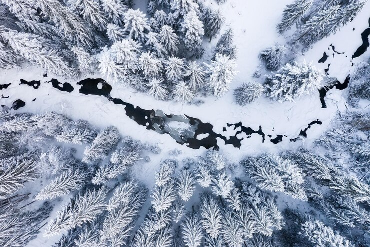

# Winter chill projections

{width="750"}

## Learning goals

-   Be aware of past studies that have projected climate change impacts on winter chill
-   Get a rough idea of how such studies are done
-   Get curious about how to do such studies

## Winter chill projections

This lesson gives an overview about how winter chill can be modeled. More specifically, it introduces various studies that have been conducted on this topic. These studies are explored to illustrate how the methodological components fit together. If everything goes as planned, most of the analyses behind these studies should be achievable by the end of this class.

### Winter chill in Oman

As a student at the University of Kassel, there was an opportunity to participate in research projects centered on mountain oases in the Sultanate of Oman. These systems later became the focus of a PhD project, where the interest in winter chill first emerged. Initially, the study plan was different, aiming to calculate nutrient budgets for the oases, which required measuring the yields of the various fruit trees in these regions. The following provides an impression of the oasis orchards:
