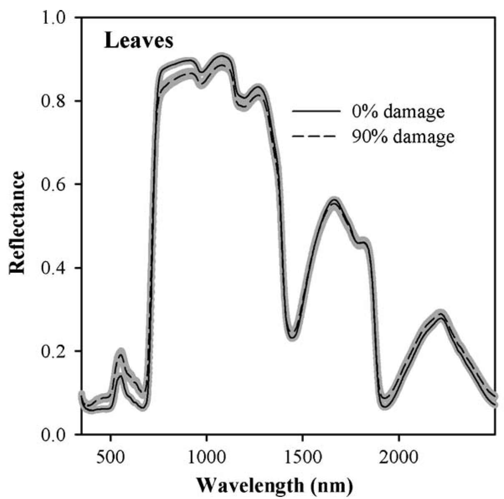
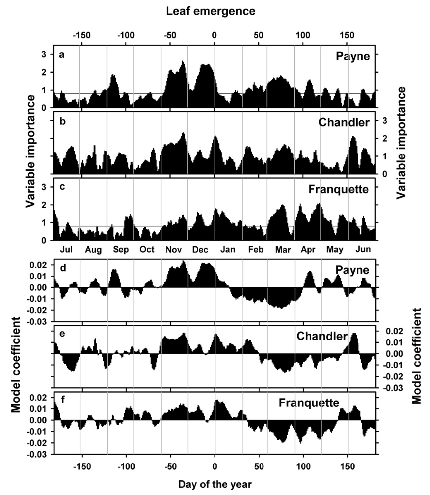

```{r, include=FALSE}
library(chillR)
library(ggplot2)
library(tidyverse)
library(patchwork)
```

## Phenology and Temperature Analysis

Attempts to correlate specific temperature periods with phenology (like bloom or leafing dates) were largely unsuccessful. This reflects the understanding that spring phenology is influenced by both chilling and heat exposure over extended periods, making single-period temperature data insufficient. The challenge is the imbalance between detailed temperature data and limited phenology observations, creating statistical issues. This is similar to challenges in remote sensing, where advanced techniques, like machine learning, are employed to analyze complex data.

## Hyperspectral Data for Damage Detection

In California, hyperspectral data were used to assess spider mite damage in peaches. Reflectance spectra from 350 to 2500 nm showed clear differences between healthy and damaged leaves. Statistical methods, such as Partial Least Squares (PLS) regression, were used to identify significant wavelengths correlating with mite damage. While promising, mite detection was only reliable for severe damage, which could be visually observed.



## PLS Regression for Phenology Analysis

PLS regression was applied to study leaf emergence in walnut cultivars in California. Using data from 1953 to 2007, the analysis correlated leaf emergence with daily temperatures. It revealed that:

-   **Chilling phase** (Nov-Jan): Warmer temperatures delayed emergence
-   **Forcing phase** (Jan-Mar): Warmer temperatures accelerated leaf emergence. For different cultivars, there were variations in temperature sensitivity, which was clearer in the ‘Payne’ cultivar.



## Caution in Interpreting PLS Results

While PLS regression is effective with large datasets, it requires caution when applied to smaller datasets. Results should not be overinterpreted but used to test or refine existing hypotheses. Random patterns should not be rationalized without supporting theory.

## PLS Regression on ‘Alexander Lucas’ Pears

For the pear cultivar ‘Alexander Lucas,’ bloom dates (first bloom) were analyzed using PLS regression:

```{r}
Alex_first <- read_tab("data/Alexander_Lucas_bloom_1958_2019.csv") %>%
  select(Pheno_year, First_bloom) %>%
  mutate(Year = as.numeric(substr(First_bloom, 1, 4)),
         Month = as.numeric(substr(First_bloom, 5, 6)),
         Day = as.numeric(substr(First_bloom, 7, 8))) %>%
  make_JDay() %>%
  select(Pheno_year, JDay) %>%
  rename(Year = Pheno_year,
         pheno = JDay)
```

Temperature data was also integrated:

```{r}
KA_temps <- read_tab("data/TMaxTMin1958-2019_patched.csv") %>%
  make_JDay()
```

The `data.frame` can be more complex but must adhere to the standard `chillR` temperature dataset structure, including columns for `Year`, `Month`, `Day`, `Tmin`, `Tmax`, and, in this case, `JDay`.

With both the temperature and phenology datasets prepared, the `PLS_pheno` function from the `chillR` package, which uses the `plsr` package, can be applied.

This function requires at least the temperature dataset (`weather_data`) and the phenology dataset (`bio_data`). It returns a list containing three objects: `$object_type` (the string 'PLS_Temp_pheno'), `$pheno` (the phenology data), and `$PLS_summary` (the analysis results).

```{r}
PLS_results <- PLS_pheno(KA_temps,
                         Alex_first)
```

The `PLS_results` element can be visualized using the `plot_PLS` function, which generates a plot of the results:


The plot produced by the `PLS_pheno` function includes several elements:

-   The top row shows the VIP plot, with important days highlighted in blue.

-   The second row displays the model coefficients, with important days colored red (for negative) or green (for positive).

-   The bottom row illustrates the temperature dynamics, with the mean temperature across all years shown as a black line and the standard deviation indicated by shading. The same color scheme as the model coefficient plot is used. Additionally, the gray shading on the left shows the full range of observed bloom dates, with the dashed line indicating the mean bloom date.

Although this figure looks appealing, it is difficult to customize, especially since it was created using R's standard plotting functions, which were limited by the available programming skills at the time. Modifying text sizes and other elements required direct writing of the plot to an image file to ensure acceptable output.

Before replicating this plot using `ggplot`, it is helpful to understand the parameters of the `PLS_pheno` function:

-   `split_month`: Defines the start of the phenological year, with the default set to 7 (ending at the end of July).

-   `runn_mean`: Controls the running mean applied to temperature data before analysis, with the default set to 11.

-   `end_at_pheno_end`: If `TRUE` (default), temperatures after the latest Julian date in the phenology dataset are excluded from the analysis.

-   `use_Tmean`: Set to `TRUE` if the temperature dataset includes a `Tmean` column, otherwise means are calculated from `Tmin` and `Tmax`.

-   `expl.var`**,** `ncomp.fix`**,** and `crossvalidate`: Specific to the PLS analysis.

-   `return.all`: If set to `TRUE`, all PLS outputs are returned.

For more details, the help function for `PLS_pheno` and the `plsr` package should be consulted. Now, the task is to reproduce this plot using `ggplot`.

```{r}

PLS_gg <- PLS_results$PLS_summary %>%
  mutate(Month = trunc(Date / 100),
         Day = Date - Month * 100,
         Date = NULL) 

PLS_gg$Date <- ISOdate(2002, 
                       PLS_gg$Month, 
                       PLS_gg$Day)
PLS_gg$Date[PLS_gg$JDay <= 0] <-
  ISOdate(2001, 
          PLS_gg$Month[PLS_gg$JDay <= 0], 
          PLS_gg$Day[PLS_gg$JDay <= 0])

PLS_gg <- PLS_gg %>%
  mutate(VIP_importance = VIP >= 0.8,
         VIP_Coeff = factor(sign(Coef) * VIP_importance))


VIP_plot<- ggplot(PLS_gg,
                  aes(x = Date,y = VIP)) +
  geom_bar(stat = 'identity',
           aes(fill = VIP > 0.8))

VIP_plot <- VIP_plot +
  scale_fill_manual(name="VIP", 
                    labels = c("<0.8", ">0.8"), 
                    values = c("FALSE" = "grey", "TRUE" = "blue")) +
  theme_bw(base_size = 15) +
  theme(axis.text.x = element_blank(),
        axis.ticks.x = element_blank(),
        axis.title.x = element_blank())

VIP_plot
```

```{r}
coeff_plot <- ggplot(PLS_gg,
                     aes(x = Date,
                         y = Coef)) +
  geom_bar(stat ='identity',
           aes(fill = VIP_Coeff)) +
  scale_fill_manual(name = "Effect direction", 
                    labels = c("Advancing",
                               "Unimportant",
                               "Delaying"), 
                    values = c("-1" = "red", 
                               "0" = "grey",
                               "1" = "dark green")) +
  theme_bw(base_size = 15) +
  ylab("PLS coefficient") +
  theme(axis.text.x = element_blank(),
        axis.ticks.x = element_blank(),
        axis.title.x = element_blank() )

coeff_plot
```

```{r}
temp_plot <- ggplot(PLS_gg) +
  geom_ribbon(aes(x = Date,
                  ymin = Tmean - Tstdev,
                  ymax = Tmean + Tstdev),
              fill = "grey") +
  geom_ribbon(aes(x = Date,
                  ymin = Tmean - Tstdev * (VIP_Coeff == -1),
                  ymax = Tmean + Tstdev * (VIP_Coeff == -1)),
              fill = "red") +
  geom_ribbon(aes(x = Date,
                  ymin = Tmean - Tstdev * (VIP_Coeff == 1),
                  ymax = Tmean + Tstdev * (VIP_Coeff == 1)),
              fill = "dark green") +
  geom_line(aes(x = Date,
                y = Tmean)) +
  theme_bw(base_size = 15) +
  ylab(expression(paste(T[mean]," (°C)")))

temp_plot
```

```{r}
plot<- (VIP_plot +
          coeff_plot +
          temp_plot +
          plot_layout(ncol=1,
            guides = "collect")
        ) & theme(legend.position = "right",
                  legend.text = element_text(size = 8),
                  legend.title = element_text(size = 10),
                  axis.title.x = element_blank())

plot
```

The code now generates a clear compound figure that displays all the expected outputs of a PLS analysis. Creating a function from this would make the process more efficient and reusable.

```{r}
ggplot_PLS <- function(PLS_results)
{
  library(ggplot2)
  PLS_gg <- PLS_results$PLS_summary %>%
    mutate(Month = trunc(Date / 100),
           Day = Date - Month * 100,
           Date = NULL) 
  
  PLS_gg$Date <- ISOdate(2002, 
                         PLS_gg$Month, 
                         PLS_gg$Day)
  
  PLS_gg$Date[PLS_gg$JDay <= 0] <-
    ISOdate(2001, 
            PLS_gg$Month[PLS_gg$JDay <= 0], 
            PLS_gg$Day[PLS_gg$JDay <= 0])
  
  PLS_gg <- PLS_gg %>%
    mutate(VIP_importance = VIP >= 0.8,
           VIP_Coeff = factor(sign(Coef) * VIP_importance))
  
  VIP_plot<- ggplot(PLS_gg,aes(x=Date,y=VIP)) +
    geom_bar(stat='identity',aes(fill=VIP>0.8))
  
  VIP_plot <- VIP_plot +
    scale_fill_manual(name="VIP", 
                      labels = c("<0.8", ">0.8"), 
                      values = c("FALSE" = "grey", 
                                 "TRUE" = "blue")) +
    theme_bw(base_size=15) +
    theme(axis.text.x = element_blank(),
          axis.ticks.x = element_blank(),
          axis.title.x = element_blank())
  
  coeff_plot <- ggplot(PLS_gg,
                       aes(x = Date,
                           y = Coef)) +
    geom_bar(stat ='identity',
             aes(fill = VIP_Coeff)) +
    scale_fill_manual(name = "Effect direction", 
                      labels = c("Advancing",
                                 "Unimportant",
                                 "Delaying"), 
                      values = c("-1" = "red", 
                                 "0" = "grey",
                                 "1" = "dark green")) +
    theme_bw(base_size = 15) +
    ylab("PLS coefficient") +
    theme(axis.text.x = element_blank(),
          axis.ticks.x = element_blank(),
          axis.title.x = element_blank())
  
  temp_plot <- ggplot(PLS_gg) +
    geom_ribbon(aes(x = Date,
                    ymin = Tmean - Tstdev,
                    ymax = Tmean + Tstdev),
                fill = "grey") +
    geom_ribbon(aes(x = Date,
                    ymin = Tmean - Tstdev * (VIP_Coeff == -1),
                    ymax = Tmean + Tstdev * (VIP_Coeff == -1)),
                fill = "red") +
    geom_ribbon(aes(x = Date,
                    ymin = Tmean - Tstdev * (VIP_Coeff == 1),
                    ymax = Tmean + Tstdev * (VIP_Coeff == 1)),
                fill = "dark green") +
    geom_line(aes(x = Date,
                  y = Tmean)) +
    theme_bw(base_size = 15) +
    ylab(expression(paste(T[mean]," (°C)")))
  
  library(patchwork)
  
  plot<- (VIP_plot +
            coeff_plot +
            temp_plot +
            plot_layout(ncol=1,
                        guides = "collect")
          ) & theme(legend.position = "right",
                    legend.text = element_text(size = 8),
                    legend.title = element_text(size = 10),
                    axis.title.x = element_blank())
  
  plot}

ggplot_PLS(PLS_results)
```

A function has now been created to automatically plot the outputs of a PLS analysis. However, the results don't match expectations. While there is a clear bloom-advancing response to high temperatures in spring, the chilling period is absent. This will be addressed in the next lesson, but possible explanations might already be forming.

## `Exercises` on chill model comparison

1)  Briefly explain why you shouldn't take the results of a PLS regression analysis between temperature and phenology at face value. What do you need in addition in order to make sense of such outputs?

PLS regression results between temperature and phenology should not be taken at face value because they are heavily influenced by the specific dataset and the assumptions underlying the model. The results need to be interpreted in the context of a theory or understanding of the biological processes involved, such as the chilling and forcing phases in phenology. Without this theoretical framework, the patterns found in the data could be misleading or overinterpreted. Additionally, the small sample sizes often used in phenology datasets can lead to unstable or unclear results. Hence, theoretical context and caution in interpretation are essential.

2.  Replicate the PLS analysis for the Roter Boskoop dataset that you used in a previous lesson.

```{r}
# Load dataset 'Roter Boskoop' and convert it into a long format 
Roter_Boskoop <- read_tab("data/Roter_Boskoop_bloom_1958_2019.csv")

Roter_Boskoop <- pivot_longer(Roter_Boskoop,
                     cols = c(First_bloom:Last_bloom),
                     names_to = "Stage",
                     values_to = "YEARMODA")

RB_first <- Roter_Boskoop %>%
  mutate(Year = as.numeric(substr(YEARMODA, 1, 4)),
         Month = as.numeric(substr(YEARMODA, 5, 6)),
         Day = as.numeric(substr(YEARMODA, 7, 8))) %>%
  make_JDay() %>%
  filter(Stage == "First_bloom")

RB_first <- read_tab("data/Roter_Boskoop_bloom_1958_2019.csv") %>%
  select(Pheno_year, First_bloom) %>%
  mutate(Year = as.numeric(substr(First_bloom, 1, 4)),
         Month = as.numeric(substr(First_bloom, 5, 6)),
         Day = as.numeric(substr(First_bloom, 7, 8))) %>%
  make_JDay() %>%
  select(Pheno_year, JDay) %>%
  rename(Year = Pheno_year,
         pheno = JDay)
```

```{r}
# Results of PLS analysis
PLS_results <- PLS_pheno(KA_temps,
                         RB_first)
```

```{r}
# Plot results of PLS analysis 
ggplot_PLS <- function(PLS_results)
{
  library(ggplot2)
  PLS_gg <- PLS_results$PLS_summary %>%
    mutate(Month = trunc(Date / 100),
           Day = Date - Month * 100,
           Date = NULL) 
  
  PLS_gg$Date <- ISOdate(2002, 
                         PLS_gg$Month, 
                         PLS_gg$Day)
  
  PLS_gg$Date[PLS_gg$JDay <= 0] <-
    ISOdate(2001, 
            PLS_gg$Month[PLS_gg$JDay <= 0], 
            PLS_gg$Day[PLS_gg$JDay <= 0])
  
  PLS_gg <- PLS_gg %>%
    mutate(VIP_importance = VIP >= 0.8,
           VIP_Coeff = factor(sign(Coef) * VIP_importance))
  
  VIP_plot<- ggplot(PLS_gg,aes(x=Date,y=VIP)) +
    geom_bar(stat='identity',aes(fill=VIP>0.8))
  
  VIP_plot <- VIP_plot +
    scale_fill_manual(name="VIP", 
                      labels = c("<0.8", ">0.8"), 
                      values = c("FALSE" = "grey", 
                                 "TRUE" = "blue")) +
    theme_bw(base_size=15) +
    theme(axis.text.x = element_blank(),
          axis.ticks.x = element_blank(),
          axis.title.x = element_blank())
  
  coeff_plot <- ggplot(PLS_gg,
                       aes(x = Date,
                           y = Coef)) +
    geom_bar(stat ='identity',
             aes(fill = VIP_Coeff)) +
    scale_fill_manual(name = "Effect direction", 
                      labels = c("Advancing",
                                 "Unimportant",
                                 "Delaying"), 
                      values = c("-1" = "red", 
                                 "0" = "grey",
                                 "1" = "dark green")) +
    theme_bw(base_size = 15) +
    ylab("PLS coefficient") +
    theme(axis.text.x = element_blank(),
          axis.ticks.x = element_blank(),
          axis.title.x = element_blank())
  
  temp_plot <- ggplot(PLS_gg) +
    geom_ribbon(aes(x = Date,
                    ymin = Tmean - Tstdev,
                    ymax = Tmean + Tstdev),
                fill = "grey") +
    geom_ribbon(aes(x = Date,
                    ymin = Tmean - Tstdev * (VIP_Coeff == -1),
                    ymax = Tmean + Tstdev * (VIP_Coeff == -1)),
                fill = "red") +
    geom_ribbon(aes(x = Date,
                    ymin = Tmean - Tstdev * (VIP_Coeff == 1),
                    ymax = Tmean + Tstdev * (VIP_Coeff == 1)),
                fill = "dark green") +
    geom_line(aes(x = Date,
                  y = Tmean)) +
    theme_bw(base_size = 15) +
    ylab(expression(paste(T[mean]," (°C)")))
  
  library(patchwork)
  
  plot<- (VIP_plot +
            coeff_plot +
            temp_plot +
            plot_layout(ncol=1,
                        guides = "collect")
          ) & theme(legend.position = "right",
                    legend.text = element_text(size = 8),
                    legend.title = element_text(size = 10),
                    axis.title.x = element_blank())
  
  plot}

ggplot_PLS(PLS_results)
```

3)  Write down your thoughts on why we're not seeing the temperature response pattern we may have expected. What happened to the chill response?

The absence of the expected chill response might be due to several factors:

1.  **Data Limitations**: Small sample sizes and potential overfitting in PLS regression could obscure the chill phase

2.  **Temperature Representation**: The temperature data may not adequately reflect the chilling period or might focus too much on the spring temperatures (forcing phase)

3.  **Chill Requirements**: Some cultivars may have specific chilling requirements not captured by average temperatures or irregular temperature fluctuation

4.  **Other Environmental Factors**: Additional factors like soil moisture and photoperiod might influence phenology, potentially overshadowing the chill response.
