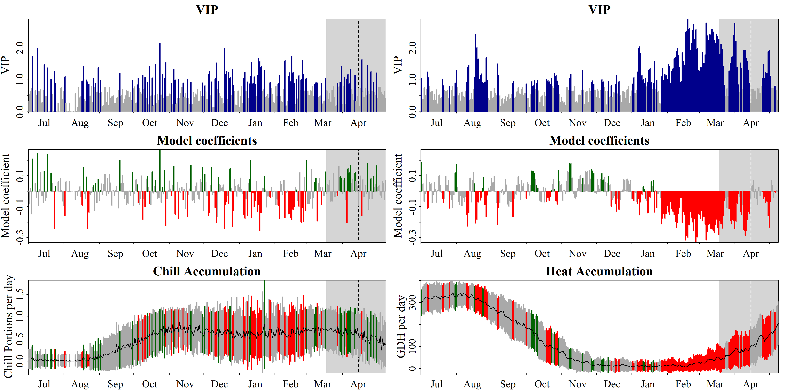
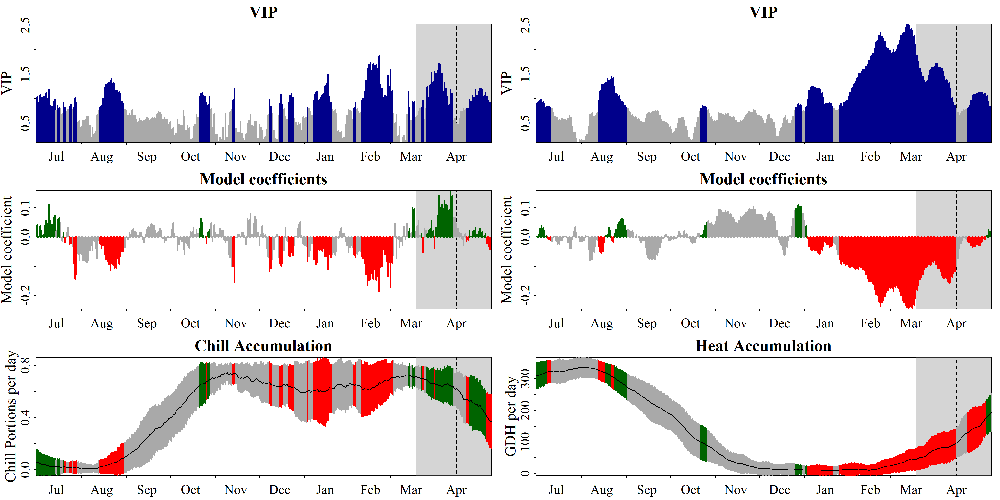
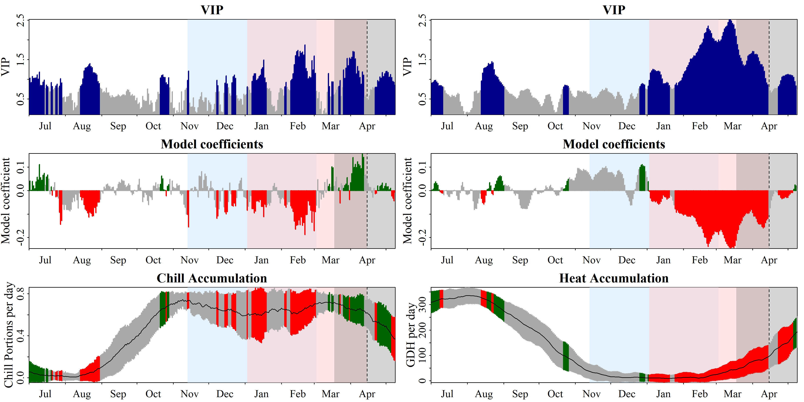

```{r, include=FALSE}
library(chillR)
library(tidyverse)
library(ggplot2)
library(patchwork)
```

## Adjusting PLS for use with non-monotonic relationships

The challenge in using PLS regression to detect the chilling period in colder regions lies in the non-monotonic relationship between temperature and chill effectiveness. Warmer temperatures can either increase or decrease chill accumulation, depending on their relative warmth. To address this, temperature needs to be transformed into a monotonically related measure of chill accumulation.

Chill models quantify chill accumulation but raise concerns about their accuracy. Despite this, the analysis proceeds with these models, assuming they reasonably approximate biological processes. Any model uncertainties should be acknowledged.

### PLS Analysis with Chilling and Forcing Data

The `chillR` package's `PLS_chill_force` function performs PLS analysis using daily chill and heat accumulation rates. First, a daily chill object (`daily_chill_obj`) containing chill/heat rates and mean temperatures is created. The `make_daily_chill_plot2` function visualizes daily chill accumulation before applying `PLS_chill_force`.

```{r}
temps_hourly <- read_tab("data/TMaxTMin1958-2019_patched.csv") %>%
  stack_hourly_temps(latitude = 50.6)

daychill <- daily_chill(hourtemps = temps_hourly,
                        running_mean = 1,
                        models = list(
                          Chilling_Hours = Chilling_Hours,
                          Utah_Chill_Units = Utah_Model,
                          Chill_Portions = Dynamic_Model,
                          GDH = GDH)
                        )

dc <- make_daily_chill_plot2(daychill,
                             metrics = c("Chill_Portions"),
                             cumulative = FALSE,
                             startdate = 300,
                             enddate = 30,
                             focusyears = c(2008), 
                             metriclabels = "Chill Portions")
```

The plot highlights specific years with the `focusyears` parameter, and switching to a cumulative view compares current chill accumulation to historical patterns.

```{r}
dc <- make_daily_chill_plot2(daychill,
                             metrics = c("Chill_Portions"),
                             cumulative = TRUE,
                             startdate = 300,
                             enddate = 30,
                             focusyears = c(2008),
                             metriclabels = "Chill Portions")
```

The plot includes double ticks on the x-axis to account for leap years, ensuring Julian dates align accurately with calendar dates. The next step is to use the daily chill object with the `PLS_chill_force` function and pear bloom data for further analysis.

```{r}
Alex_first <- read_tab("data/Alexander_Lucas_bloom_1958_2019.csv") %>%
  select(Pheno_year, First_bloom) %>%
  mutate(Year = as.numeric(substr(First_bloom, 1, 4)),
         Month = as.numeric(substr(First_bloom, 5, 6)),
         Day = as.numeric(substr(First_bloom, 7, 8))) %>%
  make_JDay() %>%
  select(Pheno_year, 
         JDay) %>%
  rename(Year = Pheno_year,
         pheno = JDay)


plscf <- PLS_chill_force(daily_chill_obj = daychill,
                         bio_data_frame = Alex_first,
                         split_month = 6,
                         chill_models = "Chill_Portions",
                         heat_models = "GDH")
```

The `PLS_chill_force` function evaluates multiple chill and heat models and outputs results that can be accessed via `plscf$Chill_Portions$GDH$PLS_summary`. These results are visualized using the `plot_PLS` function.

```{r, eval=FALSE}
plot_PLS(plscf,
         PLS_results_path = "data/plscf_outputs")
```

Although the `PLS_chill_force` function generates a plot, a more modern approach is to use `ggplot2` for better customization.



The lack of clarity in the results is due to the absence of a running mean, especially for the Dynamic Model. Applying an 11-day running mean helps smooth the data for clearer results.

```{r, eval=FALSE}
plscf <- PLS_chill_force(daily_chill_obj = daychill,
                         bio_data_frame=Alex_first,
                         split_month = 6,
                         chill_models = "Chill_Portions",
                         heat_models = "GDH",
                         runn_means = 11)
plot_PLS(plscf,
         PLS_results_path = "data/plscf_outputs_11days")
```



The plots now show clearer results: the left plot links bloom dates with chill accumulation, and the right plot does the same for heat accumulation. Both are derived from the same PLS analysis.

To identify chilling and forcing periods, consistent negative model coefficients are examined. The forcing period is evident between early January and bloom (mid-March to early May), while the chilling period is seen from November/December to February.

Chilling and forcing periods are debated, but in this dataset, the chilling period spans from November 13th to March 3rd (Julian dates -48 to 62), and the forcing period runs from January 3rd to the median bloom date (Julian dates 3 to 105.5). These periods can be marked in the plot for clarity.

```{r, eval=FALSE}
plot_PLS(plscf,
         PLS_results_path = "data/plscf_outputs_11days_periods",
         add_chill = c(-48,62),
         add_heat = c(3,105.5))
```



## `ggplot`ting the results

The process has been mostly covered during the creation of the original PLS plots, but now it will be applied to the `PLS_chill_force` outputs. The key difference is splitting the results by chill and heat analysis using `facet_wrap`. The data needs to be prepared for `ggplot`ting.

```{r}
PLS_gg <- plscf$Chill_Portions$GDH$PLS_summary %>%
  mutate(Month = trunc(Date/100),
         Day = Date - Month * 100,
         Date = ISOdate(2002,
                        Month,
                        Day))

PLS_gg[PLS_gg$JDay <= 0,"Date"]<-
  ISOdate(2001,
          PLS_gg$Month[PLS_gg$JDay <= 0],
          PLS_gg$Day[PLS_gg$JDay <= 0])

PLS_gg <- PLS_gg %>%
  mutate(VIP_importance = VIP >= 0.8,
         VIP_Coeff = factor(sign(Coef) * VIP_importance))

chill_start_JDay <- -48
chill_end_JDay <- 62
heat_start_JDay <- 3
heat_end_JDay <- 105.5

chill_start_date <- ISOdate(2001,
                            12,
                            31) + chill_start_JDay * 24 * 3600
chill_end_date <- ISOdate(2001,
                          12,
                          31) + chill_end_JDay * 24 * 3600
heat_start_date <- ISOdate(2001,
                           12,
                           31) + heat_start_JDay * 24 * 3600
heat_end_date <- ISOdate(2001,
                         12,
                         31) + heat_end_JDay * 24 * 3600
```

The process begins with the bottom plot, as it is the most complicated. The complexity arises from needing different labels on the y-axes for the two facets, as well as different scales. The daily chill accumulation rate ranges from 0 to around 1 Chill Portion, while the daily heat accumulation rate can exceed 300 GDH. Solving these issues for the bottom plot may influence the approach for the other plots.

```{r}
temp_plot <- ggplot(PLS_gg,
                    x = Date) +
  annotate("rect",
           xmin = chill_start_date,
           xmax = chill_end_date,
           ymin = -Inf,
           ymax = Inf,
           alpha = .1,
           fill = "blue") +
  annotate("rect",
           xmin = heat_start_date,
           xmax = heat_end_date,
           ymin = -Inf,
           ymax = Inf,
           alpha = .1,
           fill = "red") +
  annotate("rect",
           xmin = ISOdate(2001,
                          12,
                          31) +
             min(plscf$pheno$pheno,
                 na.rm = TRUE) * 24 * 3600,
           xmax = ISOdate(2001,
                          12,
                          31) +
             max(plscf$pheno$pheno,
                 na.rm = TRUE) * 24 * 3600,
           ymin = -Inf,
           ymax = Inf,
           alpha = .1,
           fill = "black") +
  geom_vline(xintercept = ISOdate(2001,
                                  12,
                                  31) +
               median(plscf$pheno$pheno,
                      na.rm = TRUE) * 24 * 3600,
             linetype = "dashed") +
  geom_ribbon(aes(x = Date,
                  ymin = MetricMean - MetricStdev ,
                  ymax = MetricMean + MetricStdev),
              fill="grey") +
  geom_ribbon(aes(x = Date,
                  ymin = MetricMean - MetricStdev * (VIP_Coeff == -1),
                  ymax = MetricMean + MetricStdev * (VIP_Coeff == -1)),
              fill = "red") +
  geom_ribbon(aes(x = Date,
                  ymin = MetricMean - MetricStdev * (VIP_Coeff == 1),
                  ymax = MetricMean + MetricStdev * (VIP_Coeff == 1)),
              fill = "dark green") +
  geom_line(aes(x = Date,
                y = MetricMean ))

temp_plot
```

```{r}
temp_plot <- temp_plot +
  facet_wrap(vars(Type),
             scales = "free_y",
             strip.position = "left",
             labeller =
               labeller(Type = as_labeller(
               c(Chill = "Chill (CP)",
                 Heat = "Heat (GDH)")))) +
  ggtitle("Daily chill and heat accumulation rates") +
  theme_bw(base_size = 15) + 
  theme(strip.background = element_blank(),
        strip.placement = "outside",
        strip.text.y = element_text(size =12),
        plot.title = element_text(hjust = 0.5),
        axis.title.y = element_blank()
        )

temp_plot
```

After exploring ways to customize the y-axis labels for each facet without finding a viable solution, the facet labels were used instead and moved to the left side to serve as y-axis labels. The labeller element in facet_wrap allows easy customization with chosen text. A title was also added to the plot.

The same approach can now be applied to the VIP and model coefficient plots to maintain a consistent structure when combining them later.

```{r}
VIP_plot<- ggplot(PLS_gg,
                  aes(x = Date,
                      y = VIP)) +
  annotate("rect",
           xmin = chill_start_date,
           xmax = chill_end_date,
           ymin = -Inf,
           ymax = Inf,
           alpha = .1,
           fill = "blue") +
  annotate("rect",
           xmin = heat_start_date,
           xmax = heat_end_date,
           ymin = -Inf,
           ymax = Inf,
           alpha = .1,
           fill = "red") +
  annotate("rect",
           xmin = ISOdate(2001,
                          12,
                          31) +
             min(plscf$pheno$pheno,
                 na.rm = TRUE) * 24 * 3600,
           xmax = ISOdate(2001,
                          12,
                          31) +
             max(plscf$pheno$pheno,
                 na.rm = TRUE) * 24 * 3600,
           ymin = -Inf,
           ymax = Inf,
           alpha = .1,
           fill = "black") +
  geom_vline(xintercept = ISOdate(2001,
                                  12,
                                  31) +
               median(plscf$pheno$pheno,
                      na.rm = TRUE) * 24 * 3600,
             linetype = "dashed") +
  geom_bar(stat = 'identity',
           aes(fill = VIP > 0.8))

VIP_plot
```

```{r}
VIP_plot <- VIP_plot + 
  facet_wrap(vars(Type),
             scales = "free",
             strip.position = "left",
             labeller = 
               labeller(Type = as_labeller(
                 c(Chill = "VIP for chill",
                   Heat = "VIP for heat")))) +
  scale_y_continuous(
    limits = c(0,
               max(plscf$Chill_Portions$GDH$PLS_summary$VIP))) +
  ggtitle("Variable Importance in the Projection (VIP) scores") +
  theme_bw(base_size = 15) + 
  theme(strip.background = element_blank(),
        strip.placement = "outside",
        strip.text.y = element_text(size = 12),
        plot.title = element_text(hjust = 0.5),
        axis.title.y = element_blank()
        )
  
VIP_plot
```

```{r}
VIP_plot <- VIP_plot +
  scale_fill_manual(name = "VIP", 
                    labels = c("<0.8", ">0.8"), 
                    values = c("FALSE" = "grey",
                               "TRUE" = "blue")) +
  theme(axis.text.x = element_blank(),
        axis.ticks.x = element_blank(),
        axis.title.x = element_blank(),
        axis.title.y = element_blank())

VIP_plot
```

```{r}
coeff_plot <- ggplot(PLS_gg,
                     aes(x = Date,
                         y = Coef)) +
  annotate("rect",
           xmin = chill_start_date,
           xmax = chill_end_date,
           ymin = -Inf,
           ymax = Inf,
           alpha = .1,
           fill = "blue") +
  annotate("rect",
           xmin = heat_start_date,
           xmax = heat_end_date,
           ymin = -Inf,
           ymax = Inf,
           alpha = .1,
           fill = "red") +
  annotate("rect",
           xmin = ISOdate(2001,
                          12,
                          31) +
             min(plscf$pheno$pheno,
                 na.rm=TRUE) * 24 * 3600,
           xmax = ISOdate(2001,
                          12,
                          31) +
             max(plscf$pheno$pheno,
                 na.rm = TRUE) * 24 * 3600,
           ymin = -Inf,
           ymax = Inf,
           alpha = .1,
           fill = "black") +
  geom_vline(xintercept = ISOdate(2001,
                                  12,
                                  31) +
               median(plscf$pheno$pheno,
                      na.rm = TRUE) * 24 * 3600,
             linetype = "dashed") +
  geom_bar(stat = 'identity',
           aes(fill = VIP_Coeff))

coeff_plot
```

```{r}
coeff_plot <- coeff_plot +
  facet_wrap(vars(Type),
             scales = "free",
             strip.position = "left",
             labeller =
               labeller(
                 Type = as_labeller(
                   c(Chill = "MC for chill",
                     Heat = "MC for heat")))) +
  scale_y_continuous(
    limits = c(min(plscf$Chill_Portions$GDH$PLS_summary$Coef),
               max(plscf$Chill_Portions$GDH$PLS_summary$Coef))) +
  ggtitle("Model coefficients (MC)") +
  theme_bw(base_size = 15) + 
  theme(strip.background = element_blank(),
        strip.placement = "outside",
        strip.text.y = element_text(size = 12),
        plot.title = element_text(hjust = 0.5),
        axis.title.y = element_blank()
        )
  
coeff_plot 
```

```{r}
coeff_plot <- coeff_plot +  
  scale_fill_manual(name="Effect direction", 
                    labels = c("Advancing",
                               "Unimportant",
                               "Delaying"), 
                    values = c("-1" = "red",
                               "0" = "grey",
                               "1" = "dark green")) +
  ylab("PLS coefficient") +
  theme(axis.text.x = element_blank(),
        axis.ticks.x = element_blank(),
        axis.title.x = element_blank(),
        axis.title.y = element_blank())

coeff_plot
```

The plots can now be combined using the `patchwork` package.

```{r}
plot<- (VIP_plot +
          coeff_plot +
          temp_plot +
          plot_layout(ncol = 1,
            guides = "collect")
        ) & theme(legend.position = "right",
                  legend.text = element_text(size = 8),
                  legend.title = element_text(size = 10),
                  axis.title.x = element_blank())

plot
```

A function will be created from this process:

```{r}
plot_PLS_chill_force <- function(plscf,
                                 chill_metric = "Chill_Portions",
                                 heat_metric = "GDH",
                                 chill_label = "CP",
                                 heat_label = "GDH",
                                 chill_phase = c(-48, 62),
                                 heat_phase = c(3, 105.5))
{
  PLS_gg <- plscf[[chill_metric]][[heat_metric]]$PLS_summary %>%
    mutate(Month = trunc(Date/100),
           Day = Date - Month * 100,
           Date = ISOdate(2002,
                          Month,
                          Day))
  
  PLS_gg[PLS_gg$JDay <= 0,"Date"]<-
    ISOdate(2001,
            PLS_gg$Month[PLS_gg$JDay <= 0],
            PLS_gg$Day[PLS_gg$JDay <= 0])
  
  PLS_gg <- PLS_gg %>%
    mutate(VIP_importance = VIP >= 0.8,
           VIP_Coeff = factor(sign(Coef) * VIP_importance))
  
  chill_start_date <- ISOdate(2001,
                              12,
                              31) + chill_phase[1] * 24 * 3600
  chill_end_date <- ISOdate(2001,
                            12,
                            31) + chill_phase[2] * 24 * 3600
  heat_start_date <- ISOdate(2001,
                             12,
                             31) + heat_phase[1] * 24 * 3600
  heat_end_date <- ISOdate(2001,
                           12,
                           31) + heat_phase[2] * 24 * 3600


  temp_plot <- ggplot(PLS_gg) +
    annotate("rect",
             xmin = chill_start_date,
             xmax = chill_end_date,
             ymin = -Inf,
             ymax = Inf,
             alpha = .1,
             fill = "blue") +
    annotate("rect",
             xmin = heat_start_date,
             xmax = heat_end_date,
             ymin = -Inf,
             ymax = Inf,
             alpha = .1,
             fill = "red") +
    annotate("rect",
             xmin = ISOdate(2001,
                            12,
                            31) +
               min(plscf$pheno$pheno,
                   na.rm = TRUE) * 24 * 3600,
             xmax = ISOdate(2001,
                            12,
                            31) +
               max(plscf$pheno$pheno,
                   na.rm = TRUE) * 24 * 3600,
             ymin = -Inf,
             ymax = Inf,
             alpha = .1,
             fill = "black") +
    geom_vline(xintercept = ISOdate(2001,
                                    12,
                                    31) +
                 median(plscf$pheno$pheno,
                        na.rm=TRUE) * 24 * 3600,
               linetype = "dashed") +
    geom_ribbon(aes(x = Date,
                    ymin = MetricMean - MetricStdev ,
                    ymax = MetricMean + MetricStdev ),
                fill = "grey") +
    geom_ribbon(aes(x = Date,
                    ymin = MetricMean - MetricStdev * (VIP_Coeff == -1),
                    ymax = MetricMean + MetricStdev * (VIP_Coeff == -1)),
                fill = "red") +
    geom_ribbon(aes(x = Date,
                    ymin = MetricMean - MetricStdev * (VIP_Coeff == 1),
                    ymax = MetricMean + MetricStdev * (VIP_Coeff == 1)),
                fill = "dark green") +
    geom_line(aes(x = Date,
                  y = MetricMean)) +
    facet_wrap(vars(Type),
               scales = "free_y",
               strip.position = "left",
               labeller = 
                 labeller(
                   Type =
                     as_labeller(c(Chill = paste0("Chill (",
                                                  chill_label,
                                                  ")"),
                                   Heat = paste0("Heat (",
                                                 heat_label,
                                                 ")"))))) +
    ggtitle("Daily chill and heat accumulation rates") +
    theme_bw(base_size = 15) + 
    theme(strip.background = element_blank(),
          strip.placement = "outside",
          strip.text.y = element_text(size = 12),
          plot.title = element_text(hjust = 0.5),
          axis.title.y = element_blank()
          )
  
  VIP_plot <- ggplot(PLS_gg,
                     aes(x = Date,
                         y = VIP)) +
    annotate("rect",
             xmin = chill_start_date,
             xmax = chill_end_date,
             ymin = -Inf,
             ymax = Inf,
             alpha = .1,
             fill = "blue") +
    annotate("rect",
             xmin = heat_start_date,
             xmax = heat_end_date,
             ymin = -Inf,
             ymax = Inf,
             alpha = .1,
             fill = "red") +
    annotate("rect",
             xmin = ISOdate(2001,
                            12,
                            31) + min(plscf$pheno$pheno,
                                      na.rm = TRUE) * 24 * 3600,
             xmax = ISOdate(2001,
                            12,
                            31) + max(plscf$pheno$pheno,
                                      na.rm = TRUE) * 24 * 3600,
             ymin = -Inf,
             ymax = Inf,
             alpha = .1,
             fill = "black") +
    geom_vline(xintercept = ISOdate(2001,
                                    12,
                                    31) + median(plscf$pheno$pheno,
                                                 na.rm = TRUE) * 24 * 3600,
               linetype = "dashed") +
    geom_bar(stat = 'identity',
             aes(fill = VIP>0.8)) +
    facet_wrap(vars(Type), 
               scales = "free",
               strip.position = "left",
               labeller = 
                 labeller(
                   Type = as_labeller(c(Chill="VIP for chill",
                                        Heat="VIP for heat")))) +
    scale_y_continuous(
      limits = c(0,
                 max(plscf[[chill_metric]][[heat_metric]]$PLS_summary$VIP))) +
    ggtitle("Variable Importance in the Projection (VIP) scores") +
    theme_bw(base_size = 15) + 
    theme(strip.background = element_blank(),
          strip.placement = "outside",
          strip.text.y = element_text(size = 12),
          plot.title = element_text(hjust = 0.5),
          axis.title.y = element_blank()
          ) +
    scale_fill_manual(name = "VIP", 
                      labels = c("<0.8", ">0.8"), 
                      values = c("FALSE" = "grey",
                                 "TRUE" = "blue")) +
    theme(axis.text.x = element_blank(),
          axis.ticks.x = element_blank(),
          axis.title.x = element_blank(),
          axis.title.y = element_blank())
  
  coeff_plot <- ggplot(PLS_gg,
                       aes(x = Date,
                           y = Coef)) +
    annotate("rect",
             xmin = chill_start_date,
             xmax = chill_end_date,
             ymin = -Inf,
             ymax = Inf,
             alpha = .1,
             fill = "blue") +
    annotate("rect",
             xmin = heat_start_date,
             xmax = heat_end_date,
             ymin = -Inf,
             ymax = Inf,
             alpha = .1,
             fill = "red") +
    annotate("rect",
             xmin = ISOdate(2001,
                            12,
                            31) + min(plscf$pheno$pheno,
                                      na.rm = TRUE) * 24 * 3600,
             xmax = ISOdate(2001,
                            12,
                            31) + max(plscf$pheno$pheno,
                                      na.rm = TRUE) * 24 * 3600,
             ymin = -Inf,
             ymax = Inf,
             alpha = .1,
             fill = "black") +
    geom_vline(xintercept = ISOdate(2001,
                                    12,
                                    31) + median(plscf$pheno$pheno,
                                                 na.rm = TRUE) * 24 * 3600,
               linetype = "dashed") +
    geom_bar(stat = 'identity',
             aes(fill = VIP_Coeff)) +
    facet_wrap(vars(Type),
               scales = "free",
               strip.position = "left",
               labeller =
                 labeller(
                   Type = as_labeller(c(Chill = "MC for chill",
                                        Heat = "MC for heat")))) +
    scale_y_continuous(
      limits = c(min(plscf[[chill_metric]][[heat_metric]]$PLS_summary$Coef),
                 max(plscf[[chill_metric]][[heat_metric]]$PLS_summary$Coef))) +
    ggtitle("Model coefficients (MC)") +
    theme_bw(base_size = 15) + 
    theme(strip.background = element_blank(),
          strip.placement = "outside",
          strip.text.y = element_text(size = 12),
          plot.title = element_text(hjust = 0.5),
          axis.title.y = element_blank()
          ) +
    scale_fill_manual(name = "Effect direction", 
                      labels = c("Advancing",
                                 "Unimportant",
                                 "Delaying"), 
                      values = c("-1" = "red",
                                 "0" = "grey",
                                 "1" = "dark green")) +
    ylab("PLS coefficient") +
    theme(axis.text.x = element_blank(),
          axis.ticks.x = element_blank(),
          axis.title.x = element_blank(),
          axis.title.y = element_blank())
  
  library(patchwork)
  
  plot <- (VIP_plot +
             coeff_plot +
             temp_plot +
             plot_layout(ncol = 1,
                         guides = "collect")
           ) & theme(legend.position = "right",
                     legend.text = element_text(size = 8),
                     legend.title = element_text(size = 10),
                     axis.title.x = element_blank())

plot

}

plot_PLS_chill_force(plscf)
```

With the plot production automated, it's now easy to explore how other chill models perform in distinguishing chilling and forcing periods.

```{r}
daychill <- daily_chill(hourtemps = temps_hourly,
                        running_mean = 11,
                        models = list(Chilling_Hours = Chilling_Hours,
                                      Utah_Chill_Units = Utah_Model,
                                      Chill_Portions = Dynamic_Model,
                                      GDH = GDH)
                        )

plscf <- PLS_chill_force(daily_chill_obj = daychill,
                         bio_data_frame = Alex_first,
                         split_month = 6,
                         chill_models = c("Chilling_Hours",
                                          "Utah_Chill_Units",
                                          "Chill_Portions"),
                       heat_models = c("GDH"))

plot_PLS_chill_force(plscf,
                     chill_metric = "Chilling_Hours",
                     heat_metric = "GDH",
                     chill_label = "CH",
                     heat_label = "GDH",
                     chill_phase = c(0,0),
                     heat_phase = c(0,0))
```

```{r}
plot_PLS_chill_force(plscf,
                     chill_metric = "Utah_Chill_Units",
                     heat_metric = "GDH",
                     chill_label = "CU",
                     heat_label = "GDH",
                     chill_phase = c(0,0),
                     heat_phase = c(0,0))
```

The other two common models also struggle to accurately identify the chilling period. The reasons for this will be reflected upon later.

## `Exercises` on chill model comparison

1.  Repeat the `PLS_chill_force` procedure for the ‘Roter Boskoop’ dataset. Include plots of daily chill and heat accumulation.

```{r}
# Read bloom dataset of 'Roter Boskoop' 
RB_first <- read_tab("data/Roter_Boskoop_bloom_1958_2019.csv") %>%
  select(Pheno_year, First_bloom) %>%
  mutate(Year = as.numeric(substr(First_bloom, 1, 4)),
         Month = as.numeric(substr(First_bloom, 5, 6)),
         Day = as.numeric(substr(First_bloom, 7, 8))) %>%
  make_JDay() %>%
  select(Pheno_year, 
         JDay) %>%
  rename(Year = Pheno_year,
         pheno = JDay)

# Read hourly temperatures 
temps_hourly <- read_tab("data/TMaxTMin1958-2019_patched.csv") %>%
  stack_hourly_temps(latitude = 50.6)

# Produce daily chill and heat accumulation rates
daychill <- daily_chill(hourtemps = temps_hourly,
                        running_mean = 1,
                        models = list(
                          Chilling_Hours = Chilling_Hours,
                          Utah_Chill_Units = Utah_Model,
                          Chill_Portions = Dynamic_Model,
                          GDH = GDH)
                        )
# Implement PLS analysis based on daily chill and heat accumulation rates 
plscf_RB <- PLS_chill_force(daily_chill_obj = daychill,
                         bio_data_frame = RB_first,
                         split_month = 6,
                         chill_models = "Chill_Portions",
                         heat_models = "GDH")
```

```{r}
# Split the results according to chill vs. heat analysis
PLS_gg <- plscf_RB$Chill_Portions$GDH$PLS_summary %>%
  mutate(Month = trunc(Date/100),
         Day = Date - Month * 100,
         Date = ISOdate(2002,
                        Month,
                        Day))

PLS_gg[PLS_gg$JDay <= 0,"Date"]<-
  ISOdate(2001,
          PLS_gg$Month[PLS_gg$JDay <= 0],
          PLS_gg$Day[PLS_gg$JDay <= 0])

PLS_gg <- PLS_gg %>%
  mutate(VIP_importance = VIP >= 0.8,
         VIP_Coeff = factor(sign(Coef) * VIP_importance))

chill_start_JDay <- -48
chill_end_JDay <- 62
heat_start_JDay <- 3
heat_end_JDay <- 117

chill_start_date <- ISOdate(2001,
                            12,
                            31) + chill_start_JDay * 24 * 3600
chill_end_date <- ISOdate(2001,
                          12,
                          31) + chill_end_JDay * 24 * 3600
heat_start_date <- ISOdate(2001,
                           12,
                           31) + heat_start_JDay * 24 * 3600
heat_end_date <- ISOdate(2001,
                         12,
                         31) + heat_end_JDay * 24 * 3600
```

```{r}
# Plot daily chill and heat accumulation rates 
temp_plot <- temp_plot +
  facet_wrap(vars(Type),
             scales = "free_y",
             strip.position = "left",
             labeller =
               labeller(Type = as_labeller(
               c(Chill = "Chill (CP)",
                 Heat = "Heat (GDH)")))) +
  ggtitle("Daily chill and heat accumulation rates") +
  theme_bw(base_size = 15) + 
  theme(strip.background = element_blank(),
        strip.placement = "outside",
        strip.text.y = element_text(size =12),
        plot.title = element_text(hjust = 0.5),
        axis.title.y = element_blank()
        )

temp_plot
```

2.  Run `PLS_chill_force` analyses for all three major chill models. Delineate your best estimates of chilling and forcing phases for all of them.

```{r}
plscf_RB <- PLS_chill_force(daily_chill_obj = daychill,
                         bio_data_frame = RB_first,
                         split_month = 6,
                         chill_models = c("Chilling_Hours",
                                          "Utah_Chill_Units",
                                          "Chill_Portions"),
                       heat_models = c("GDH"))
```

3.  Plot results for all three analyses, including shaded plot areas for the chilling and forcing periods you estimated.

```{r}
# Chilling Hours Model
plot_PLS_chill_force(plscf_ch,
                     chill_metric = "Chilling_Hours",
                     heat_metric = "GDH",
                     chill_label = "CH",
                     heat_label = "GDH",
                     chill_phase = c(0,0),
                     heat_phase = c(0,0))
```

```{r}
# Utah Model
plot_PLS_chill_force(plscf_utah,
                     chill_metric = "Utah_Chill_Units",
                     heat_metric = "GDH",
                     chill_label = "CU",
                     heat_label = "GDH",
                     chill_phase = c(0,0),
                     heat_phase = c(0,0))
```

```{r}
# Dynamic Model
plot_PLS_chill_force(plscf,
                     chill_metric = "Chill_Portions",
                     heat_metric = "GDH",
                     chill_label = "CU",
                     heat_label = "GDH",
                     chill_phase = c(0,0),
                     heat_phase = c(0,0))
```
