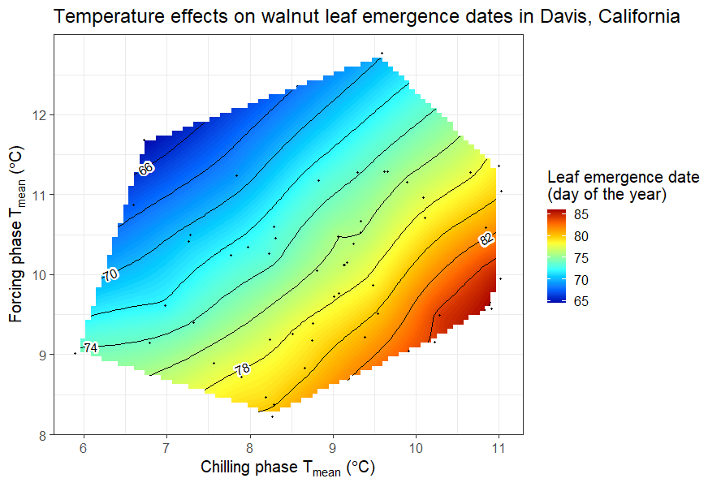
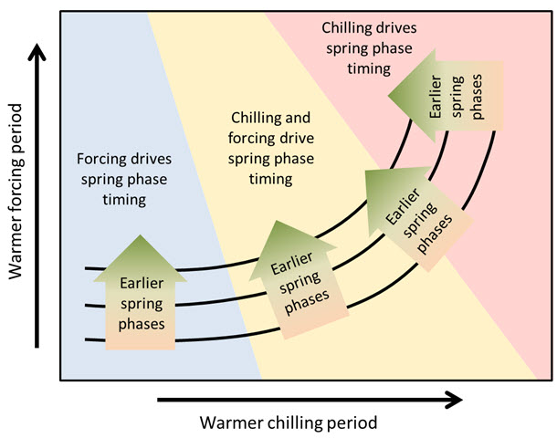

## Chilling vs. forcing temperatures

In the last chapter, the mean temperatures during the chilling and forcing phases were analyzed in relation to the bloom dates of ‘Alexander Lucas’ pears.

A similar analysis was conducted for the leaf emergence dates of the walnut cultivar ‘Payne’ in Davis, California.

Detecting a clear pattern for pears in Klein-Altendorf was challenging, but the walnut analysis revealed that early leaf emergence occurred with cool endodormancy and warm ecodormancy. This aligns with the idea that dormancy is shortened by abundant chill in endodormancy and heat in ecodormancy. Given previous insights on temperature-chill relationships, the observed temperature response curve is expected. To explore different climates, various similar analyses have been conducted, starting with chestnuts in Beijing:

**](images/Rainbow_chestnuts.jpg)

The following plot illustrates the results for cherries in Klein-Altendorf:

**](images/Rainbow_cherries_Klein-Altendorf.jpg)

The following figure presents the results for apricots in the UK:

**](images/Rainbow_apricots_UK.jpg)

## Patterns in temperature responses

The general color scheme remains consistent across the plots, with a tendency for the earliest dates to appear in the upper left corner and the latest in the bottom right. However, variations exist, particularly in the slope of the color gradient. While these differences may not be immediately obvious in the previous plots, they become clearer when examining data across a climatic gradient. To investigate tree phenology responses to temperature variations, apricot bloom data from five locations across China were compared.

**](images/map_China.jpg)

The following visualization shows the distinct winter temperature variations across these five locations:

**](images/temperatures_China.jpg)

Phenology data for each location were obtained from the Chinese Phenology database, and similar analyses were conducted as before. However, since different apricot cultivars were used, this introduces a potential source of error. To simplify visualization, the full color surfaces for all five locations are not displayed in a single figure; instead, the following plot presents only the contour lines:

**](images/contours_China.jpg)

As temperature increases, the contour lines become steeper. In Jiamusi, the coldest location, the lines are nearly horizontal, while in Guiyang, the warmest site, they appear more diagonal. The other locations follow a gradient between these extremes, with progressively steeper slopes.

This pattern suggests a possible general trend in the temperature response of temperate trees. The following figure illustrates this temperature response hypothesis, originally presented in grayscale by Guo et al. [(2015a)](Responses%20of%20spring%20phenology%20in%20temperate%20zone%20trees%20to%20climate%20warming:%20A%20case%20study%20of%20apricot%20flowering%20in%20China%20-%20ScienceDirect):

According to this hypothesis, trees in cold-winter climates primarily respond to temperatures during ecodormancy, as chill accumulation is typically sufficient, making temperature variations during this period negligible. This could explain the difficulty in clearly defining the chilling period in colder regions.

As endodormancy temperatures rise, chill accumulation begins to have an effect. In the yellow region of the diagram, contour lines start bending upward, indicating that warmer chilling periods now delay bud development, though forcing temperatures still play a dominant role. This delaying effect strengthens as temperatures continue to increase.

At a certain threshold, chill accumulation conditions become the primary driver, potentially leading to stagnation or even delays in budbreak rather than earlier phenology.

This remains a hypothesis, requiring further testing. Additional support comes from an analysis of ‘Fuji’ apples at four locations in Shaanxi Province, China. While the temperature gradient here is less pronounced than in the apricot study, there is still variation, and importantly, the same apple cultivar was examined across all four locations.

**](images/temps_Shaanxi.jpg)

Mean temperatures during the chilling season varied from 2.6°C to 6.0°C, with an overall range of approximately 1°C to 7°C. Contour analysis results suggest that these temperature differences significantly influenced the bloom date response to both chilling and forcing conditions.

**](images/Shaanxi_contours.jpg)

A winter visit to Yan’an, the coldest location, confirmed the extremely low temperatures there. This is reflected in the diagram, where the contour lines remain nearly horizontal. In contrast, warmer sites, particularly Liquan, exhibit a different pattern, with high temperatures during endodormancy causing a noticeable delay in bloom.

## The warm end of the spectrum

All the temperature response curves examined so far, including those from the full temperature gradient in China, have featured relatively cool conditions. These locations fit well within the proposed temperature response hypothesis. However, the most critical predictions concern the warmest temperature extremes, where a net delay in spring phenology is expected with increasing temperatures.

Delayed phenology is rarely discussed in the scientific literature, where the prevailing expectation is a continuous advancement of bloom and leaf emergence. Interestingly, even key references on phenology advances, such as Parmesan & Yohe [(2003)](A%20globally%20coherent%20fingerprint%20of%20climate%20change%20impacts%20across%20natural%20systems%20%7C%20Nature) include occasional records suggesting the opposite trend. While these could be measurement errors, they might also indicate an underlying phenomenon.

Testing the warm end of the hypothetical temperature response curve requires phenology data from a very warm region. However, such locations rarely cultivate temperate fruit trees. An exception emerged in 2015 when [Haïfa Benmoussa](‪Haïfa%20Benmoussa‬%20-%20‪Google%20Scholar‬)from Tunisia, working with long-term phenology records for her PhD, provided data from a particularly warm growing region. Some of her results have been presented in earlier chapters, but the most intriguing aspect was the opportunity to analyze contour lines for trees in these warm conditions, potentially validating the temperature response hypothesis.

The following figure presents the findings for almonds grown in Central Tunisia:

**](images/rainbow_local_almonds.jpg)

The almonds in this study are local cultivars, likely well adapted to the region’s warm temperature conditions. To further explore the effects of temperature, the analysis also includes ‘foreign’ cultivars imported from cooler climates.

%20in%20warming%20Mediterranean%20orchards%20-%20ScienceDirect)**](images/rainbow_foreign_almonds.jpg)

The predicted vertical contour lines are clearly visible in this analysis, aligning with the temperature response hypothesis. However, this does not constitute definitive proof. In science, unlike in mathematics, hypotheses can only be supported or rejected, not conclusively proven. To confidently establish this temperature response pattern, further evidence is needed from a wider range of species and locations—offering many opportunities for further research.

## Implications of our hypothesis

If the temperature response hypothesis is correct, phenology dynamics may not consistently align with the expectation of ever-advancing bloom and leaf emergence. Instead, strong advances should occur up to a certain threshold, beyond which further warming could lead to a slowdown. Eventually, phenology may stagnate, and with continued warming, noticeable delays could emerge. While some studies hint at this pattern, systematic research on the subject remains limited, presenting further opportunities for investigation.

## `Exercises` on the relative importance of chill and heat

1.  Describe the temperature response hypothesis outlined in this chapter.

The temperature response hypothesis suggests that the impact of temperature on tree phenology is not linear but follows a distinct pattern depending on climate conditions:

1.  **Cold-Winter Climates**: In regions with cold winters, tree phenology is primarily influenced by temperatures during ecodormancy, when buds respond to heat. Chill accumulation is usually sufficient, and temperature variations during this period have little effect.

2.  **Moderate Warming**: As winter temperatures rise, chill accumulation starts to play a more significant role. Warmer chilling periods begin to delay phenology, though forcing temperatures still have the dominant influence. This transition is reflected in contour lines that bend upward in temperature response diagrams.

3.  **Excessive Warming** – At higher temperatures, chill accumulation becomes the primary limiting factor. The usual expectation of advancing phenology with warming no longer holds. Instead, first stagnation and eventually delays in bloom and leaf emergence may occur, as seen in warmer study locations.
