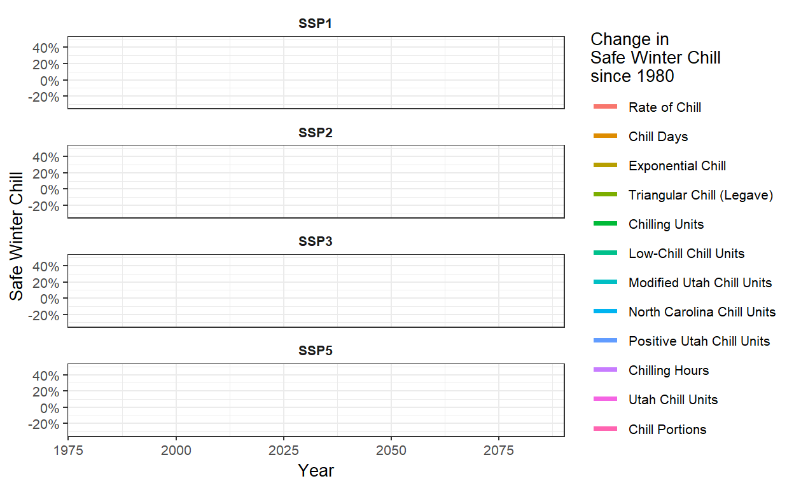
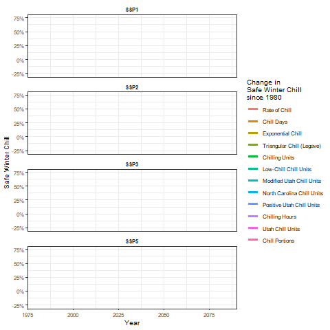

## Safe Winter Chill

Safe Winter Chill refers to the 10th percentile of chill distributions, representing the amount of chill exceeded in 90% of years. For growers, it provides a reliable chill requirement that is likely to be met in the majority of years. For instance, if a plant needs 800 Chill Hours, the Safe Winter Chill indicates that in 90% of years, enough chill will accumulate to break dormancy and trigger spring growth.

This concept is particularly useful for considering long-term trends and climate variability. It focuses on the chill that is consistently met across most years, eliminating the need to account for extreme years or outliers, offering a more dependable measure of how a plant will perform under typical conditions.

## Chill metrics

One common method to visualize Safe Winter Chill is through heat maps. These maps allow for easy comparison of different chill models and how chill conditions fluctuate across years and regions. Heat maps provide a clear visual representation of which years meet the chill requirements and which do not, helping track long-term trends.

A set of 13 chill metrics, compiled by Eduardo Fernandez [(2020)](https://www.sciencedirect.com/science/article/abs/pii/S1161030120301106), is used to measure the cold accumulation required by plants. These metrics include various models for measuring chill, each designed to capture different aspects of cold exposure. A well-known tool for working with these metrics is the `dormancyR` package, available on GitHub.

```{r, echo=FALSE, message=FALSE}
library(chillR)
library(dormancyR)
library(tidyverse)
library(colorRamps)
library(kableExtra)
library(patchwork)
library(gganimate)
library(gifski)
library(png)
library(transformr)

SSPs <- c("ssp126", "ssp245", "ssp370", "ssp585")
Times <- c(2050, 2085)
```

```{r}
hourly_models <- list(Chilling_units = chilling_units,
     Low_chill = low_chill_model,
     Modified_Utah = modified_utah_model,
     North_Carolina = north_carolina_model,
     Positive_Utah = positive_utah_model,
     Chilling_Hours = Chilling_Hours,
     Utah_Chill_Units = Utah_Model,
     Chill_Portions = Dynamic_Model)

daily_models <- list(Rate_of_Chill = rate_of_chill,
                     Chill_Days = chill_days,
                     Exponential_Chill = exponential_chill,
                     # Triangular_Chill_Haninnen = triangular_chill_1,
                     Triangular_Chill_Legave = triangular_chill_2)

metrics <- c(names(daily_models),
             names(hourly_models))

model_labels = c("Rate of Chill",
                 "Chill Days",
                 "Exponential Chill",
                 # "Triangular Chill (Häninnen)",
                 "Triangular Chill (Legave)",
                 "Chilling Units",
                 "Low-Chill Chill Units",
                 "Modified Utah Chill Units",
                 "North Carolina Chill Units",
                 "Positive Utah Chill Units",
                 "Chilling Hours",
                 "Utah Chill Units",
                 "Chill Portions")
```

```{r, eval = FALSE}
data.frame(Metric = model_labels, 'Function name' = metrics)
```

```{r, echo=FALSE}
kable(data.frame(Metric = model_labels, 'Function name' = metrics), align = c("c")) %>%
  kable_styling("striped", 
                position = "center", 
                font_size = 14) 

```

The next step involves applying all the chill models to the observed temperature record, as well as to historical and future temperature scenarios for Bonn. Since the temperature data has already been saved, there is no need to repeat the time-intensive processes of weather generation and climate data downloading. Instead, the data can simply be loaded. The past temperature data is loaded first, while future scenarios will be processed later using a loop.

```{r, eval=FALSE}
Bonn_temps <- read_tab("data/Bonn_temps.csv")

Temps <- load_temperature_scenarios("data",
                                    "Bonn_hist_scenarios")
```

The chill models can now be applied. Some models require hourly temperature data, while others use daily data. Eduardo developed the `tempResponse_list_daily` function to apply similar procedures to daily data. Unlike the `tempResponse_daily_list` function from `chillR`, it doesn’t have a misstolerance parameter, so years with incomplete winter seasons must be manually excluded.

```{r, eval=FALSE}
Start_JDay <- 305
End_JDay <- 59

daily_models_past_scenarios <-
  tempResponse_list_daily(Temps,
                          Start_JDay = Start_JDay,
                          End_JDay = End_JDay,
                          models=daily_models)

daily_models_past_scenarios <- lapply(
  daily_models_past_scenarios,
  function(x) x[which(x$Perc_complete>90),])

hourly_models_past_scenarios<-
  tempResponse_daily_list(Temps,
                          latitude = 50.866,
                          Start_JDay = Start_JDay,
                          End_JDay = End_JDay,
                          models = hourly_models,
                          misstolerance = 10)

past_scenarios <- daily_models_past_scenarios


past_scenarios <- lapply(
  names(past_scenarios),
  function(x)
    cbind(past_scenarios[[x]],
          hourly_models_past_scenarios[[x]][,names(hourly_models)]))

names(past_scenarios) <- names(daily_models_past_scenarios)

daily_models_observed <-
  tempResponse_daily(Bonn_temps,
                     Start_JDay = Start_JDay,
                     End_JDay = End_JDay,
                     models = daily_models)


daily_models_observed <-
  daily_models_observed[which(daily_models_observed$Perc_complete>90),]

hourly_models_observed <-
  tempResponse_daily_list(Bonn_temps,
                          latitude= 50.866,
                          Start_JDay = Start_JDay,
                          End_JDay = End_JDay,
                          models = hourly_models,
                          misstolerance = 10)

past_observed <- cbind(
  daily_models_observed,
  hourly_models_observed[[1]][,names(hourly_models)])

save_temperature_scenarios(past_scenarios,
                           "data/future_climate",
                           "Bonn_multichill_305_59_historic")
write.csv(past_observed,
          "data/future_climate/Bonn_multichill_305_59_observed.csv",
          row.names=FALSE)
```

The same procedures are now applied to the future data. Given the presence of eight scenarios, it is efficient to implement this process within a loop.

```{r, eval=FALSE}
SSPs <- c("ssp126", "ssp245", "ssp370", "ssp585")
Times <- c(2050, 2085)


list_ssp <-
  strsplit(names(future_temps), '\\.') %>%
  map(2) %>%
  unlist()

list_gcm <-
  strsplit(names(future_temps), '\\.') %>%
  map(3) %>%
  unlist()

list_time <-
  strsplit(names(future_temps), '\\.') %>%
  map(4) %>%
  unlist()

for(SSP in SSPs)
  for(Time in Times)
  {
    Temps <- future_temps[list_ssp == SSP & list_time == Time]
    names(Temps) <- list_gcm[list_ssp == SSP & list_time == Time]
    daily_models_future_scenarios <- tempResponse_list_daily(
      Temps,
      Start_JDay = Start_JDay,
      End_JDay = End_JDay,
      models = daily_models)
    daily_models_future_scenarios<-lapply(
      daily_models_future_scenarios,
      function(x) x[which(x$Perc_complete>90),])
    hourly_models_future_scenarios<-
      tempResponse_daily_list(
        Temps,
        latitude = 50.866,
        Start_JDay = Start_JDay,
        End_JDay = End_JDay,
        models=hourly_models,
        misstolerance = 10)
    
    future_scenarios <- daily_models_future_scenarios
    
    future_scenarios <- lapply(
      names(future_scenarios),
      function(x)
        cbind(future_scenarios[[x]],
              hourly_models_future_scenarios[[x]][,names(hourly_models)]))
    names(future_scenarios)<-names(daily_models_future_scenarios)
    
    chill<-future_scenarios
    
    save_temperature_scenarios(
      chill,
      "data/future_climate",
      paste0("Bonn_multichill_305_59_",Time,"_",SSP))
  }

```

All the scenarios for processing and plotting have now been saved to disk. The next step is to load these scenarios and generate the corresponding chill projections.

```{r}
chill_past_scenarios <- load_temperature_scenarios(
  "data/future_climate",
  "Bonn_multichill_305_59_historic")

chill_observed <- 
  read_tab("data/future_climate/Bonn_multichill_305_59_observed.csv")


chills <- make_climate_scenario(chill_past_scenarios,
                                caption = "Historic",
                                historic_data = chill_observed,
                                time_series = TRUE)

for(SSP in SSPs)
  for(Time in Times)
  {
    chill <- load_temperature_scenarios(
      "data/future_climate",
      paste0("Bonn_multichill_305_59_",Time,"_",SSP))
    if(SSP == "ssp126") SSPcaption <- "SSP1"
    if(SSP == "ssp245") SSPcaption <- "SSP2"
    if(SSP == "ssp370") SSPcaption <- "SSP3"    
    if(SSP == "ssp585") SSPcaption <- "SSP5"    
    if(Time == "2050") Time_caption <- "2050"
    if(Time == "2085") Time_caption <- "2085"
    chills <- make_climate_scenario(chill,
                                    caption = c(SSPcaption,
                                                Time_caption),
                                    add_to = chills)
  }
```

To visualize Safe Winter Chill, a heatmap will be created using `ggplot2` functions. This involves reshaping the data into a long-format `data.frame`. The 10% quantiles are also calculated from the distributions. Since the chill models use different units and have varying numeric values, all results are normalized by expressing them as changes relative to a 1980 baseline.

```{r}
for(i in 1:length(chills))
   {ch <- chills[[i]]
   if(ch$caption[1] == "Historic")
     {GCMs <- rep("none",length(names(ch$data)))
      SSPs <- rep("none",length(names(ch$data)))
      Years <- as.numeric(ch$labels)
      Scenario <- rep("Historic",
                      length(names(ch$data)))} else
                        {GCMs <- names(ch$data)
                        SSPs <- rep(ch$caption[1],
                                    length(names(ch$data)))
                        Years <- rep(as.numeric(ch$caption[2]),
                                     length(names(ch$data)))
                        Scenario <- rep("Future",
                                        length(names(ch$data)))}
   for(nam in names(ch$data))
     {for(met in metrics)
       {temp_res <-
         data.frame(Metric = met,
                    GCM = GCMs[which(nam == names(ch$data))],
                    SSP = SSPs[which(nam == names(ch$data))],
                    Year = Years[which(nam == names(ch$data))],
                    Result = quantile(ch$data[[nam]][,met],0.1), 
                    Scenario = Scenario[which(nam == names(ch$data))])
       if(i == 1 & nam == names(ch$data)[1] & met == metrics[1])
         results <- temp_res else
           results <- rbind(results,
                            temp_res)
         }
     }
   }

for(met in metrics)
  results[which(results$Metric == met),"SWC"] <-
    results[which(results$Metric == met),"Result"]/
      results[which(results$Metric == met & results$Year == 1980),
              "Result"]-1
```

The results are now ready for plotting. To ensure consistency across the plot’s panels, the full range of Safe Winter Chill change values must be captured. Once the range is established, the first heatmap plot can be created, focusing on future scenarios (excluding cases where the GCM is set to "none"). In the plot aesthetics, the `factor` function is used for the y-axis to ensure the metrics are displayed in the order specified by the `levels` parameter.

```{r}
rng = range(results$SWC)

p_future <- ggplot(results[which(!results$GCM == "none"),],
                   aes(GCM,
                       y = factor(Metric,
                                  levels = metrics),
                       fill = SWC)) +
  geom_tile()

p_future
```

The current plot combines data for both SSPs and time points. To improve clarity, these aspects can be displayed in separate facets, allowing for a more detailed visualization.

```{r}
p_future <-
  p_future +
  facet_grid(SSP ~ Year) 

p_future
```

The design work begins by selecting a black-and-white color scheme and reducing the size of the axis text. This is done to accommodate the large amount of text on the axes, which would be difficult to display at full size.

```{r}
p_future <-
  p_future +
  theme_bw(base_size = 15) +
  theme(axis.text = element_text(size=6))

p_future
```

The current color scheme makes it difficult to distinguish subtle differences, so a red-to-blue color ramp will be used instead, with several intermediate values. The `colorRamps` library offers a variety of attractive schemes, including the `matlab.like` color ramp, from which 15 equally spaced values will be selected. The changes will be displayed in percentage terms, and the scale limits will be set to the full range of the data determined earlier.

```{r}
p_future <-
  p_future +
  scale_fill_gradientn(colours = matlab.like(15),
                       labels = scales::percent,
                       limits = rng)

p_future
```

A few additional cosmetic adjustments are needed. The angle of the x-axis labels will be changed to 75° to improve readability. A more descriptive title will be added to the legend (with `\n` for line breaks). The automatic axis labels will be replaced with the customized labels designed earlier, and the y-axis label will be updated to "Chill metric" for clarity.

```{r}
p_future <-
  p_future  +
  theme(axis.text.x = element_text(angle = 75, 
                                   hjust = 1,
                                   vjust = 1)) +
  labs(fill = "Change in\nSafe Winter Chill\nsince 1980") +
  scale_y_discrete(labels = model_labels) +
  ylab("Chill metric")

p_future
```

The plot for the past scenarios can now be created. The procedure is mostly the same as for the future scenarios, so the details will not be repeated. One key difference is that the x-axis will be moved to the top using the `scale_x_continuous(position = "top")` command.

```{r}
p_past<-
  ggplot(results[which(results$GCM == "none"),],
         aes(Year,
             y = factor(Metric, 
                        levels=metrics),
             fill = SWC)) +
  geom_tile()

p_past<-
  p_past +
  theme_bw(base_size = 15) +
  theme(axis.text = element_text(size = 6))

p_past<-
  p_past +
  scale_fill_gradientn(colours = matlab.like(15),
                       labels = scales::percent,
                       limits = rng)

p_past<-
  p_past +
  scale_x_continuous(position = "top") 

p_past<-
  p_past +
  labs(fill = "Change in\nSafe Winter Chill\nsince 1980") +
  scale_y_discrete(labels = model_labels) +
  ylab("Chill metric")

p_past
```

The plots can now be combined using the `patchwork` package. The layout differs slightly from before, with the plots stacked vertically (`nrow = 2`), and relative heights specified by `heights = c(1,2)`. Changes to the facet strip are applied at this stage. This is convenient because it allows the adjustment to be made once, rather than for each subplot individually.

```{r}
chill_comp_plot<-
  (p_past +
     p_future +
     plot_layout(guides = "collect",
                 nrow = 2,
                 heights = c(1,3))) &
  theme(legend.position = "right",
        strip.background = element_blank(),
        strip.text = element_text(face = "bold"))

chill_comp_plot
```

This is the final result. Notable differences in the behavior of the various models can be observed. Some models suggest that Safe Winter Chill is increasing, while others indicate a decrease. This highlights the importance of model choice in the analysis.

## An animated plot of relative changes in Safe Winter Chill

Finally, the `gganimate` package will be explored to add an interesting feature to the figures created with `ggplot2`. To use this, a simpler representation of the Safe Winter Chill data will be produced by summarizing the results across all GCMs. Additionally, the historical data will be duplicated, with one copy assigned to each SSP scenario. This is necessary for easily plotting the full time series, broken down by SSP.

```{r}
hist_results <- results[which(results$GCM == "none"),]
hist_results$SSP <- "SSP1"
hist_results_2 <- hist_results
hist_results_2$SSP <- "SSP2"
hist_results_3 <- hist_results
hist_results_3$SSP <- "SSP3"
hist_results_4 <- hist_results
hist_results_4$SSP <- "SSP5"
hist_results <- rbind(hist_results,
                      hist_results_2,
                      hist_results_3,
                      hist_results_4)

future_results <- results[which(!results$GCM == "none"),]

GCM_aggregate <- aggregate(
  future_results$SWC,
  by=list(future_results$Metric,
          future_results$SSP,
          future_results$Year),
  FUN=mean)

colnames(GCM_aggregate) <- c("Metric",
                             "SSP",
                             "Year",
                             "SWC")

SSP_Time_series<-rbind(hist_results[,c("Metric",
                                       "SSP",
                                       "Year",
                                       "SWC")],
                       GCM_aggregate)
```

The next step is to create a line plot showing changes in Safe Winter Chill over the two SSP scenarios for all chill metrics. This procedure closely follows the previous steps, with the main difference being the use of the `geom_line` command instead of `geom_tile`. There are also a few other minor adjustments.

```{r}
SSP_Time_series$Year <- as.numeric(SSP_Time_series$Year)

chill_change_plot<-
  ggplot(data = SSP_Time_series,
         aes(x = Year,
             y = SWC,
             col = factor(Metric,
                          levels = metrics))) +
  geom_line(lwd = 1.3) +
  facet_wrap(~SSP,
             nrow = 4) +
  theme_bw(base_size = 10) +
  labs(col = "Change in\nSafe Winter Chill\nsince 1980") +
  scale_color_discrete(labels = model_labels) +
  scale_y_continuous(labels = scales::percent) +
  theme(strip.background = element_blank(),
        strip.text = element_text(face = "bold")) +
  ylab("Safe Winter Chill")

chill_change_plot
```

As the final step, the plot will be converted into a moving picture using the `transition_reveal` function from the `gganimate` package. The resulting animation will then be saved.

```{r,eval=FALSE}
ccp <-chill_change_plot +
  transition_reveal(Year)

animate(ccp, fps = 10)

anim_save("data/chill_comparison_animation.gif",
          animation = last_animation())
```



The animation illustrates the development of chill over time, relative to the 1980 baseline, and evaluated using 13 chill models.

## `Exercises` on chill model comparison

1.  Perform a similar analysis for the location you’ve chosen for your exercises.

```{r, eval=FALSE}
# Load temperature data for Yakima
Yakima_temps <- read_tab("Yakima/Yakima_temps.csv")

Temps <- load_temperature_scenarios("Yakima",
                                    "Yakima_hist_scenarios")
```

```{r, eval=FALSE}
# Remove all years with incomplete winter seasons in past scenarios 
Start_JDay <- 305
End_JDay <- 59

daily_models_past_scenarios <-
  tempResponse_list_daily(Temps,
                          Start_JDay = Start_JDay,
                          End_JDay = End_JDay,
                          models=daily_models)

daily_models_past_scenarios <- lapply(
  daily_models_past_scenarios,
  function(x) x[which(x$Perc_complete>90),])

hourly_models_past_scenarios<-
  tempResponse_daily_list(Temps,
                          latitude = 46.6,
                          Start_JDay = Start_JDay,
                          End_JDay = End_JDay,
                          models = hourly_models,
                          misstolerance = 10)

past_scenarios <- daily_models_past_scenarios


past_scenarios <- lapply(
  names(past_scenarios),
  function(x)
    cbind(past_scenarios[[x]],
          hourly_models_past_scenarios[[x]][,names(hourly_models)]))

names(past_scenarios) <- names(daily_models_past_scenarios)

daily_models_observed <-
  tempResponse_daily(Yakima_temps,
                     Start_JDay = Start_JDay,
                     End_JDay = End_JDay,
                     models = daily_models)


daily_models_observed <-
  daily_models_observed[which(daily_models_observed$Perc_complete>90),]

hourly_models_observed <-
  tempResponse_daily_list(Yakima_temps,
                          latitude= 46.6,
                          Start_JDay = Start_JDay,
                          End_JDay = End_JDay,
                          models = hourly_models,
                          misstolerance = 10)

past_observed <- cbind(
  daily_models_observed,
  hourly_models_observed[[1]][,names(hourly_models)])

save_temperature_scenarios(past_scenarios,
                           "Yakima/future_climate",
                           "Yakima_multichill_305_59_historic")
write.csv(past_observed,
          "Yakima/future_climate/Yakima_multichill_305_59_observed.csv",
          row.names=FALSE)
```

```{r, eval=FALSE}
# Applying the same procedures to the future data
SSPs <- c("ssp126", "ssp245","ssp370", "ssp585")
Times <- c(2050, 2085)


list_ssp <- 
  strsplit(names(chill_future_scenario_list), '\\.') %>%
  map(2) %>%
  unlist()

list_gcm <-
  strsplit(names(chill_future_scenario_list), '\\.') %>%
  map(3) %>%
  unlist()

list_time <-
  strsplit(names(chill_future_scenario_list), '\\.') %>%
  map(4) %>%
  unlist()


future_temps <- load_temperature_scenarios("Yakima/future_climate","Yakima_futuretemps")


for(SSP in SSPs)
  for(Time in Times)
    {
    Temps <- future_temps[list_ssp == SSP & list_time == Time]
    names(Temps) <- list_gcm[list_ssp == SSP & list_time == Time]
    daily_models_future_scenarios <- tempResponse_list_daily(
      Temps,
      Start_JDay = Start_JDay,
      End_JDay = End_JDay,
      models = daily_models)
    daily_models_future_scenarios<-lapply(
      daily_models_future_scenarios,
      function(x) x[which(x$Perc_complete>90),])
    hourly_models_future_scenarios<-
      tempResponse_daily_list(
        Temps,
        latitude = 50.866,
        Start_JDay = Start_JDay,
        End_JDay = End_JDay,
        models=hourly_models,
        misstolerance = 10)

    future_scenarios <- daily_models_future_scenarios
    
    future_scenarios <- lapply(
      names(future_scenarios),
      function(x)
        cbind(future_scenarios[[x]],
              hourly_models_future_scenarios[[x]][,names(hourly_models)]))
    names(future_scenarios)<-names(daily_models_future_scenarios)
    
    chill<-future_scenarios
    
    save_temperature_scenarios(
      chill,
      "Yakima/future_climate",
      paste0("Yakima_multichill_305_59_",Time,"_",SSP))
}
```

```{r, eval=FALSE}
# Load all scenarios and produce chill scenarios 
chill_past_scenarios <- load_temperature_scenarios(
  "Yakima/future_climate",
  "Yakima_multichill_305_59_historic")

chill_observed <- 
  read_tab("Yakima/future_climate/Yakima_multichill_305_59_observed.csv")


chills <- make_climate_scenario(chill_past_scenarios,
                                caption = "Historic",
                                historic_data = chill_observed,
                                time_series = TRUE)
```

```{r, eval=FALSE}
for(SSP in SSPs)
  for(Time in Times)
    {
    chill <- load_temperature_scenarios(
      "Yakima/future_climate",
      paste0("Yakima_multichill_305_59_",Time,"_",SSP))
    if(SSP == "ssp126") SSPcaption <- "SSP1"
    if(SSP == "ssp245") SSPcaption <- "SSP2"
    if(SSP == "ssp370") SSPcaption <- "SSP3"
    if(SSP == "ssp585") SSPcaption <- "SSP5"    
    if(Time == "2050") Time_caption <- "2050"
    if(Time == "2085") Time_caption <- "2085"
    chills <- make_climate_scenario(chill,
                                    caption = c(SSPcaption,
                                                Time_caption),
                                    add_to = chills)
}
```

```{r, eval=FALSE}
# Reorganize the data into a long data.frame and normalize all results 
for(i in 1:length(chills))
   {ch <- chills[[i]]
   if(ch$caption[1] == "Historic")
     {GCMs <- rep("none",length(names(ch$data)))
      SSPs <- rep("none",length(names(ch$data)))
      Years <- as.numeric(ch$labels)
      Scenario <- rep("Historic",
                      length(names(ch$data)))} else
                        {GCMs <- names(ch$data)
                        SSPs <- rep(ch$caption[1],
                                    length(names(ch$data)))
                        Years <- rep(as.numeric(ch$caption[2]),
                                     length(names(ch$data)))
                        Scenario <- rep("Future",
                                        length(names(ch$data)))}
   for(nam in names(ch$data))
     {for(met in metrics)
       {temp_res <-
         data.frame(Metric = met,
                    GCM = GCMs[which(nam == names(ch$data))],
                    SSP = SSPs[which(nam == names(ch$data))],
                    Year = Years[which(nam == names(ch$data))],
                    Result = quantile(ch$data[[nam]][,met],0.1), 
                    Scenario = Scenario[which(nam == names(ch$data))])
       if(i == 1 & nam == names(ch$data)[1] & met == metrics[1])
         results <- temp_res else
           results <- rbind(results,
                            temp_res)
         }
     }
   }

for(met in metrics)
  results[which(results$Metric == met),"SWC"] <-
    results[which(results$Metric == met),"Result"]/
      results[which(results$Metric == met & results$Year == 1980),
              "Result"]-1
```

2.  Make a heat map illustrating past and future changes in Safe Winter Chill, relative to a past scenario, for the 13 chill models used here.

```{r, eval=FALSE}
# Plot future changes in Safe Winter Chill
rng <- range(results$SWC)

p_future <- ggplot(results[results$GCM != "none", ], 
                   aes(x = GCM, 
                       y = factor(Metric, levels = metrics), 
                       fill = SWC)) +
  geom_tile() +
  facet_grid(SSP ~ Year) +
  theme_bw(base_size = 15) +
  theme(axis.text = element_text(size = 6),
        axis.text.x = element_text(angle = 75, hjust = 1, vjust = 1)) +
  scale_fill_gradientn(colours = matlab.like(15), 
                       labels = scales::percent, 
                       limits = rng) +
  labs(fill = "Change in\nSafe Winter Chill\nsince 1980", 
       y = "Chill metric") +
  scale_y_discrete(labels = model_labels)

p_future
```

```{r, echo=FALSE}
load("p_future.RData")
print(p_future)
```

```{r, eval=FALSE}
# Plot past changes in Safe Winter Chill  
p_past <- ggplot(results[results$GCM == "none", ], 
                 aes(x = Year, 
                     y = factor(Metric, levels = metrics), 
                     fill = SWC)) +
  geom_tile() +
  theme_bw(base_size = 15) +
  theme(axis.text = element_text(size = 6)) +
  scale_fill_gradientn(colours = matlab.like(15), 
                       labels = scales::percent, 
                       limits = rng) +
  scale_x_continuous(position = "top") +
  labs(fill = "Change in\nSafe Winter Chill\nsince 1980", 
       y = "Chill metric") +
  scale_y_discrete(labels = model_labels)

p_past
```

```{r, echo=FALSE}
load("p_past.RData")
print(p_past)
```

```{r, eval=FALSE}
# Plot heat map with past and future changes in Safe Winter Chill
chill_comp_plot<-
  (p_past +
     p_future +
     plot_layout(guides = "collect",
                 nrow = 2,
                 heights = c(1,3))) &
  theme(legend.position = "right",
        strip.background = element_blank(),
        strip.text = element_text(face = "bold"))

chill_comp_plot
```

```{r, echo=FALSE}
load("chill_comp_plot.RData")
print(chill_comp_plot)
```

3.  Produce an animated line plot of your results (summarizing Safe Winter Chill across all the GCMs).

```{r, eval=FALSE}
hist_results <- results[which(results$GCM == "none"),]
hist_results$SSP <- "SSP1"
hist_results_2 <- hist_results
hist_results_2$SSP <- "SSP2"
hist_results_3 <- hist_results
hist_results_3$SSP <- "SSP3"
hist_results_4 <- hist_results
hist_results_4$SSP <- "SSP5"
hist_results <- rbind(hist_results,
                      hist_results_2,
                      hist_results_3,
                      hist_results_4)

future_results <- results[which(!results$GCM == "none"),]

GCM_aggregate <- aggregate(
  future_results$SWC,
  by=list(future_results$Metric,
          future_results$SSP,
          future_results$Year),
  FUN=mean)

colnames(GCM_aggregate) <- c("Metric",
                             "SSP",
                             "Year",
                             "SWC")

SSP_Time_series<-rbind(hist_results[,c("Metric",
                                       "SSP",
                                       "Year",
                                       "SWC")],
                       GCM_aggregate)
```

```{r, eval=FALSE}
SSP_Time_series$Year <- as.numeric(SSP_Time_series$Year)

chill_change_plot<-
  ggplot(data = SSP_Time_series,
         aes(x = Year,
             y = SWC,
             col = factor(Metric,
                          levels = metrics))) +
  geom_line(lwd = 1.3) +
  facet_wrap(~SSP,
             nrow = 4) +
  theme_bw(base_size = 10) +
  labs(col = "Change in\nSafe Winter Chill\nsince 1980") +
  scale_color_discrete(labels = model_labels) +
  scale_y_continuous(labels = scales::percent) +
  theme(strip.background = element_blank(),
        strip.text = element_text(face = "bold")) +
  ylab("Safe Winter Chill")
```

```{r, eval=FALSE}
ccp <-chill_change_plot +
  transition_reveal(Year)

animate(ccp, fps = 10)

anim_save("Yakima/chill_comparison_animation.gif",
          animation = last_animation())
```


