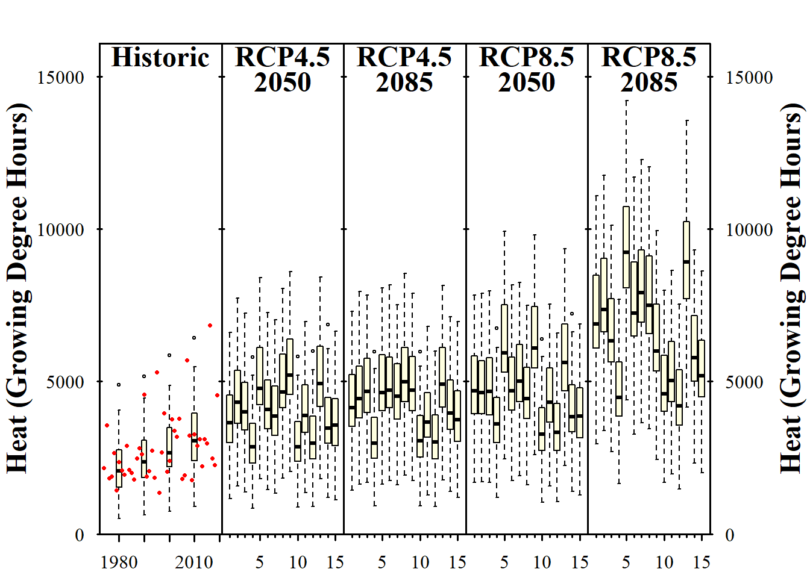
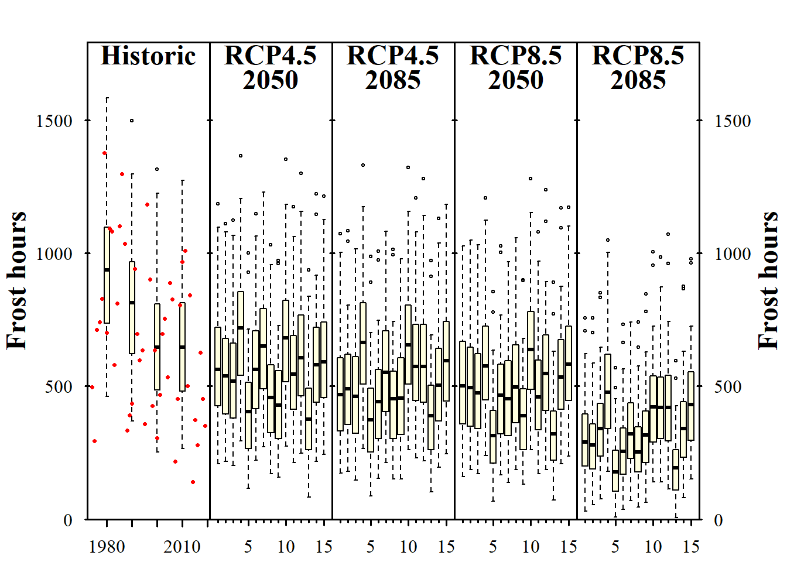

```{r load_packages_ClimateWizard, echo=FALSE, message=FALSE, warning=FALSE}
require(chillR)
require(kableExtra)
require(tidyverse)

Bonn_temps <- read_tab("data/Bonn_temps.csv")
chill_hist_scenario_list <- load_temperature_scenarios("data","Bonn_hist_chill_305_59")

```

## Using ClimateWizard

The `ClimateWizard` provides access to future climate data from CMIP5 models for the RCP 4.5 and RCP 8.5 scenarios. Since the service is occasionally unavailable, malfunctions may occur. The following example shows how to retrieve data for a specific area:

```{r, eval=FALSE}
getClimateWizardData(coordinates = c(longitude = 10.61, 
                                     latitude = 34.93),
                     scenario = "rcp45",
                     start_year = 2020,
                     end_year = 2050,
                     metric = c("CD18", "R02"),
                     GCMs = c("bcc-csm1-1", "BNU-ESM"))
```

This code retrieves data for two climate models, an RCP scenario, and two climate metrics: cooling degree days above 18°C ("CD18") and annual precipitation days over 0.2 mm/day ("R02").

## Adaptation for Bonn

Instead of the sample coordinates in Tunisia, data for Bonn should be used. All available climate models and both RCP scenarios (4.5 and 8.5) are considered. The focus is on minimum and maximum temperatures (`monthly_min_max_temps`). Since `ClimateWizard` cannot automatically download multiple scenarios, a loop is used:

```{r, eval=FALSE}
RCPs <- c("rcp45", 
          "rcp85")

Times <- c(2050, 
           2085)

for(RCP in RCPs)
  for(Time in Times) {
    clim_scen <- getClimateWizardData(
      coordinates = c(longitude = 7.143, 
                      latitude = 50.866),
      scenario = RCP,
      start_year = Time - 15,
      end_year = Time + 15,
      metric = "monthly_min_max_temps",
      GCMs = "all")
    save_temperature_scenarios(clim_scen, "data/ClimateWizard", paste0("Bonn_futures_", Time, "_", RCP))
  }
```

### Baseline Adjustment

The `ClimateWizard` database requires a 20-year baseline period between 1950 and 2005. Since weather data for Bonn is available from 1973 to 2019, the period 1975–2005 is chosen to allow a median year adjustment to 1990. This reflects current climate trends and meets database requirements.

Since the observed weather data require a median year adjustment to 1996, a correction is applied:

```{r, eval=FALSE}
scenario_1990 <- Bonn_temps %>% temperature_scenario_from_records(1990)
scenario_1996 <- Bonn_temps %>% temperature_scenario_from_records(1996)

adjustment_scenario <- temperature_scenario_baseline_adjustment(
  scenario_1996, 
  scenario_1990)
```

### Temperature Generation and Storage

To avoid repeated time-consuming data queries, the adjusted scenarios are saved.

```{r, eval=FALSE}
for(RCP in RCPs)
  for(Time in Times)
  {
    clim_scen <- load_ClimateWizard_scenarios(
      "data/climateWizard",
      paste0("Bonn_futures_",
             Time,
             "_",
             RCP))
    
    clim_scen_adjusted <-
      temperature_scenario_baseline_adjustment(
        baseline_temperature_scenario = adjustment_scenario,
        temperature_scenario = clim_scen)
    
    Temps <- temperature_generation(
      weather = Bonn_temps, 
      years = c(1973,
                2019),
      sim_years = c(2001,
                    2101),
      temperature_scenario = clim_scen_adjusted)
    
    save_temperature_scenarios(
      Temps,
      "data/Weather_ClimateWizard",
      paste0("Bonn_",
             Time,
             "_",
             RCP))
  }
```

### Creation of Historical Scenarios

For better analysis, historical temperature data for the years 1980, 1990, 2000, and 2010 are generated and stored:

```{r, eval=FALSE}
all_past_scenarios <- temperature_scenario_from_records(weather = Bonn_temps, 
                                                        year = c(1980, 
                                                                 1990, 
                                                                 2000, 
                                                                 2010))

adjusted_scenarios <- temperature_scenario_baseline_adjustment(
  baseline = scenario_1996, 
  temperature_scenario = all_past_scenarios)

all_past_scenario_temps <- temperature_generation(
  weather = Bonn_temps, 
  years = c(1973, 
            2019), 
  sim_years = c(2001, 
                2101), 
  temperature_scenario = adjusted_scenarios)

save_temperature_scenarios(all_past_scenario_temps, "data/Weather_ClimateWizard", "Bonn_historic")
```

### Modeling and Calculation of Chill, Heat, and Frost Scenarios

Three models are defined to calculate chill, heat, and frost hours:

```{r}
models <- list(Chill_Portions = Dynamic_Model, 
               GDH = GDH, 
               Frost_H = function(x) step_model(x, data.frame(lower=c(-1000,0),
                                                              upper=c(0,1000),
                                                              weight=c(1,0))))
```

The calculation is performed for future scenarios:

```{r, eval=FALSE}
chill_past_scenarios <- load_temperature_scenarios(
  "data/chill_ClimateWizard",
  "Bonn_historic")

chill_observed <- load_temperature_scenarios(
  "data/chill_ClimateWizard",
  "Bonn_observed")

chills <- make_climate_scenario(
  chill_past_scenarios,
  caption = "Historic",
  historic_data = chill_observed,
  time_series = TRUE)

for(RCP in RCPs)
  for(Time in Times)
    {
    chill <- load_temperature_scenarios(
      "data/chill_ClimateWizard",
      paste0("Bonn_",
             Time,
             "_",
             RCP))
    if(RCP == "rcp45") RCPcaption <- "RCP4.5"
    if(RCP == "rcp85") RCPcaption <- "RCP8.5"
    if(Time == "2050") Time_caption <- "2050"
    if(Time == "2085") Time_caption <- "2085"
    chills <- chill %>% 
      make_climate_scenario(
        caption = c(RCPcaption,
                    Time_caption),
        add_to = chills)
}
```

### Visualization of Results

The determined scenarios are displayed in graphs:

```{r, eval=FALSE}
info_chill <- 
  plot_climate_scenarios(climate_scenario_list = chills, 
                         metric = "Chill_Portions", 
                         metric_label = "Chill (Chill Portions)")
```


```{r, eval=FALSE}
info_heat <- 
  plot_climate_scenarios(climate_scenario_list = chills, 
                         metric = "GDH", 
                         metric_label = "Heat (Growing Degree Hours)")
```



```{r, eval=FALSE}
info_frost <- 
  plot_climate_scenarios(climate_scenario_list = chills, 
                         metric = "Frost_H", 
                         metric_label = "Frost hours")
```



## `Exercises` on generating CMIP5 temperature scenarios

1)  Analyze the historic and future impact of climate change on three agroclimatic metrics of your choice, for the location you've chosen for your earlier analyses.

```{r, include=FALSE}
Yakima_temps <- read_tab("Yakima/Yakima_temps.csv")
chill_hist_scenario_list <- load_temperature_scenarios("Yakima","Yakima_hist_chill_305_59")
```

```{r, eval=FALSE}
# Set baseline period and save temperature scenarios 
RCPs <- c("rcp45",
          "rcp85")
Times <- c(2050,
           2085)

for(RCP in RCPs)
  for(Time in Times)
  {start_year <- Time - 15
  end_year <- Time + 15
  clim_scen <-
    getClimateWizardData(
      c(longitude = -120.539,
        latitude = 46.569),
      RCP,
      start_year,
      end_year,
      temperature_generation_scenarios = TRUE,
      baseline =c(1975, 2005),
      metric = "monthly_min_max_temps",
      GCMs = "all")
  save_temperature_scenarios(clim_scen,
                             "Yakima/ClimateWizard",
                             paste0("Yakima_futures_",Time,"_",RCP))}
```

```{r}
# Baseline adjustment
scenario_1990 <- Yakima_temps %>%
  temperature_scenario_from_records(1990)
scenario_1998 <- Yakima_temps %>%
  temperature_scenario_from_records(1998)
adjustment_scenario <-
  temperature_scenario_baseline_adjustment(scenario_1998,
                                           scenario_1990)
```

```{r}
# Selecting RCPs and scenario years 
RCPs <- c("rcp45",
          "rcp85")
Times <- c(2050,
           2085)
```

```{r, eval=FALSE}
# Temperature generation for future scenarios 
for(RCP in RCPs)
  for(Time in Times)
  {
    clim_scen <- load_ClimateWizard_scenarios(
      "Yakima/climateWizard",
      paste0("Yakima_futures_",
             Time,
             "_",
             RCP))
    
    clim_scen_adjusted <-
      temperature_scenario_baseline_adjustment(
        baseline_temperature_scenario = adjustment_scenario,
        temperature_scenario = clim_scen)
    
    Temps <- temperature_generation(
      weather = Yakima_temps, 
      years = c(1973,
                2023),
      sim_years = c(2001,
                    2101),
      temperature_scenario = clim_scen_adjusted)
    
    save_temperature_scenarios(
      Temps,
      "Yakima/Weather_ClimateWizard",
      paste0("Yakima_",
             Time,
             "_",
             RCP))
  }
```

```{r, eval=FALSE}
# Adding historic scenarios 
all_past_scenarios <- temperature_scenario_from_records(
  weather = Yakima_temps,
  year = c(1980,
           1990,
           2000,
           2010))

adjusted_scenarios <- temperature_scenario_baseline_adjustment(
  baseline = scenario_1998,
  temperature_scenario = all_past_scenarios)

all_past_scenario_temps <- temperature_generation(
  weather = Yakima_temps,
  years = c(1973,
            2023),
  sim_years = c(2001,
                2101),
  temperature_scenario = adjusted_scenarios)

save_temperature_scenarios(
  all_past_scenario_temps,
  "Yakima/Weather_ClimateWizard",
  "Yakima_historic")
```

```{r}
# Selection of models 
models <- list(Chill_Portions = Dynamic_Model, 
               GDH = GDH, 
               Frost_H = function(x) step_model(x, data.frame(lower=c(-1000,0),
                                                              upper=c(0,1000),
                                                              weight=c(1,0))))
```

```{r, eval=FALSE}
# Apply the models to historic data 
Temps <- load_temperature_scenarios("Yakima/Weather_ClimateWizard",
                                    "Yakima_historic")

chill_past_scenarios <-
  Temps %>%
  tempResponse_daily_list(
    latitude = 46.569,
    Start_JDay = 305,
    End_JDay = 59,
    models = models,
    misstolerance = 10)

chill_observed <- 
  Yakima_temps %>%
  tempResponse_daily_list(
    latitude = 46.569,
    Start_JDay = 305,
    End_JDay = 59,
    models = models,
    misstolerance = 10)

save_temperature_scenarios(chill_past_scenarios,
                           "Yakima/chill_ClimateWizard",
                           "Yakima_historic")
save_temperature_scenarios(chill_observed,
                           "Yakima/chill_ClimateWizard",
                           "Yakima_observed")
```

```{r}
chill_past_scenarios <- load_temperature_scenarios(
  "Yakima/chill_ClimateWizard",
  "Yakima_historic")
chill_observed <- load_temperature_scenarios(
  "Yakima/chill_ClimateWizard",
  "Yakima_observed")

chills <- make_climate_scenario(
  chill_past_scenarios,
  caption = "Historic",
  historic_data = chill_observed,
  time_series = TRUE)

# Plot climate scenarios 
plot_climate_scenarios(
  climate_scenario_list = chills,
  metric = "Chill_Portions",
  metric_label = "Chill (Chill Portions)")
```

```{r, eval=FALSE}
# Add climate scenario to the chills object
for(RCP in RCPs)
  for(Time in Times)
    {
    Temps <- load_temperature_scenarios(
      "Yakima/Weather_ClimateWizard",
      paste0("Yakima_",
             Time,
             "_",
             RCP))
    chill <- Temps %>% 
      tempResponse_daily_list(
        latitude = 46.569,
        Start_JDay = 305,
        End_JDay = 59,
        models = models,
        misstolerance = 10)
    save_temperature_scenarios(
      chill,
      "Yakima/chill_ClimateWizard",
      paste0("Yakima_",
             Time,
             "_",
             RCP))
}
```

```{r}
for(RCP in RCPs)
  for(Time in Times)
    {
    chill <- load_temperature_scenarios(
      "Yakima/chill_ClimateWizard",
      paste0("Yakima_",
             Time,
             "_",
             RCP))
    if(RCP == "rcp45") RCPcaption <- "RCP4.5"
    if(RCP == "rcp85") RCPcaption <- "RCP8.5"
    if(Time == "2050") Time_caption <- "2050"
    if(Time == "2085") Time_caption <- "2085"
    chills <- chill %>% 
      make_climate_scenario(
        caption = c(RCPcaption,
                    Time_caption),
        add_to = chills)
}
```

```{r}
# Plot chill hours
info_chill <-
  plot_climate_scenarios(
    climate_scenario_list = chills,
    metric = "Chill_Portions",
    metric_label = "Chill (Chill Portions)",
    texcex = 1.5)
```

```{r}
# Plot Heat (Growing degree hours)
info_heat <-
  plot_climate_scenarios(
    climate_scenario_list = chills,
    metric = "GDH",
    metric_label = "Heat (Growing Degree Hours)",
    texcex = 1.5)
```

```{r}
# Plot frost hours
info_frost <- 
  plot_climate_scenarios(  
    climate_scenario_list=chills,
    metric="Frost_H",
    metric_label="Frost hours",
    texcex=1.5)
```
