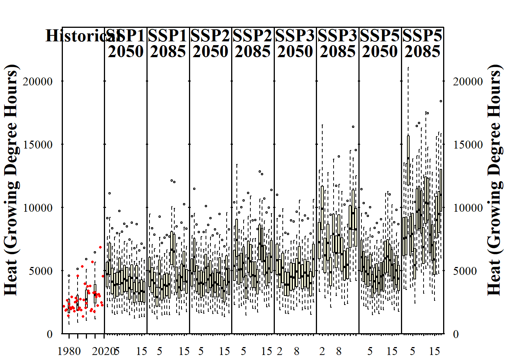
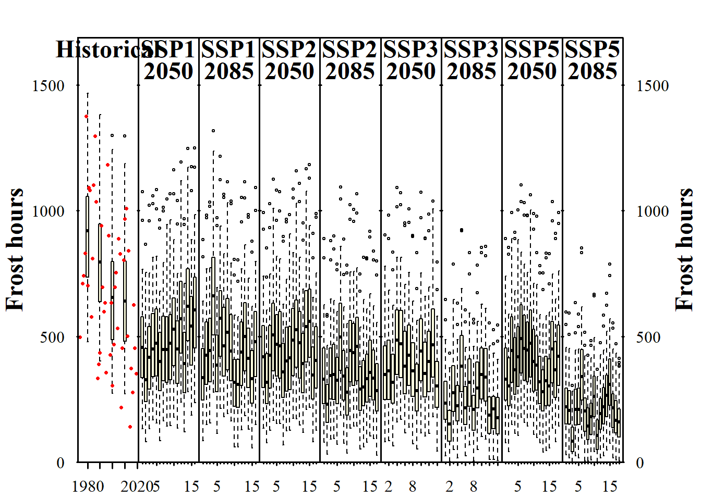

## Accessing Gridded Climate Data from the Copernicus Climate Data Store

Future climate data is often provided in a gridded format, making it necessary to download large datasets to extract information for a single station. While CMIP5 data was accessible through ClimateWizard, a comparable solution for CMIP6 is not available.

```{r, include=FALSE}
library(chillR)
```

## **Accessing CMIP6 Data**

The Copernicus Climate Data Store (CDS) provides access to CMIP6 climate projections. A free registration is required to obtain an API key for downloading data.

The function `download_cmip6_ecmwfr()` allows downloading climate model data for a specified region. For example, retrieving data for Bonn (7.1°E, 50.8°N):

```{r, eval=FALSE}
location = c(7.1, 50.8)
area <- c(52, 6, 50, 8) # (max. Lat, min. Lon, min. Lat, max. Lon)

download_cmip6_ecmwfr(
  scenarios = 'ssp126', 
  area = area,
  user = 'USER_ID',
  key = 'API_KEY',
  model = 'default',
  frequency = 'monthly',
  variable = c('Tmin', 'Tmax'),
  year_start = 2015,
  year_end = 2100)
```

The data is stored in a subfolder (`cmip6_downloaded`). Models that lack data for the selected parameters are automatically excluded.

It is possible to download multiple climate scenarios simultaneously:

```{r, eval=FALSE}
download_cmip6_ecmwfr(
  scenarios = c("ssp126", "ssp245", "ssp370", "ssp585"), 
  area = area,
  user = 'write user id here'
  key = 'write key here',
  model = 'default',
  frequency = 'monthly',
  variable = c('Tmin', 'Tmax'),
  year_start = 2015,
  year_end = 2100)
```

## **Generating Change Scenarios**

Since climate models use a coarse grid, it is useful to calculate temperature changes relative to a baseline period (1986-2014).

```{r, eval=FALSE}
download_baseline_cmip6_ecmwfr(
  area = area,
  user = 'USER_ID',
  key = 'API_KEY',
  model = 'match_downloaded',
  frequency = 'monthly',
  variable = c('Tmin', 'Tmax'),
  year_start = 1986, 
  year_end = 2014)
```

## **Extracting Data for a Specific Station**

The `extract_cmip6_data()` function allows extracting climate data for a specific location.

```{r, eval=FALSE}
station <- data.frame(
  station_name = c("Bonn"),
  longitude = c(7.1),
  latitude = c(50.8))

extracted <- extract_cmip6_data(stations = station)

write.csv(extracted$`ssp126_AWI-CM-1-1-MR`, "data/extract_example_ssp126_AWI-CM-1-1-MR.csv", row.names = FALSE)
```

## **Calculating Relative Changes**

Using the extracted data, relative climate change scenarios can be generated:

```{r, eval=FALSE}
change_scenarios <- gen_rel_change_scenario(extracted)
write.csv(change_scenarios, "data/all_change_scenarios.csv", row.names = FALSE)
```

To make the data usable for further analysis, it can be converted into a structured format:

```{r, eval=FALSE}
scen_list <- convert_scen_information(change_scenarios)
```

## **Adjusting the Baseline for Weather Simulations**

If the baseline period of the scenarios does not match observational records, an adjustment is needed.

Example: Calculating the temperature trend in Bonn between 1996 and 2000:

```{r, eval=FALSE}
temps_1996 <- temperature_scenario_from_records(Bonn_temps, 1996)
temps_2000 <- temperature_scenario_from_records(Bonn_temps, 2000)

base <- temperature_scenario_baseline_adjustment(temps_1996, temps_2000)
```

Now, the baseline of the scenarios is adjusted:

```{r, eval=FALSE}
scen_list <- convert_scen_information(change_scenarios, give_structure = FALSE)

adjusted_list <- temperature_scenario_baseline_adjustment(
  base,
  scen_list,
  temperature_check_args = list(scenario_check_thresholds = c(-5, 15)))
```

## **Generating and Saving Climate Scenarios**

The corrected climate scenarios can now be used in a weather generator:

```{r, eval=FALSE}
temps <- temperature_generation(Bonn_temps, 
                                years = c(1973, 2019), 
                                sim_years = c(2001, 2100), 
                                adjusted_list)

save_temperature_scenarios(temps,
                           "data/future_climate",
                           "Bonn_futuretemps")
```

It's important to save the data now to avoid waiting for the process to run again in the future. Temperature responses are calculated efficiently using the `tempResponse_daily_list` function, with three models: the Dynamic Model for chill accumulation, the GDH model for heat accumulation, and a simple model for frost hours.

```{r}
frost_model <- function(x)
  step_model(x,
             data.frame(
               lower = c(-1000, 0),
               upper = c(0, 1000),
               weight = c(1, 0)))

models <- list(Chill_Portions = Dynamic_Model,
               GDH = GDH,
               Frost_H = frost_model)

```

Climate scenarios are generated using the `make_climate_scenario` function and plotted. Historical and future climate scenarios are combined, and for each SSP and year (2050, 2085), the scenario is added.

```{r, eval=FALSE}
chill_future_scenario_list <- tempResponse_daily_list(temps,
                                                    latitude = 50.8,
                                                    Start_JDay = 305,
                                                    End_JDay = 59,
                                                    models = models)

chill_future_scenario_list <- lapply(chill_future_scenario_list,
                                     function(x) x %>%
                                       filter(Perc_complete == 100))

save_temperature_scenarios(chill_future_scenario_list,
                           "data/future_climate",
                           "Bonn_futurechill_305_59")
```

## **Loading Historical Data and Making Climate Scenarios**

Historical climate data is loaded and used to create climate scenarios for both past and future conditions.

```{r, eval=FALSE}
chill_hist_scenario_list <- load_temperature_scenarios("data",
                                                     "Bonn_hist_chill_305_59")

observed_chill <- read_tab("data/Bonn_observed_chill_305_59.csv")

chills <- make_climate_scenario(
  chill_hist_scenario_list,
  caption = "Historical",
  historic_data = observed_chill,
  time_series = TRUE)

plot_climate_scenarios(
  climate_scenario_list = chills,
  metric = "Chill_Portions",
  metric_label = "Chill (Chill Portions)")
```


## **Processing Future Climate Scenarios by SSP and Time**

For each SSP and time combination (2050, 2085), future climate scenarios are added to the climate scenarios object.

```{r, eval=FALSE}
SSPs <- c("ssp126", "ssp245", "ssp370", "ssp585")
Times <- c(2050, 2085)

list_ssp <- 
  strsplit(names(chill_future_scenario_list), '\\.') %>%
  map(2) %>%
  unlist()

list_gcm <-
  strsplit(names(chill_future_scenario_list), '\\.') %>%
  map(3) %>%
  unlist()

list_time <-
  strsplit(names(chill_future_scenario_list), '\\.') %>%
  map(4) %>%
  unlist()


for(SSP in SSPs)
  for(Time in Times)
    {
    
    # find all scenarios for the ssp and time
    chill <- chill_future_scenario_list[list_ssp == SSP & list_time == Time]
    names(chill) <- list_gcm[list_ssp == SSP & list_time == Time]
    if(SSP == "ssp126") SSPcaption <- "SSP1"
    if(SSP == "ssp245") SSPcaption <- "SSP2"
    if(SSP == "ssp370") SSPcaption <- "SSP3"
    if(SSP == "ssp585") SSPcaption <- "SSP5"    
    if(Time == "2050") Time_caption <- "2050"
    if(Time == "2085") Time_caption <- "2085"
    chills <- chill %>% 
      make_climate_scenario(
        caption = c(SSPcaption,
                    Time_caption),
        add_to = chills)
}
```

## **Plotting and Analyzing Climate Trends**

Finally, the trends for chill, heat, and frost hours are visualized, and additional information is stored for later analysis.

```{r, eval=FALSE}
info_chill <- plot_climate_scenarios(
  climate_scenario_list = chills,
  metric = "Chill_Portions",
  metric_label = "Chill (Chill Portions)",
  texcex = 1.5)
```


```{r, eval=FALSE}
info_heat <- plot_climate_scenarios(
  climate_scenario_list = chills,
  metric = "GDH",
  metric_label = "Heat (Growing Degree Hours)",
  texcex = 1.5)
```



```{r, eval=FALSE}
info_frost <- plot_climate_scenarios(
  climate_scenario_list = chills,
  metric = "Frost_H",
  metric_label = "Frost hours",
  texcex = 1.5)
```



## `Exercises` on generating CMIP6 temperature scenarios

1)  Analyze the historic and future impact of climate change on two agroclimatic metrics of your choice, for the location you've chosen for your earlier analyses.

```{r, include=FALSE}
require(chillR)
require(tidyverse)
library(ncdf4)
library(PCICt)
Yakima_temps <- read_tab("Yakima/Yakima_temps.csv")
change_scenarios <- read.csv("Yakima/all_change_scenarios.csv")
temps <- load_temperature_scenarios("Yakima/future_climate","Yakima_future_")
```

```{r, eval=FALSE}
# Set location
location = c(-120.5, 46.6)
area <- c(48, -122 , 45, -119)

# Download scenarios 
download_cmip6_ecmwfr(
  scenarios = c("ssp126", "ssp245", "ssp370", "ssp585"), 
  area = c(49, -122 , 44, -118),
  user = 'd78103f2-834f-468c-94f0-8b7064c75df7',
  key = 'ac66d05a-e82b-42d1-9a8d-a94c1afb9fb9',
  model = 'default',
  frequency = 'monthly',
  variable = c('Tmin', 'Tmax'),
  year_start = 2015,
  year_end = 2100)

# Download baseline
download_baseline_cmip6_ecmwfr(
  area = c(49, -122 , 44, -118),
  user = 'd78103f2-834f-468c-94f0-8b7064c75df7',
  key = 'ac66d05a-e82b-42d1-9a8d-a94c1afb9fb9',
  model = 'match_downloaded',
  frequency = 'monthly',
  variable = c('Tmin', 'Tmax'),
  year_start = 1986, 
  year_end = 2014, 
  month = 1:12)

# Extract data for specified location
station <- data.frame(
  station_name = c("Yakima"),
  longitude = c(-120.5),
  latitude = c(46.6))

extracted <- extract_cmip6_data(stations = station,
                                download_path = "cmip6_downloaded/49_-122_44_-118")
```

```{r, echo=FALSE}
# Extract data for specified location
station <- data.frame(
  station_name = c("Yakima"),
  longitude = c(-120.5),
  latitude = c(46.6))

extracted <- extract_cmip6_data(stations = station,
                                download_path = "cmip6_downloaded/49_-122_44_-118")
```

```{r message=FALSE, warning=FALSE}
# Generate change scenarios
change_scenarios <- gen_rel_change_scenario(extracted)

# Convert information into a list
scen_list <- convert_scen_information(change_scenarios)

# Calculate temperature between 1996 and 2000
temps_1996 <- temperature_scenario_from_records(Yakima_temps,
                                                1996)

temps_2000 <- temperature_scenario_from_records(Yakima_temps,
                                                2000)

# Adjusts baseline based on observed temperature trends
base <- temperature_scenario_baseline_adjustment(temps_1996,
                                                 temps_2000)

# Convert scenarios 
scen_list <- convert_scen_information(change_scenarios, 
                                      give_structure = FALSE)

adjusted_list <- temperature_scenario_baseline_adjustment(base,
                                                          scen_list,
                                                          temperature_check_args = list(scenario_check_thresholds = c(-5, 15)))
```

```{r, eval=FALSE}
# Generate temperatures 
for(scen in 1:length(adjusted_list))
{
  if(!file.exists(paste0("Yakima/future_climate/Yakima_future_",
                         scen,"_",
                         names(adjusted_list)[scen],".csv")) )
  {temp_temp <- temperature_generation(Yakima_temps,
                                       years = c(1973, 2019),
                                       sim_years = c(2001, 2100),
                                       adjusted_list[scen],  
                                       temperature_check_args = 
                                         list( scenario_check_thresholds = c(-5, 15)))
  write.csv(temp_temp[[1]],paste0("Yakima/future_climate/Yakima_future_",scen,"_",names(adjusted_list)[scen],".csv"),
            row.names=FALSE)
  print(paste("Processed object",scen,"of", length(adjusted_list)))
  
  
  }
  
}
```

```{r, echo=FALSE}
chill_future_scenario_list <- load_temperature_scenarios("Yakima/future_climate",
                                                         "Yakima_futurechill")
```

```{r, eval=FALSE}
# Selection of models 
models <- list(Chill_Portions = Dynamic_Model, 
               GDH = GDH, 
               Frost_H = function(x) step_model(x, data.frame(lower=c(-1000,0),
                                                              upper=c(0,1000),
                                                              weight=c(1,0))))

# Calculate temperature responses 
temps <- load_temperature_scenarios("Yakima/future_climate","Yakima_future_")

chill_future_scenario_list <- tempResponse_daily_list(temps,
                                                      latitude = 46.6,
                                                      Start_JDay = 305,
                                                      End_JDay = 59,
                                                      models = models)

chill_future_scenario_list <- lapply(chill_future_scenario_list,
                                     function(x) x %>%
                                       filter(Perc_complete == 100))

save_temperature_scenarios(chill_future_scenario_list,
                           "Yakima/future_climate",
                           "Yakima_futurechill_305_59")
```

```{r}
# Generate climate scenarios 
observed_chill <- read_tab("Yakima/Yakima_observed_chill_305_59.csv")
chill_hist_scenario_list <- load_temperature_scenarios("Yakima",
                                                       "Yakima_hist_chill_305_59")

chills <- make_climate_scenario(
  chill_hist_scenario_list,
  caption = "Historic",
  historic_data = observed_chill,
  time_series = TRUE)

# Plot historic climate scenarios 
plot_climate_scenarios(
  climate_scenario_list = chills,
  metric = "Chill_Portions",
  metric_label = "Chill (Chill Portions)")
```

```{r}
# Identify data that belong to specific combinations of SSP and time 
SSPs <- c("ssp126", "ssp245", "ssp370", "ssp585")
Times <- c(2050, 2085)

list_ssp <- 
  strsplit(names(chill_future_scenario_list), '\\.') %>%
  map(2) %>%
  unlist()

list_gcm <-
  strsplit(names(chill_future_scenario_list), '\\.') %>%
  map(3) %>%
  unlist()

list_time <-
  strsplit(names(chill_future_scenario_list), '\\.') %>%
  map(4) %>%
  unlist()


for(SSP in SSPs)
  for(Time in Times)
  {
    
    chill <- chill_future_scenario_list[list_ssp == SSP & list_time == Time]
    names(chill) <- list_gcm[list_ssp == SSP & list_time == Time]
    if(SSP == "ssp126") SSPcaption <- "SSP1"
    if(SSP == "ssp245") SSPcaption <- "SSP2"
    if(SSP == "ssp370") SSPcaption <- "SSP3"  
    if(SSP == "ssp585") SSPcaption <- "SSP5"    
    if(Time == "2050") Time_caption <- "2050"
    if(Time == "2085") Time_caption <- "2085"
    chills <- chill %>% 
      make_climate_scenario(
        caption = c(SSPcaption,
                    Time_caption),
        add_to = chills)
  }
```

```{r}
# Plot chill hours
info_chill <-
  plot_climate_scenarios(
    climate_scenario_list = chills,
    metric = "Chill_Portions",
    metric_label = "Chill (Chill Portions)",
    texcex = 1.5)
```

```{r}
# Plot Heat (Growing degree hours)
info_heat <-
  plot_climate_scenarios(
    climate_scenario_list = chills,
    metric = "GDH",
    metric_label = "Heat (Growing Degree Hours)",
    texcex = 1.5)
```
