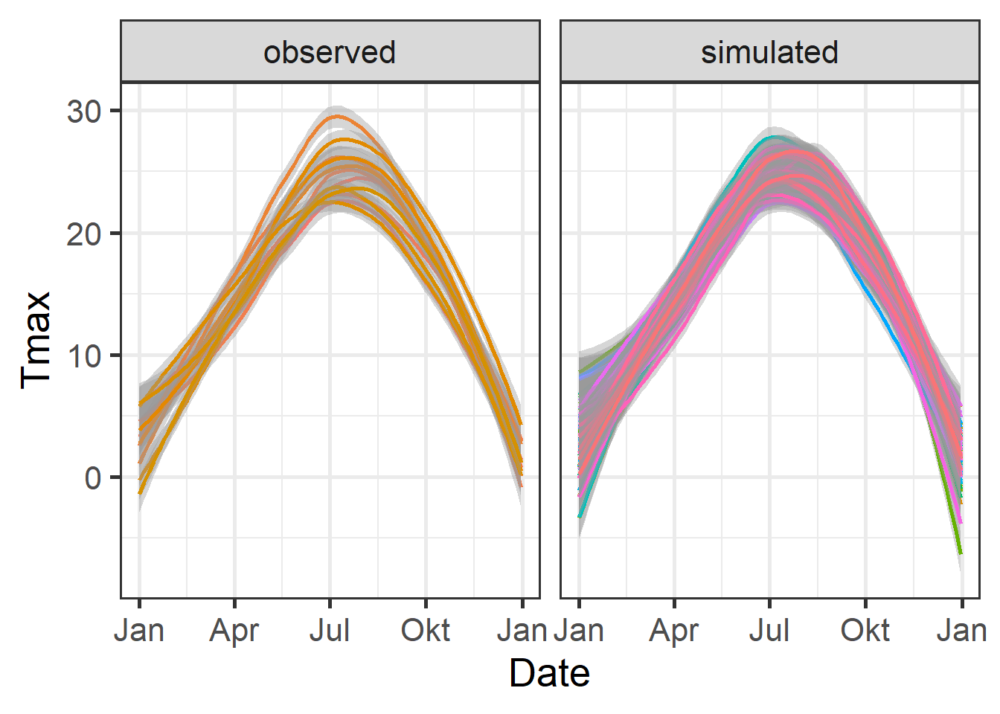

Effective orchard management requires understanding local climate conditions, especially chill availability, to make informed decisions on tree species and cultivars. While historical weather data has been useful, orchard managers now need more tailored, site-specific forecasts, especially regarding chill and heat levels, to optimize planting decisions.

### Chill Scenarios

The key objective is to provide growers with reliable forecasts for chill availability, helping them select the right trees. Climate conditions like chill and heat accumulation must be predicted over the long term, beyond simple historical data. This enables better decision-making when considering tree species that will meet their specific climatic needs and cope with potential frost risks.

### Risk Assessment in Orchard Planning

Because trees have long lifespans, they experience different weather patterns throughout their productive years. For optimal yields, trees must consistently meet their climatic requirements each year. Orchard managers need to understand the full range of possible weather scenarios, ensuring that chosen trees will meet their chill requirements and avoid frost damage. This requires assessing the distribution of local climate data, as opposed to relying on a single year's data.

### Weather Generators

The best way to assess the local climate is through long-term weather data. Weather generators model these patterns and simulate realistic weather conditions to help in orchard planning. `chillR` uses the R-compatible weather generator `RMAWGEN` for simulating temperature data, which is crucial for modeling chill availability.

```{r, include=FALSE}
# Load necessary libraries
library(chillR)
library(ggplot2)
library(kableExtra)
library(tidyverse)

Temperatures <- read.csv("data/generated_temperatures_example_1.csv")
Temperatures[,"Date"] <- as.Date(ISOdate(2000, Temperatures$Month, Temperatures$Day))

chill_comparison_full_seasons <- read.csv("data/chill_comparison_full_seasons.csv")
```

### Weather Generation in `chillR`

To generate temperature data, `chillR` uses the `RMAWGEN` weather generator. The function `temperature_generation` is used to calibrate long-term temperature data, and it produces simulated temperature records that can be used to evaluate climate patterns over extended periods.

```{r eval=FALSE, warning=FALSE}
Temp <- KA_weather %>%
  temperature_generation(years = c(1998, 2009),
                         sim_years = c(2001, 2100))

Temperatures <- KA_weather %>% filter(Year %in% 1998:2009) %>%
  cbind(Data_source = "observed") %>%
  rbind(
    Temp[[1]] %>% select(c(Year,
                           Month,
                           Day,
                           Tmin,
                           Tmax)) %>%
      cbind(Data_source = "simulated")
  ) %>%
  mutate(Date = as.Date(ISOdate(2000,
                                Month,
                                Day)))
```

### Temperature Visualization

To compare observed and simulated temperature data, `ggplot2` is used to visualize smoothed temperature trends, allowing for clearer analysis of temperature patterns.

```{r, eval=FALSE}
ggplot(data = Temperatures,
       aes(Date, Tmin)) +
  geom_smooth(aes(colour = factor(Year))) +
  facet_wrap(vars(Data_source)) +
  theme_bw(base_size = 20) +
  theme(legend.position = "none") +
  scale_x_date(date_labels = "%b")
```


```{r, eval=FALSE}
ggplot(data=Temperatures,
       aes(Date, Tmax)) +
  geom_smooth(aes(colour = factor(Year))) +
  facet_wrap(vars(Data_source)) +
  theme_bw(base_size = 20) +
  theme(legend.position = "none") +
  scale_x_date(date_labels = "%b")
```



### Chill Comparison

Next, chill accumulation is analyzed by comparing observed and simulated chill data using the `stack_hourly_temps` and `chilling` functions. This helps in assessing the chill accumulation over multiple years.

```{r, eval=FALSE}
chill_observed <- Temperatures %>%
  filter(Data_source == "observed") %>%
  stack_hourly_temps(latitude = 50.4) %>%
  chilling(Start_JDay = 305,
           End_JDay = 59)

chill_simulated <- Temperatures %>%
  filter(Data_source == "simulated") %>%
  stack_hourly_temps(latitude = 50.4) %>%
  chilling(Start_JDay = 305,
           End_JDay = 59)

chill_comparison <-
  cbind(chill_observed,
        Data_source = "observed") %>%
  rbind(cbind(chill_simulated,
              Data_source = "simulated"))

```

### Chill Distribution Visualization

The distribution of chill accumulation is visualized using a histogram to compare observed and simulated chill portions.

```{r, eval=FALSE}
ggplot(chill_comparison_full_seasons,
       aes(x = Chill_portions)) + 
  geom_histogram(binwidth = 1,
                 aes(fill = factor(Data_source))) +
  theme_bw(base_size = 20) +
  labs(fill = "Data source") +
  xlab("Chill accumulation (Chill Portions)") +
  ylab("Frequency")
```


### Cumulative Distribution Function

A cumulative distribution function (CDF) is plotted to visualize the likelihood of meeting the required chill accumulation thresholds.

```{r}
chill_simulations <-
  chill_comparison_full_seasons %>%
  filter(Data_source == "simulated")

ggplot(chill_simulations,
       aes(x = Chill_portions)) +
  stat_ecdf(geom = "step",
            lwd = 1.5,
            col = "blue") +
  ylab("Cumulative probability") +
  xlab("Chill accumulation (in Chill Portions)") +
  theme_bw(base_size = 20)
```

### Quantiles for Safe Winter Chill

Specific quantiles of chill accumulation are calculated to assess "Safe Winter Chill" levels and the risk associated with not meeting chilling requirements.

```{r}
# 10% quantile (Safe Winter Chill)
quantile(chill_simulations$Chill_portions, 0.1)

# 50% confidence interval (25th to 75th percentile)
quantile(chill_simulations$Chill_portions, c(0.25, 0.75))
```

## `Exercises` on temperature generation

1.  For the location you chose for your earlier analyses, use chillR’s weather generator to produce 100 years of synthetic temperature data.

```{r, echo=FALSE}
Yakima <- read.csv("Yakima/Yakima_weather.csv")
Temperatures <- read.csv("Yakima/Temperatures.csv")
Temperatures[,"Date"] <- as.Date(ISOdate(2000, Temperatures$Month, Temperatures$Day))
```

```{r, eval=FALSE}
# Generate temperature data with temperature_generation function
Temp <- Yakima %>% 
  temperature_generation(years = c(1998, 2009),
                         sim_years = c(2001, 2100))

Temperatures <- Yakima %>% 
  select(Year, Month, Day, Tmin, Tmax) %>%  
  filter(Year %in% 1998:2009) %>%
  cbind(Data_source = "observed") %>%
  rbind(
    Temp[[1]] %>% select(c(Year, Month, Day, Tmin, Tmax)) %>% 
      cbind(Data_source = "simulated")
  ) %>%
  mutate(Date = as.Date(ISOdate(2000, Month, Day)))
```

```{r message=FALSE}
# Plot observed vs. simulated minimum temperature data
ggplot(data = Temperatures,
       aes(Date,
           Tmin)) +
  geom_smooth(aes(colour = factor(Year))) +
  facet_wrap(vars(Data_source)) +
  theme_bw(base_size = 20) +
  theme(legend.position = "none") +
  scale_x_date(date_labels = "%b")
```

```{r message=FALSE}
# Plot observed vs. simulated maximum temperature data
ggplot(data = Temperatures,
       aes(Date,
           Tmax)) +
  geom_smooth(aes(colour = factor(Year))) +
  facet_wrap(vars(Data_source)) +
  theme_bw(base_size = 20) +
  theme(legend.position = "none") +
  scale_x_date(date_labels = "%b")
```

2.  Calculate winter chill (in Chill Portions) for your synthetic weather, and illustrate your results as histograms and cumulative distributions.

```{r}
# Analyzing chill accumulation by comparing observed and simulated chill data using the stack_hourly_temps function
chill_observed <- Temperatures %>%
  filter(Data_source == "observed") %>%
  stack_hourly_temps(latitude = 46.6) %>%
  chilling(Start_JDay = 305,
           End_JDay = 59)
  
chill_simulated <- Temperatures %>%
  filter(Data_source == "simulated") %>%
  stack_hourly_temps(latitude = 46.6) %>%
  chilling(Start_JDay = 305,
           End_JDay = 59)
  
chill_comparison <-
  cbind(chill_observed,
        Data_source = "observed") %>%
  rbind(cbind(chill_simulated,
              Data_source = "simulated"))

chill_comparison_full_seasons <- 
  chill_comparison %>%
  filter(Perc_complete == 100)
```

```{r}
# Plot chill distribution as histogram
ggplot(chill_comparison_full_seasons,
       aes(x = Chill_portions)) + 
  geom_histogram(binwidth = 1,
                 aes(fill = factor(Data_source))) +
  theme_bw(base_size = 20) +
  labs(fill = "Data source") +
  xlab("Chill accumulation (Chill Portions)") +
  ylab("Frequency")
```

```{r}
chill_simulations <-
  chill_comparison_full_seasons %>%
  filter(Data_source == "simulated")
  
# Plot chill distribution as cumulative distribution
ggplot(chill_simulations,
       aes(x = Chill_portions)) +
  stat_ecdf(geom = "step",
            lwd = 1.5,
            col = "blue") +
  ylab("Cumulative probability") +
  xlab("Chill accumulation (in Chill Portions)") +
  theme_bw(base_size = 20)
```

3.  Produce similar plots for the number of freezing hours (\<0°C) in April (or October, if your site is in the Southern Hemisphere) for your location of interest

```{r}
df <- data.frame(
  lower =  c(-1000,    0),
  upper =  c(    0, 1000),
  weight = c(    1,    0))

freezing_hours <- function(x) step_model(x, df)

chill_observed <- Temperatures %>%
  filter(Data_source == "observed") %>%
  stack_hourly_temps(latitude = 46.6) %>%
  tempResponse(Start_JDay = 91,
               End_JDay = 120,
               models = list(Frost = freezing_hours,
                             Chill_portions = Dynamic_Model,
                             GDH = GDH))

chill_simulated <- Temperatures %>%
  filter(Data_source == "simulated") %>%
  stack_hourly_temps(latitude = 46.6) %>%
  tempResponse(Start_JDay = 91,
               End_JDay = 120,
               models=list(Frost = freezing_hours,
                           Chill_portions = Dynamic_Model,
                           GDH = GDH))

chill_comparison <-
  cbind(chill_observed,
        Data_source = "observed") %>%
  rbind(cbind(chill_simulated,
              Data_source = "simulated"))

chill_comparison_full_seasons <-
  chill_comparison %>%
  filter(Perc_complete == 100)
```

```{r}
# Plot chill distribution in April as histogram 
ggplot(chill_comparison_full_seasons,
       aes(x = Frost)) + 
  geom_histogram(binwidth = 25,
                 aes(fill = factor(Data_source))) +
  theme_bw(base_size = 10) +
  labs(fill = "Data source") +
  xlab("Frost incidence during April (hours)") +
  ylab("Frequency")
```

```{r}
chill_simulations <-
  chill_comparison_full_seasons %>%
  filter(Data_source == "simulated")

# Plot chill distribution in April as cumulative distribution 
ggplot(chill_simulations,
       aes(x = Frost)) +
  stat_ecdf(geom = "step",
            lwd = 1.5,
            col = "blue") +
  ylab("Cumulative probability") +
  xlab("Frost incidence during April (hours)") +
  theme_bw(base_size = 20)
```
