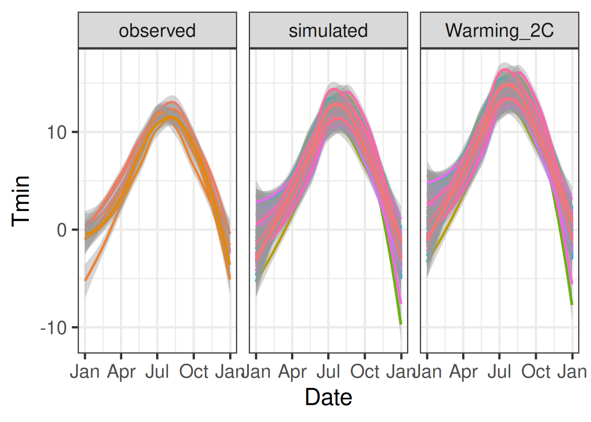
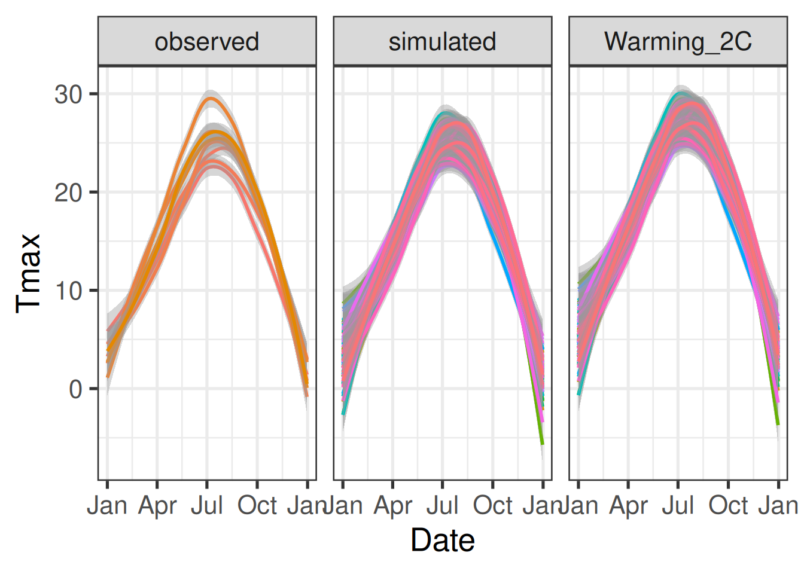
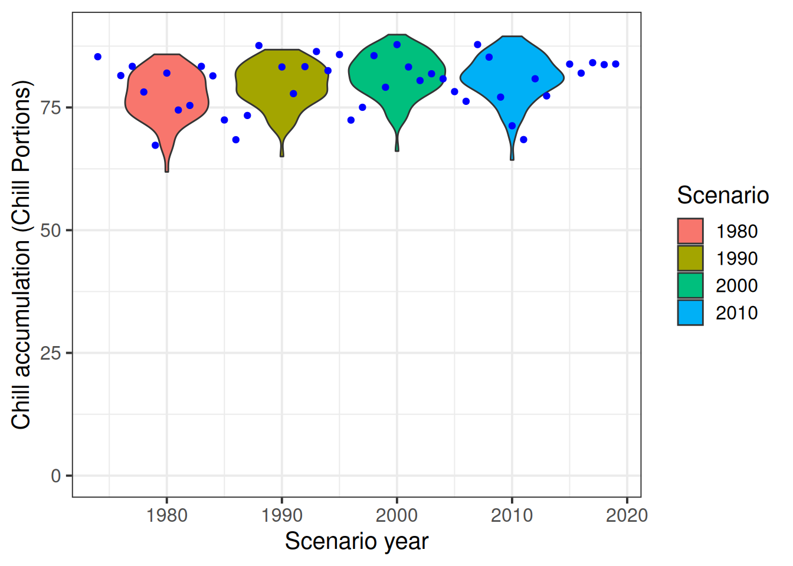
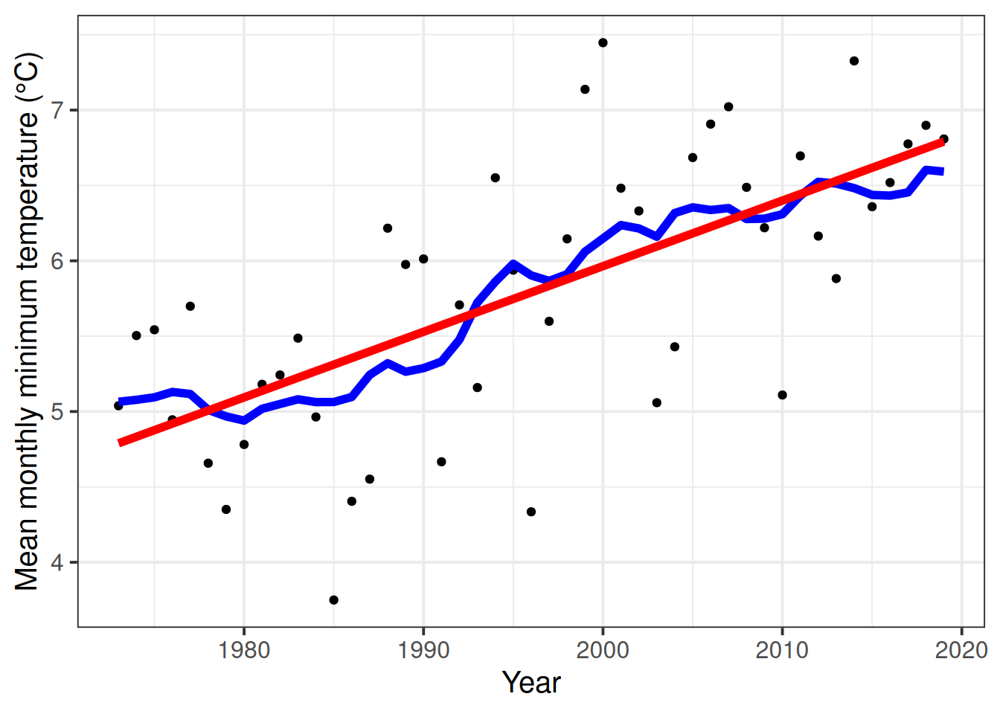
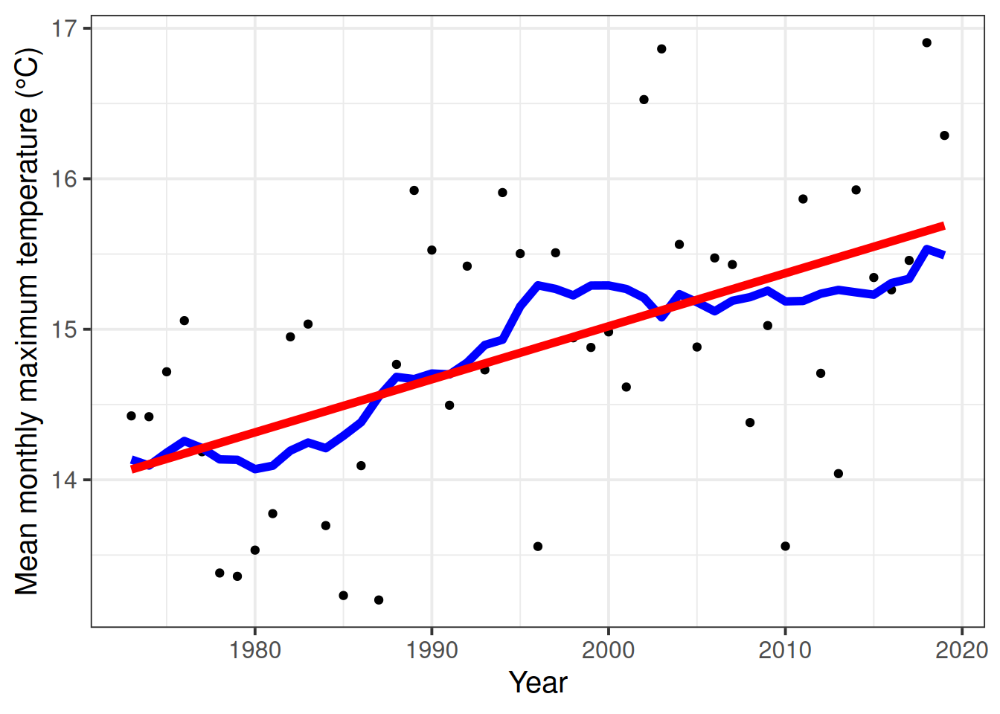

```{r load_packages_hist_temp, echo=FALSE, message=FALSE}
require(chillR)
require(tidyverse)
require(kableExtra)
Temperature_scenarios <- read_tab("data/Temperature_scenarios.csv") %>%
  mutate(Date = as.Date(ISOdate(2000,
                                Month,
                                Day)))
Bonn_temps <- 
  read_tab("data/Bonn_temps.csv")
chill_hist_scenario_list <- 
  load_temperature_scenarios("data","Bonn_hist_chill_305_59")

```

## Generating Climate Scenarios with `chillR`

A weather generator in the `chillR` package can create agroclimatic profiles for specific locations. By calibrating it with historical temperature data, the generated profile represents the climate of the calibration period. This generator also simulates future climate scenarios using the `temperature_scenario` parameter in the `temperature_generation` function.

### Defining a Temperature Scenario

The `temperature_scenario` parameter requires a `data.frame` with two columns (`Tmin` and `Tmax`), each containing 12 values representing monthly temperature adjustments. Without this parameter, no temperature changes are applied.

A simple scenario increasing temperatures by 2°C in all months is created as follows:

```{r, eval=FALSE}
change_scenario <- data.frame(Tmin = rep(2, 12), Tmax = rep(2, 12))

Temp_2 <- temperature_generation(KA_weather,
                                 years = c(1998, 2005),
                                 sim_years = c(2001, 2100),
                                 temperature_scenario = change_scenario)
```

### Comparing Observed and Simulated Temperatures

A dataset is created to compare observed and simulated temperatures:

```{r, eval=FALSE}
Temperature_scenarios <- KA_weather %>%
  filter(Year %in% 1998:2005) %>%
  cbind(Data_source = "observed") %>%
  rbind(Temp[[1]] %>% 
          select(c(Year, Month, Day, Tmin, Tmax)) %>% 
          cbind(Data_source = "simulated")
        ) %>%
  rbind(Temp_2[[1]] %>%
          select(c(Year, Month, Day, Tmin, Tmax)) %>% 
          cbind(Data_source = "Warming_2C")
        ) %>%
  mutate(Date = as.Date(ISOdate(2000,
                                Month,
                                Day)))

```

These scenarios can be visualized using `ggplot2`:

```{r,eval=FALSE}
ggplot(data = Temperature_scenarios, 
       aes(Date, Tmin)) +
  geom_smooth(aes(colour = factor(Year))) +
  facet_wrap(vars(Data_source)) +
  theme_bw(base_size = 20) +
  theme(legend.position = "none") +
  scale_x_date(date_labels = "%b")
```



```{r,eval=FALSE}
ggplot(data = Temperature_scenarios,
       aes(Date,Tmax)) +
  geom_smooth(aes(colour = factor(Year))) +
  facet_wrap(vars(Data_source)) +
  theme_bw(base_size = 20) +
  theme(legend.position = "none") +
  scale_x_date(date_labels = "%b")
```



This simplified approach applies uniform changes across all months, which does not reflect historical patterns but aligns with early climate modeling methods.

## Creating Historical Temperature Scenarios

A long-term dataset is necessary to generate historical climate scenarios. Weather data for Cologne/Bonn Airport is downloaded and formatted for `chillR`:

```{r, eval=FALSE}
station_list <- handle_gsod(action = "list_stations", location = c(7.1, 50.8))
Bonn_weather <- handle_gsod(action = "download_weather",
                            location = station_list$chillR_code[1],
                            time_interval = c(1973, 2019)) %>%
  handle_gsod()
```

Missing data is identified and interpolated:

```{r, eval=FALSE}
Bonn_patched <- patch_daily_temperatures(weather = Bonn_weather$`KOLN BONN`,
                                         patch_weather = list(KA_weather))

Bonn <- fix_weather(Bonn_patched)

Bonn_temps <- Bonn$weather
```

### Generating Scenarios for Specific Years

Historical temperature scenarios for years like 1980, 1990, 2000, and 2010 are created:

```{r, eval=FALSE}
scenario_1980 <- temperature_scenario_from_records(weather = Bonn_temps, 
                                                   year = 1980)
```

The scenario is refined by setting a reference year (1996) and adjusting accordingly:

```{r, eval=FALSE}
scenario_1996 <- temperature_scenario_from_records(weather = Bonn_temps, 
                                                   year = 1996)

relative_scenario <- temperature_scenario_baseline_adjustment(
  baseline = scenario_1996, 
  temperature_scenario = scenario_1980)
```

This adjusted scenario is used to generate temperature projections:

```{r, eval=FALSE}
temps_1980 <- temperature_generation(weather = Bonn_temps,
                                     years = c(1973, 2019),
                                     sim_years = c(2001, 2100),
                                     temperature_scenario = relative_scenario)
```

The process is repeated for multiple years:

```{r, eval=FALSE}
all_past_scenarios <- temperature_scenario_from_records(
  weather = Bonn_temps, 
  year = c(1980, 
           1990, 
           2000, 
           2010))

adjusted_scenarios <- temperature_scenario_baseline_adjustment(
  baseline = scenario_1996, 
  temperature_scenario = all_past_scenarios)

all_past_scenario_temps <- temperature_generation(
  weather = Bonn_temps,
  years = c(1973, 2019),
  sim_years = c(2001, 2100),
  temperature_scenario = adjusted_scenarios)
```

The generated data is saved for future use:

```{r,eval=FALSE}
save_temperature_scenarios(all_past_scenario_temps, "data", "Bonn_hist_scenarios")
```

## Estimating Chill Accumulation

Using the `tempResponse_daily_list` function, chill accumulation can be estimated:

```{r, eval=FALSE}
chill_hist_scenario_list <- tempResponse_daily_list(all_past_scenario_temps,
                                                    latitude = 50.9,
                                                    Start_JDay = 305,
                                                    End_JDay = 59,
                                                    models = models)
```

Observed chill data is computed and saved:

```{r, eval=FALSE}
scenarios <- names(chill_hist_scenario_list)[1:4]

all_scenarios <- chill_hist_scenario_list[[scenarios[1]]] %>%
  mutate(scenario = as.numeric(scenarios[1]))

for (sc in scenarios[2:4])
 all_scenarios <- all_scenarios %>%
  rbind(chill_hist_scenario_list[[sc]] %>%
          cbind(
            scenario=as.numeric(sc))
        ) %>%
  filter(Perc_complete == 100)

actual_chill <- tempResponse_daily_list(Bonn_temps,
                                        latitude=50.9,
                                        Start_JDay = 305,
                                        End_JDay = 59,
                                        models)[[1]] %>%
  filter(Perc_complete == 100)

write.csv(actual_chill, "data/Bonn_observed_chill_305_59.csv", row.names = FALSE)
```

### Visualizing Chill Accumulation Scenarios

```{r, eval=FALSE}
ggplot(data = all_scenarios, aes(scenario, Chill_Portions, fill = factor(scenario))) +
  geom_violin() +
  ylab("Chill accumulation (Chill Portions)") +
  xlab("Scenario year") +
  theme_bw(base_size = 15) +
  ylim(c(0,90)) +
  geom_point(data = actual_chill, aes(End_year, Chill_Portions, fill = "blue"), col = "blue", show.legend = FALSE) +
  scale_fill_discrete(name = "Scenario", breaks = unique(all_scenarios$scenario))
```



## Comparing Running Mean and Linear Regression Approaches

The running mean and linear regression methods are compared to estimate long-term trends:

```{r, eval=FALSE}
temperature_means <- 
  data.frame(Year = min(Bonn_temps$Year):max(Bonn_temps$Year),
             Tmin = aggregate(Bonn_temps$Tmin,
                              FUN = "mean",
                              by = list(Bonn_temps$Year))[,2],
             Tmax=aggregate(Bonn_temps$Tmax,
                            FUN = "mean",
                            by = list(Bonn_temps$Year))[,2]) %>%
  mutate(runn_mean_Tmin = runn_mean(Tmin,15),
         runn_mean_Tmax = runn_mean(Tmax,15))

Tmin_regression <- lm(Tmin~Year, temperature_means)
Tmax_regression <- lm(Tmax~Year, temperature_means)

temperature_means <- temperature_means %>%
  mutate(regression_Tmin = Tmin_regression$coefficients[1]+
           Tmin_regression$coefficients[2]*temperature_means$Year,
           regression_Tmax = Tmax_regression$coefficients[1]+
           Tmax_regression$coefficients[2]*temperature_means$Year
         )

# Plot mean monthly minimum temperature 
ggplot(temperature_means,
       aes(Year,
           Tmin)) + 
  geom_point() + 
  geom_line(data = temperature_means,
            aes(Year,
                runn_mean_Tmin),
            lwd = 2,
            col = "blue") + 
  geom_line(data = temperature_means,
            aes(Year,
                regression_Tmin),
            lwd = 2,
            col = "red") +
  theme_bw(base_size = 15) +
  ylab("Mean monthly minimum temperature (°C)")

```



```{r, eval=FALSE}
# Plot mean monthly maximum temperature
ggplot(temperature_means,
       aes(Year,
           Tmax)) + 
  geom_point() + 
  geom_line(data = temperature_means,
            aes(Year,
                runn_mean_Tmax),
            lwd = 2,
            col = "blue") + 
  geom_line(data = temperature_means,
            aes(Year, 
                regression_Tmax),
            lwd = 2,
            col = "red") +
  theme_bw(base_size = 15) +
  ylab("Mean monthly maximum temperature (°C)")
```



These methods yield different results, highlighting variations in trend estimation as climate change progresses. This comparison underscores the importance of selecting appropriate methods for temperature trend analysis.

## `Exercises` on generating historic temperature scenarios

1)  For the location you chose for previous exercises, produce historic temperature scenarios representing several years of the historic record (your choice).

```{r load_packages, echo=FALSE, message=FALSE, warning=FALSE}
require(chillR)
require(tidyverse)
require(kableExtra)
Yakima_temps <- read_tab("Yakima/Yakima_temps.csv")
chill_hist_scenario_list <- 
  load_temperature_scenarios("Yakima","Yakima_hist_chill_305_59")
```

```{r message=FALSE, warning=FALSE, eval=FALSE}
# Get a list of close-by weather stations
station_list <- handle_gsod(action = "list_stations",
                            location = c(long = -120.5, lat = 46.6),
                            time_interval = c(1973, 2023))


# Download data
Yakima_weather <- handle_gsod(action = "download_weather",
                            location = station_list$chillR_code[1],
                            time_interval = c(1973, 2023)) %>%
  handle_gsod()


# Check record for missing data
fix_weather(Yakima_weather$`YAKIMA AIR TERMINAL/MCALSR FIELD AP`)$QC


# Filling gaps in temperature records
patch_weather <-
  handle_gsod(action = "download_weather",
              location = as.character(station_list$chillR_code[c(4, 6)]),
              time_interval = c(1973, 2023)) %>%
  handle_gsod()


Yakima_patched <- patch_daily_temperatures(
  weather = Yakima_weather$`YAKIMA AIR TERMINAL/MCALSR FIELD AP`,
  patch_weather = patch_weather)

fix_weather(Yakima_patched)$QC

Yakima_temps <- Yakima_patched$weather
```

```{r}
# Generating running mean and linear regression 
temperature_means <- 
  data.frame(Year = min(Yakima_temps$Year):max(Yakima_temps$Year),
             Tmin = aggregate(Yakima_temps$Tmin,
                              FUN = "mean",
                              by = list(Yakima_temps$Year))[,2],
             Tmax=aggregate(Yakima_temps$Tmax,
                            FUN = "mean",
                            by = list(Yakima_temps$Year))[,2]) %>%
  mutate(runn_mean_Tmin = runn_mean(Tmin,15),
         runn_mean_Tmax = runn_mean(Tmax,15))


Tmin_regression <- lm(Tmin~Year,
                      temperature_means)

Tmax_regression <- lm(Tmax~Year,
                      temperature_means)

temperature_means <- temperature_means %>%
  mutate(regression_Tmin = Tmin_regression$coefficients[1]+
           Tmin_regression$coefficients[2]*temperature_means$Year,
         regression_Tmax = Tmax_regression$coefficients[1]+
           Tmax_regression$coefficients[2]*temperature_means$Year
  )
```

```{r}
# Plot mean monthly minimum temperature of 1973 to 2023
ggplot(temperature_means,
       aes(Year,
           Tmin)) + 
  geom_point() + 
  geom_line(data = temperature_means,
            aes(Year,
                runn_mean_Tmin),
            lwd = 2,
            col = "blue") + 
  geom_line(data = temperature_means,
            aes(Year,
                regression_Tmin),
            lwd = 2,
            col = "red") +
  theme_bw(base_size = 15) +
  ylab("Mean monthly minimum temperature (°C)")
```

```{r}
# Plot mean monthly maximum temperature of 1973 to 2023
ggplot(temperature_means,
       aes(Year,
           Tmax)) + 
  geom_point() + 
  geom_line(data = temperature_means,
            aes(Year,
                runn_mean_Tmax),
            lwd = 2,
            col = "blue") + 
  geom_line(data = temperature_means,
            aes(Year, 
                regression_Tmax),
            lwd = 2,
            col = "red") +
  theme_bw(base_size = 15) +
  ylab("Mean monthly maximum temperature (°C)")
```

2)  Produce chill distributions for these scenarios and plot them.

```{r, eval=FALSE}
# Generating scenarios for specific years 
scenario_1980 <- temperature_scenario_from_records(weather = Yakima_temps,
                                                   year = 1980)

temps_1980 <- temperature_generation(weather = Yakima_temps,
                                     years = c(1973, 2023),
                                     sim_years = c(2001, 2100),
                                     temperature_scenario = scenario_1980)

# Setting a reference year (1998)
scenario_1998 <- temperature_scenario_from_records(weather = Yakima_temps,
                                                   year = 1998)

relative_scenario <- temperature_scenario_baseline_adjustment(
  baseline = scenario_1998,
  temperature_scenario = scenario_1980)

# Adjusted scenario is used to generate temperature projections
temps_1980 <- temperature_generation(weather = Yakima_temps,
                                   years = c(1973, 2023),
                                   sim_years = c(2001,2100),
                                   temperature_scenario = relative_scenario)

# Process is repeated for multiple years 
all_past_scenarios <- temperature_scenario_from_records(
  weather = Yakima_temps,
  year = c(1980,
           1990,
           2000,
           2010, 
           2020))

adjusted_scenarios <- temperature_scenario_baseline_adjustment(
  baseline = scenario_1998,
  temperature_scenario = all_past_scenarios)

all_past_scenario_temps <- temperature_generation(
  weather = Yakima_temps,
  years = c(1973, 2023),
  sim_years = c(2001, 2100),
  temperature_scenario = adjusted_scenarios)

# Generated data is saved for future use 
save_temperature_scenarios(all_past_scenario_temps, "Yakima", "Yakima_hist_scenarios")
```

```{r, eval=FALSE}
# Selecting models for evaluation 
frost_model <- function(x)
  step_model(x,
             data.frame(
               lower = c(-1000, 0),
               upper = c(0, 1000),
               weight = c(1, 0)))

models <- list(Chill_Portions = Dynamic_Model, 
               GDH = GDH,
               Frost_H = frost_model)

# Using tempResponse_daily_list function to estimate chill accumulation
chill_hist_scenario_list <- tempResponse_daily_list(all_past_scenario_temps,
                                                    latitude = 46.6,
                                                    Start_JDay = 305,
                                                    End_JDay = 59,
                                                    models = models)

chill_hist_scenario_list <- lapply(chill_hist_scenario_list,
                                   function(x) x %>%
                                     filter(Perc_complete == 100))

# Save generated chill data 
save_temperature_scenarios(chill_hist_scenario_list, "Yakima","Yakima_hist_chill_305_59")
```

```{r}
# Load generated chill data for Yakima
chill_hist_scenario_list <- load_temperature_scenarios("Yakima","Yakima_hist_chill_305_59")

# Compute the actual 'observed' chill for comparison
scenarios <- names(chill_hist_scenario_list)[1:5]

all_scenarios <- chill_hist_scenario_list[[scenarios[1]]] %>%
  mutate(scenario = as.numeric(scenarios[1]))

for (sc in scenarios[2:5])
  all_scenarios <- all_scenarios %>%
  rbind(chill_hist_scenario_list[[sc]] %>%
          cbind(
            scenario=as.numeric(sc))
  ) %>%
  filter(Perc_complete == 100)

actual_chill <- tempResponse_daily_list(Yakima_temps,
                                        latitude=46.6,
                                        Start_JDay = 305,
                                        End_JDay = 59,
                                        models)[[1]] %>%
  filter(Perc_complete == 100)
```

```{r message=FALSE, warning=FALSE}
# Visualize chill accumulation 
ggplot(data = all_scenarios,
       aes(scenario,
           Chill_Portions,
           fill = factor(scenario))) +
  geom_violin() +
  ylab("Chill accumulation (Chill Portions)") +
  xlab("Scenario year") +
  theme_bw(base_size = 15) +
  ylim(c(0,90)) +
  geom_point(data = actual_chill,
             aes(End_year,
                 Chill_Portions,
                 fill = "blue"),
             col = "blue",
             show.legend = FALSE) +
  scale_fill_discrete(name = "Scenario",
                      breaks = unique(all_scenarios$scenario)) 
```

```{r, saving_observed_chill, eval=FALSE}
# Save observed chill data for Yakima
write.csv(actual_chill,"Yakima/Yakima_observed_chill_305_59.csv", row.names = FALSE)
```
