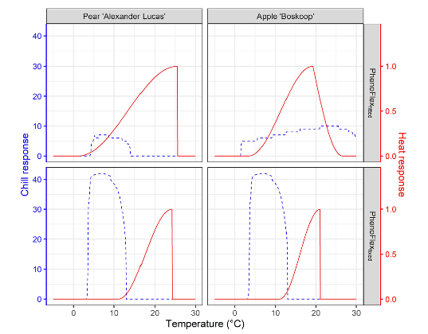

```{r, include=FALSE}
library(chillR)
library(tidyverse)
library(ggplot2)
library(kableExtra)
library(tidyr)
```

## Motivation

The `PhenoFlex` model is relatively new and needs validation under different conditions. Additionally, some results from the original publication [(Luedeling et al., 2021)](https://www.sciencedirect.com/science/article/pii/S016819232100174X?via%3Dihub) suggest potentially implausible temperature responses during chill accumulation (e.g., the chill response for PhenoFlex_fitted in apple ‘Boskoop’).



The figure above shows an unexpected chill response at temperatures above 25 °C. Since such high temperatures may even hinder chill accumulation, this suggests that the calibration conditions during endo-dormancy were not sufficiently variable. This highlights the need for more relevant temperature data to achieve a more accurate parameter set.

## Using Experimental Phenology Data to Assess PhenoFlex

In the lab, the decision was made to use data from the tree-moving experiment, analyzed in the chapter on *Experimentally Enhanced PLS*, to calibrate the `PhenoFlex` model. This chapter provides an overview of the process and key results. For further details, the published analysis [(Fernandez et al., 2022)](https://www.sciencedirect.com/science/article/pii/S016819232200209X) can be referred to.

The weather and phenology data will be loaded from the data folder, followed by cleaning procedures to ensure compliance with the `PhenoFlex` format. If the files are not yet available, they need to be downloaded and saved in the `data` folder.

```{r message=FALSE}
# Load the data from the folder
data <- read_tab("data/final_weather_data_S1_S2_apple_hourly.csv")

# Generate a new column (Year_2) to simulate the year and comply with the format of PhenoFlex functions
data["Year_2"] <- data$Treatment + data$Year 

# Since this experiment was conducted during two consecutive seasons, the next step will fix a small continuity issue
# generated during the season 2
data[data$Treatment >= 34, "Year_2"] <-
  data[data$Treatment >= 34, "Year_2"] - 1

# For further compatibility, I will now select the columns needed and will drop "Year" (the original one)
data <- data[c("YEARMODA", "Year_2", "Month",
               "Day", "Hour", "JDay", "Temp")]

# To replace the missing "Year" column, I will now change the name of the column
colnames(data)[which(colnames(data) == "Year_2")] <- "Year"


# Import the phenology data from the repository
pheno <- read_tab("data/final_bio_data_S1_S2_apple.csv")

# Remove troubling treatments
pheno <- pheno[!(pheno$Treatment %in% c(36, 3, 23, 24, 17, 18, 61)), 
               c("Treatment", "pheno")]

pheno["Treatment"] <- pheno$Treatment + 2019

colnames(pheno) <- c("Year", "pheno")
```

The format of both datasets can now be examined using the `head()` function to observe their structure.

The weather records contain the hourly temperature to which the trees were exposed during the experiment.

```{r eval=FALSE}
head(data)
```

```{r echo = FALSE}
kable(head(data), align = c("c")) %>%
  kable_styling(
    bootstrap_options = c("striped", "hover"), 
    position = "center", 
    font_size = 14,   
    full_width = TRUE 
  )
```

The phenology data includes the date of full bloom (in day of the year), recorded when 50% of the flowers were open and the first petals were falling, according to the BBCH scale.

```{r eval=FALSE}
head(pheno)
```

```{r echo = FALSE}
kable(head(pheno),row.names=FALSE, align = c("c")) %>%
  kable_styling(
    bootstrap_options = c("striped", "hover"), 
    position = "center", 
    font_size = 14,   
    full_width = TRUE 
  )
```

Both datasets contain a `treatment` column, representing a "fake" year or season corresponding to the actual treatment applied in the experiment.

For comparison, two versions of the analysis were developed to calibrate the `PhenoFlex` model. In version 1 (`PhenoFlex_marginal`), all available experimental seasons were included, even five seasons that might have been marginal in terms of temperature for overcoming the dormancy of apple trees. In version 2 (`PhenoFlex_normal`), these marginal seasons were excluded from the calibration dataset


As shown in the figure above, the five marginal seasons were identified as a small cluster at the upper limit of the distribution after sorting the seasons based on the mean temperature experienced by the trees from the beginning of the experiment until the moment of full bloom.

In the following section, different datasets are created for the two versions of the analysis. The treatments corresponding to the years `c(2032, 2061, 2065, 2077, 2081)`, identified as marginal seasons, are removed from the calibration dataset in `PhenoFlex_normal`.

```{r}
pheno_marginal <- pheno

pheno_normal <- pheno[!(pheno$Year %in% 
                          c(2032, 2061, 2065, 2077, 2081)), ]
```

The same approach can now be applied to the weather data by defining two vectors containing the seasons selected for model calibration. Forty seasons will be randomly chosen for calibration in both versions of the analysis, while the remaining 14 experimental seasons will be reserved for validation.

```{r}
# Define a vector of calibration and validation seasons. Marginal includes
# the marginal seasons
calibration_seasons <-
  sort(sample(pheno_normal$Year, 
              40, 
              replace = FALSE))

calibration_seasons_marginal <-
  sort(c(sample(calibration_seasons, 
                35,
                replace = FALSE),
         pheno_marginal$Year[which(!(pheno_marginal$Year %in%
                                       pheno_normal$Year))]))

calibration_seasons_normal <- calibration_seasons

# Common validation seasons
validation_seasons <- 
  sort(pheno_normal[!(pheno_normal$Year %in% 
                        calibration_seasons), "Year"])

# Define the list of seasons (weather data)
season_list_marginal <- 
  genSeasonList(data,
                mrange = c(9, 7),
                years = calibration_seasons_marginal)

season_list_normal <-
  genSeasonList(data,
                mrange = c(9, 7),
                years = calibration_seasons_normal)
```

The techniques learned in the chapter on *The `PhenoFlex` Model* are now applied to fit the model parameters to the data. The fitting procedure begins with wide ranges, especially for yc and zc, to allow the model to identify the best estimates.

```{r, message = FALSE, eval = FALSE}
# Set the initial parameters (wide ranges)
#   yc,  zc,  s1, Tu,     E0,      E1,     A0,          A1,   Tf, Tc, Tb, slope
lower <- 
  c(20, 100, 0.1,  0, 3000.0,  9000.0, 6000.0,       5.e13,    0,  0,  0,  0.05)
par   <- 
  c(40, 190, 0.5, 25, 3372.8,  9900.3, 6319.5, 5.939917e13,    4, 36,  4,  1.60)
upper <-
  c(80, 500, 1.0, 30, 4000.0, 10000.0, 7000.0,       6.e13,   10, 40, 10, 50.00)

# Run the fitter
pheno_fit_marginal <- 
  phenologyFitter(par.guess = par,
                  modelfn = PhenoFlex_GDHwrapper,
                  bloomJDays = pheno_marginal[pheno_marginal$Year %in%
                                                calibration_seasons_marginal,
                                              "pheno"],
                  SeasonList = season_list_marginal,
                  lower = lower,
                  upper = upper,
                  control = list(smooth = FALSE,
                                 verbose = FALSE,
                                 maxit = 100,
                                 nb.stop.improvement = 10))

# Same for version 2
pheno_fit_normal <- 
  phenologyFitter(par.guess = par,
                  modelfn = PhenoFlex_GDHwrapper,
                  bloomJDays = pheno_normal[pheno_normal$Year %in%
                                              calibration_seasons_normal,
                                            "pheno"],
                  SeasonList = season_list_normal,
                  lower = lower,
                  upper = upper,
                  control = list(smooth = FALSE,
                                 verbose = FALSE,
                                 maxit = 100,
                                 nb.stop.improvement = 10))
```

The argument maxit in the control list is set to 100 to ensure the code runs quickly. For a more thorough assessment, higher values (e.g., 1,000) would likely be more appropriate.

The results of the fitting, including the model parameters and predicted bloom dates, are saved and read from the folder to save time in future analyses.

```{r, eval=FALSE}
write.csv(pheno_fit_marginal$par,
          "data/PhenoFlex_marginal_params.csv",
          row.names = FALSE)

write.csv(pheno_fit_normal$par,
          "data/PhenoFlex_normal_params.csv",
          row.names = FALSE)

write.csv(data.frame(pheno_marginal[pheno_marginal$Year %in%
                                      calibration_seasons_marginal, ],
                     "Predicted" = pheno_fit_marginal$pbloomJDays),
          "data/PhenoFlex_marginal_predicted_bloom.csv",
          row.names = FALSE)

write.csv(data.frame(pheno_normal[pheno_normal$Year %in%
                                    calibration_seasons_normal, ],
                     "Predicted" = pheno_fit_normal$pbloomJDays),
          "data/PhenoFlex_normal_predicted_bloom.csv",
          row.names = FALSE)
```

The results from the fitting procedure can be examined by obtaining the predictions made by the model using the fitted parameters. The prediction error can then be estimated based on these predictions.

```{r}
# Read the parameters
params_marginal <- read.csv("data/PhenoFlex_marginal_params.csv")[[1]]
params_normal <- read.csv("data/PhenoFlex_normal_params.csv")[[1]]

# Generate a data set to collect the outputs of the fitting for the calibration data 
out_df_marginal <- read.csv("data/PhenoFlex_marginal_predicted_bloom.csv")
out_df_normal <- read.csv("data/PhenoFlex_normal_predicted_bloom.csv")

# Compute the error (observed - predicted)
out_df_marginal[["Error"]] <-
  out_df_marginal$pheno - out_df_marginal$Predicted

out_df_normal[["Error"]] <-
  out_df_normal$pheno - out_df_normal$Predicted
```

Model performance metrics can now be computed based on the previously estimated prediction error. While this may not be highly relevant during the calibration procedure, it provides a way to compare the performance of the two `PhenoFlex` versions.

```{r, echo = FALSE}
calibration_metrics <- 
  data.frame("Metric" = c("RMSEP", "RPIQ"),
             "PhenoFlex_marginal" = c(RMSEP(out_df_marginal$Predicted,
                                            out_df_marginal$pheno,
                                            na.rm = TRUE),
                                      RPIQ(out_df_marginal$Predicted,
                                           out_df_marginal$pheno)),
             "PhenoFlex_normal" = c(RMSEP(out_df_normal$Predicted,
                                          out_df_normal$pheno, 
                                          na.rm = TRUE),
                                    RPIQ(out_df_normal$Predicted,
                                         out_df_normal$pheno)))
```

```{r, eval=FALSE}
calibration_metrics
```

```{r, echo=FALSE}
kable(calibration_metrics, align = c("c")) %>%
  kable_styling(
    bootstrap_options = c("striped", "hover"), 
    position = "center", 
    font_size = 14,   
    full_width = TRUE 
  )
```

There is room for improvement, particularly given that only 10 iterations were used. However, the results clearly show that calibrating the model with the marginal seasons reduced the performance of `PhenoFlex`.

The next step involves plotting some of the results.

```{r}
out_df_all <- bind_rows("PhenoFlex marginal" = out_df_marginal,
                        "PhenoFlex normal" = out_df_normal,
                        .id = "PhenoFlex version")

# Plot the observed versus predicted values
ggplot(out_df_all,
       aes(pheno, 
           Predicted)) +
  geom_point() +
  geom_abline(intercept = 0, slope = 1) +
  labs(x = "Observed") +
  facet_grid(~ `PhenoFlex version`) +
  theme_bw()
```

The plot reveals that the version including the marginal seasons displays greater dispersion compared to the version that excludes the marginal seasons in the calibration of the framework.

## Validation

At this point, it's important to evaluate how well both versions can predict bloom dates for seasons not included in the calibration dataset. To do this, the model parameters need to be extracted, and the function `PhenoFlex_GDHwrapper()` should be used. It’s essential to remember that the same set of seasons is used for the validation of both the `PhenoFlex_marginal` and `PhenoFlex_normal` versions.

```{r}
# Generate a validation data set with phenology data
valid_df_marginal <- pheno_marginal[pheno_marginal$Year %in% 
                                      validation_seasons, ]

valid_df_normal <- pheno_normal[pheno_normal$Year %in%
                                  validation_seasons, ]

# Generate a list of seasons with weather data for the validation procedure
valid_season_list <- genSeasonList(data,
                                   mrange = c(9, 7), 
                                   years = validation_seasons)

# Estimate the bloom dates with PhenoFlexGDHwrapper
for (i in 1 : nrow(valid_df_marginal)) {
  valid_df_marginal[i, "Predicted"] <-
    PhenoFlex_GDHwrapper(valid_season_list[[i]],
                         params_marginal)
  }

# The same for the second version
for (i in 1 : nrow(valid_df_normal)) {
  valid_df_normal[i, "Predicted"] <-
    PhenoFlex_GDHwrapper(valid_season_list[[i]],
                         params_normal)
  }

# Compute the error (observed - predicted)
valid_df_marginal[["Error"]] <-
  valid_df_marginal$pheno - valid_df_marginal$Predicted

valid_df_normal[["Error"]] <- 
  valid_df_normal$pheno - valid_df_normal$Predicted
```

Since the difference between the observed values and the values predicted by the model (i.e., the prediction error) is already known for the validation dataset, model performance metrics such as RMSEP and RPIQ can be estimated. The functions `RMSEP()` and `RPIQ()` from the `chillR` package can be used to calculate these metrics.

```{r, echo = FALSE}
validation_metrics <-
  data.frame("Metric" = c("RMSEP",
                          "RPIQ"),
             "PhenoFlex_marginal" = c(RMSEP(valid_df_marginal$Predicted,
                                            valid_df_marginal$pheno, 
                                            na.rm = TRUE),
                                      RPIQ(valid_df_marginal$Predicted,
                                           valid_df_marginal$pheno)),
             "PhenoFlex_normal" = c(RMSEP(valid_df_normal$Predicted,
                                          valid_df_normal$pheno, 
                                          na.rm = TRUE),
                                    RPIQ(valid_df_normal$Predicted,
                                         valid_df_normal$pheno)))
```

```{r, eval = FALSE}
validation_metrics
```

```{r, echo = FALSE}
kable(validation_metrics, align = c("c")) %>%
  kable_styling(
    bootstrap_options = c("striped", "hover"), 
    position = "center", 
    font_size = 14,   
    full_width = TRUE 
  )
```

The results presented in the table confirm the pattern observed during the calibration procedure, with the inclusion of the marginal seasons lowering the performance of `PhenoFlex`. However, visualizing the results graphically is always helpful. Therefore, the next step is to plot the results.

```{r}
# Create a unique data set
valid_df_all <- 
  bind_rows("PhenoFlex marginal" = valid_df_marginal,
            "PhenoFlex normal" = valid_df_normal,
            .id = "PhenoFlex version")

# Plot the calibrated and validated 
ggplot(out_df_all,
       aes(pheno,
           Predicted,
           color = "Calibration")) +
  geom_point() +
  geom_point(data = valid_df_all,
             aes(pheno, 
                 Predicted,
                 color = "Validation")) + 
  scale_color_manual(values = c("cadetblue",
                                "firebrick")) +
  geom_abline(intercept = 0, 
              slope = 1) +
  labs(x = "Observed",
       color = "Dataset") +
  facet_grid(~ `PhenoFlex version`) +
  theme_bw()
```

Once again, the red dots (representing the validation seasons) in `PhenoFlex_marginal` appear more dispersed and farther from the line x = y compared to the red dots in the `PhenoFlex_normal` version.

Next, the chill and heat response curves for both versions of the analysis will be examined. To do this, the functions `apply_const_temp()`, `gen_bell()`, and `GDH_response()`, which were introduced in the chapter *The PhenoFlex model - a second look*, will be used. These functions will be reloaded, with the process hidden using chunk options.

```{r echo = FALSE}
apply_const_temp <- function(temp, A0, A1, E0, E1, Tf, slope,
                             portions = 1200,
                             deg_celsius = TRUE){
  temp_vector <- rep(temp,
                     times = portions)
  res <- chillR::DynModel_driver(temp = temp_vector,
                                 A0 = A0,
                                 A1 = A1,
                                 E0 = E0,
                                 E1 = E1,
                                 Tf = Tf,
                                 slope = slope,
                                 deg_celsius = deg_celsius)
  return(invisible(res$y[length(res$y)]))
}

gen_bell <- function(par, 
                     temp_values = seq(-5, 20, 0.1)) {
  E0 <- par[5]
  E1 <- par[6]
  A0 <- par[7]
  A1 <- par[8]
  Tf <- par[9]
  slope <- par[12]

  y <- c()
  for(i in seq_along(temp_values)) {
    y[i] <- apply_const_temp(temp = temp_values[i],
                             A0 = A0,
                             A1 = A1,
                             E0 = E0,
                             E1 = E1,
                             Tf = Tf,
                             slope = slope)
  }
  return(invisible(y))
}

GDH_response <- function(par, T)
{Tb <- par[11]
 Tu <- par[4]
 Tc <- par[10]
 GDH_weight <- rep(0, length(T))
 GDH_weight[which(T >= Tb & T <= Tu)] <-
   1/2 * (1 + cos(pi + pi * (T[which(T >= Tb & T <= Tu)] - Tb)/(Tu - Tb)))
 GDH_weight[which(T > Tu & T <= Tc)] <-
   (1 + cos(pi/2 + pi/2 * (T[which(T >  Tu & T <= Tc)] -Tu)/(Tc - Tu)))
  return(GDH_weight)
}
```

```{r warning=FALSE}
# Create a data set with theoretical temperatures and heat and chill responses
temp_response_marginal <- data.frame(Temp = seq(-5, 60, 0.1),
                                     Chill_res = gen_bell(params_marginal,
                                                          temp_values = seq(-5, 60, 0.1)),
                                     Heat_res = GDH_response(params_marginal,
                                                             seq(-5, 60, 0.1)),
                                     Version = "PhenoFlex marginal")

temp_response_normal <- data.frame(Temp = seq(-5, 60, 0.1),
                                   Chill_res = gen_bell(params_normal,
                                                        temp_values = seq(-5, 60, 0.1)),
                                   Heat_res = GDH_response(params_normal,
                                                           seq(-5, 60, 0.1)),
                                   Version = "PhenoFlex normal")


# Generate a single data set
temp_response <- bind_rows(temp_response_marginal, 
                           temp_response_normal)

# Plotting
ggplot(temp_response, 
       aes(Temp)) +
  geom_line(aes(y = Chill_res,
                color = "Chill")) +
  geom_line(aes(y = Heat_res * 25, 
                color = "Heat")) +
  scale_y_continuous(expand = expansion(mult = c(0.001, 0.01)),
                     sec.axis = sec_axis(~ . / 25, 
                                         name = "Arbitrary heat units")) +
  scale_x_continuous(expand = expansion(mult = 0)) +
  scale_color_manual(values = c("blue4", 
                                "firebrick")) +
  labs(x = "Temperature (°C)",
       y = "Arbitrary chill units",
       color = NULL) +
  facet_grid(Version ~ .) +
  theme_bw() +
  theme(legend.position = c(0.85, 0.85))
```

Some differences in the chill response are observed between the versions, while the heat curves are similar. `PhenoFlex_normal` somewhat emulates the chill response seen in the original chill model (i.e., the Dynamic model). In `PhenoFlex_marginal`, the accumulation of chill begins only at temperatures above 5 °C. Regarding the heat response, `PhenoFlex_normal` shows heat accumulation at slightly higher temperatures compared to `PhenoFlex_marginal`. However, since very few model iterations were used, these results are challenging to interpret.

## **Conclusions**

This was a condensed version of the analysis, but it provides some valuable insights into the potential limitations of the modeling framework. It appears that, under extreme conditions, the process of dormancy breaking may be influenced by mechanisms not accounted for in the `PhenoFlex` framework (or any other existing frameworks). To test this hypothesis, however, further systematic studies would be necessary.

## `Exercises` on improving the performance of `PhenoFlex`

1.  What was the objective of this work?

The objective of this work was to calibrate the `PhenoFlex` model using data from the tree-moving experiment and analyze its performance. The aim was to assess the impact of including marginal seasons on the model’s calibration and performance, particularly in predicting bloom dates, and to explore potential limitations of the modeling framework.

2.  What was the main conclusion?

The main conclusion of the work was that calibrating the `PhenoFlex` model with the marginal seasons lowered its performance. The results suggested that extreme conditions might involve mechanisms not considered in the `PhenoFlex` framework, which could affect the process of dormancy breaking in apple trees. However, further studies are needed to explore this potential limitation in more detail.

3.  What experiments could we conduct to test the hypothesis that emerged at the end of the conclusion?

To test the hypothesis that dormancy breaking is influenced by mechanisms not accounted for in the `PhenoFlex` framework under extreme conditions, additional systematic studies could be conducted. These experiments might include:

-   **Testing with more iterations:** Increasing the number of iterations in the model to better understand the impact of marginal seasons on performance

-   **Manipulating environmental conditions:** Conducting experiments that simulate extreme temperatures or other environmental stressors to observe how these conditions affect dormancy breaking

-   **Including additional physiological factors:** Exploring the incorporation of other biological processes or mechanisms, such as hormonal changes in trees during dormancy, which might influence the bloom timing

-   **Field experiments under diverse climates:** Setting up controlled field trials in different climatic regions with varying temperature extremes to assess the model’s robustness under different environmental stresses
