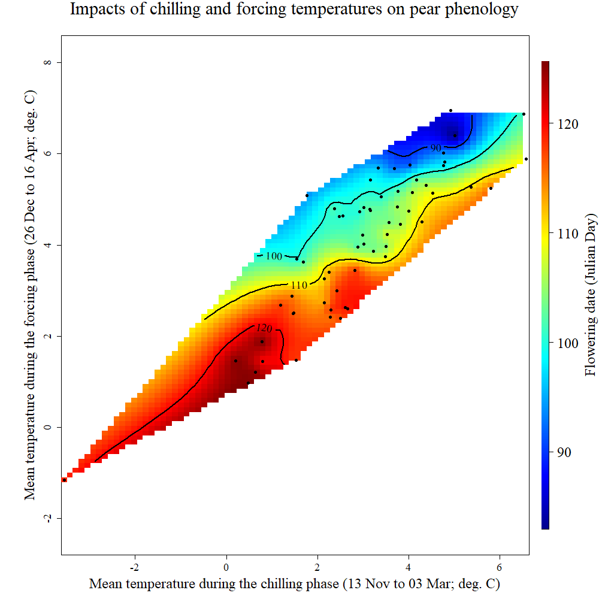

## Chilling and forcing requirements

Identifying dormancy phases enables a more precise analysis of phenological responses. Using the pear variety 'Alexander Lucas', PLS analysis is applied to examine the effects of temperature during dormancy.

```{r, include=FALSE}
library(chillR)
library(ggplot2)
library(tidyverse)
library(fields)
library(reshape2)
library(metR)
library(colorRamps)
```

```{r}
Alex_first <- read_tab("data/Alexander_Lucas_bloom_1958_2019.csv") %>%
  select(Pheno_year, First_bloom) %>%
  mutate(Year = as.numeric(substr(First_bloom, 1, 4)),
         Month = as.numeric(substr(First_bloom, 5, 6)),
         Day = as.numeric(substr(First_bloom, 7, 8))) %>%
  make_JDay() %>%
  select(Pheno_year, 
         JDay) %>%
  rename(Year = Pheno_year,
         pheno = JDay)

temps <- read_tab("data/TMaxTMin1958-2019_patched.csv")

temps_hourly <- temps %>%
  stack_hourly_temps(latitude = 50.6)

daychill <- daily_chill(hourtemps = temps_hourly,
                        running_mean = 1,
                        models = list(Chilling_Hours = Chilling_Hours,
                                      Utah_Chill_Units = Utah_Model,
                                      Chill_Portions = Dynamic_Model,
                                      GDH = GDH)
                        )


plscf <- PLS_chill_force(daily_chill_obj = daychill,
                         bio_data_frame = Alex_first,
                         split_month = 6,
                         chill_models = "Chill_Portions",
                         heat_models = "GDH",
                         runn_means = 11)

```

The results are visualized using `plot_PLS_chill_force` to illustrate temperature effects during dormancy.

```{r, echo=FALSE}
plot_PLS_chill_force <- function(plscf,
                                 chill_metric = "Chill_Portions",
                                 heat_metric = "GDH",
                                 chill_label = "CP",
                                 heat_label = "GDH",
                                 chill_phase = c(-48, 62),
                                 heat_phase = c(3, 105.5))
{
  PLS_gg <- plscf[[chill_metric]][[heat_metric]]$PLS_summary %>%
    mutate(Month = trunc(Date/100),
           Day = Date - Month * 100,
           Date = ISOdate(2002,
                          Month,
                          Day))
  
  PLS_gg[PLS_gg$JDay <= 0,"Date"]<-
    ISOdate(2001,
            PLS_gg$Month[PLS_gg$JDay <= 0],
            PLS_gg$Day[PLS_gg$JDay <= 0])
  
  PLS_gg <- PLS_gg %>%
    mutate(VIP_importance = VIP >= 0.8,
           VIP_Coeff = factor(sign(Coef) * VIP_importance))
  
  chill_start_date <- ISOdate(2001,
                              12,
                              31) + chill_phase[1] * 24 * 3600
  chill_end_date <- ISOdate(2001,
                            12,
                            31) + chill_phase[2] * 24 * 3600
  heat_start_date <- ISOdate(2001,
                             12,
                             31) + heat_phase[1] * 24 * 3600
  heat_end_date <- ISOdate(2001,
                           12,
                           31) + heat_phase[2] * 24 * 3600


  temp_plot <- ggplot(PLS_gg) +
    annotate("rect",
             xmin = chill_start_date,
             xmax = chill_end_date,
             ymin = -Inf,
             ymax = Inf,
             alpha = .1,
             fill = "blue") +
    annotate("rect",
             xmin = heat_start_date,
             xmax = heat_end_date,
             ymin = -Inf,
             ymax = Inf,
             alpha = .1,
             fill = "red") +
    annotate("rect",
             xmin = ISOdate(2001,
                            12,
                            31) +
               min(plscf$pheno$pheno,
                   na.rm = TRUE) * 24 * 3600,
             xmax = ISOdate(2001,
                            12,
                            31) +
               max(plscf$pheno$pheno,
                   na.rm = TRUE) * 24 * 3600,
             ymin = -Inf,
             ymax = Inf,
             alpha = .1,
             fill = "black") +
    geom_vline(xintercept = ISOdate(2001,
                                    12,
                                    31) +
                 median(plscf$pheno$pheno,
                        na.rm=TRUE) * 24 * 3600,
               linetype = "dashed") +
    geom_ribbon(aes(x = Date,
                    ymin = MetricMean - MetricStdev ,
                    ymax = MetricMean + MetricStdev ),
                fill = "grey") +
    geom_ribbon(aes(x = Date,
                    ymin = MetricMean - MetricStdev * (VIP_Coeff == -1),
                    ymax = MetricMean + MetricStdev * (VIP_Coeff == -1)),
                fill = "red") +
    geom_ribbon(aes(x = Date,
                    ymin = MetricMean - MetricStdev * (VIP_Coeff == 1),
                    ymax = MetricMean + MetricStdev * (VIP_Coeff == 1)),
                fill = "dark green") +
    geom_line(aes(x = Date,
                  y = MetricMean)) +
    facet_wrap(vars(Type),
               scales = "free_y",
               strip.position = "left",
               labeller = 
                 labeller(
                   Type =
                     as_labeller(c(Chill = paste0("Chill (",
                                                  chill_label,
                                                  ")"),
                                   Heat = paste0("Heat (",
                                                 heat_label,
                                                 ")"))))) +
    ggtitle("Daily chill and heat accumulation rates") +
    theme_bw(base_size = 15) + 
    theme(strip.background = element_blank(),
          strip.placement = "outside",
          strip.text.y = element_text(size = 12),
          plot.title = element_text(hjust = 0.5),
          axis.title.y = element_blank()
          )
  
  VIP_plot <- ggplot(PLS_gg,
                     aes(x = Date,
                         y = VIP)) +
    annotate("rect",
             xmin = chill_start_date,
             xmax = chill_end_date,
             ymin = -Inf,
             ymax = Inf,
             alpha = .1,
             fill = "blue") +
    annotate("rect",
             xmin = heat_start_date,
             xmax = heat_end_date,
             ymin = -Inf,
             ymax = Inf,
             alpha = .1,
             fill = "red") +
    annotate("rect",
             xmin = ISOdate(2001,
                            12,
                            31) + min(plscf$pheno$pheno,
                                      na.rm = TRUE) * 24 * 3600,
             xmax = ISOdate(2001,
                            12,
                            31) + max(plscf$pheno$pheno,
                                      na.rm = TRUE) * 24 * 3600,
             ymin = -Inf,
             ymax = Inf,
             alpha = .1,
             fill = "black") +
    geom_vline(xintercept = ISOdate(2001,
                                    12,
                                    31) + median(plscf$pheno$pheno,
                                                 na.rm = TRUE) * 24 * 3600,
               linetype = "dashed") +
    geom_bar(stat = 'identity',
             aes(fill = VIP>0.8)) +
    facet_wrap(vars(Type), 
               scales = "free",
               strip.position = "left",
               labeller = 
                 labeller(
                   Type = as_labeller(c(Chill="VIP for chill",
                                        Heat="VIP for heat")))) +
    scale_y_continuous(
      limits = c(0,
                 max(plscf[[chill_metric]][[heat_metric]]$PLS_summary$VIP))) +
    ggtitle("Variable Importance in the Projection (VIP) scores") +
    theme_bw(base_size = 15) + 
    theme(strip.background = element_blank(),
          strip.placement = "outside",
          strip.text.y = element_text(size = 12),
          plot.title = element_text(hjust = 0.5),
          axis.title.y = element_blank()
          ) +
    scale_fill_manual(name = "VIP", 
                      labels = c("<0.8", ">0.8"), 
                      values = c("FALSE" = "grey",
                                 "TRUE" = "blue")) +
    theme(axis.text.x = element_blank(),
          axis.ticks.x = element_blank(),
          axis.title.x = element_blank(),
          axis.title.y = element_blank())
  
  coeff_plot <- ggplot(PLS_gg,
                       aes(x = Date,
                           y = Coef)) +
    annotate("rect",
             xmin = chill_start_date,
             xmax = chill_end_date,
             ymin = -Inf,
             ymax = Inf,
             alpha = .1,
             fill = "blue") +
    annotate("rect",
             xmin = heat_start_date,
             xmax = heat_end_date,
             ymin = -Inf,
             ymax = Inf,
             alpha = .1,
             fill = "red") +
    annotate("rect",
             xmin = ISOdate(2001,
                            12,
                            31) + min(plscf$pheno$pheno,
                                      na.rm = TRUE) * 24 * 3600,
             xmax = ISOdate(2001,
                            12,
                            31) + max(plscf$pheno$pheno,
                                      na.rm = TRUE) * 24 * 3600,
             ymin = -Inf,
             ymax = Inf,
             alpha = .1,
             fill = "black") +
    geom_vline(xintercept = ISOdate(2001,
                                    12,
                                    31) + median(plscf$pheno$pheno,
                                                 na.rm = TRUE) * 24 * 3600,
               linetype = "dashed") +
    geom_bar(stat = 'identity',
             aes(fill = VIP_Coeff)) +
    facet_wrap(vars(Type),
               scales = "free",
               strip.position = "left",
               labeller =
                 labeller(
                   Type = as_labeller(c(Chill = "MC for chill",
                                        Heat = "MC for heat")))) +
    scale_y_continuous(
      limits = c(min(plscf[[chill_metric]][[heat_metric]]$PLS_summary$Coef),
                 max(plscf[[chill_metric]][[heat_metric]]$PLS_summary$Coef))) +
    ggtitle("Model coefficients (MC)") +
    theme_bw(base_size = 15) + 
    theme(strip.background = element_blank(),
          strip.placement = "outside",
          strip.text.y = element_text(size = 12),
          plot.title = element_text(hjust = 0.5),
          axis.title.y = element_blank()
          ) +
    scale_fill_manual(name = "Effect direction", 
                      labels = c("Advancing",
                                 "Unimportant",
                                 "Delaying"), 
                      values = c("-1" = "red",
                                 "0" = "grey",
                                 "1" = "dark green")) +
    ylab("PLS coefficient") +
    theme(axis.text.x = element_blank(),
          axis.ticks.x = element_blank(),
          axis.title.x = element_blank(),
          axis.title.y = element_blank())
  
  library(patchwork)
  
  plot <- (VIP_plot +
             coeff_plot +
             temp_plot +
             plot_layout(ncol = 1,
                         guides = "collect")
           ) & theme(legend.position = "right",
                     legend.text = element_text(size = 8),
                     legend.title = element_text(size = 10),
                     axis.title.x = element_blank())

plot

}
```

```{r}
plot_PLS_chill_force(plscf,
                     chill_metric = "Chill_Portions",
                     heat_metric = "GDH",
                     chill_label = "CP",
                     heat_label = "GDH",
                     chill_phase = c(-48, 62),
                     heat_phase = c(3, 105.5))
```

The identified phases for chilling and forcing are highlighted in color. To determine climatic requirements, accumulated values are calculated.

```{r}
chill_phase <- c(317, 62)
heat_phase <- c(3, 105.5)

chill <- tempResponse(hourtemps = temps_hourly,
                      Start_JDay = chill_phase[1],
                      End_JDay = chill_phase[2],
                      models = list(Chill_Portions = Dynamic_Model),
                      misstolerance = 10)

heat <- tempResponse(hourtemps = temps_hourly,
                     Start_JDay = heat_phase[1],
                     End_JDay = heat_phase[2],
                     models = list(GDH = GDH))
```

Histograms show the distribution of chill and heat accumulation:

```{r message=FALSE}
ggplot(data = chill,
       aes(x = Chill_Portions)) +
  geom_histogram() +
  ggtitle("Chill accumulation during endodormancy (Chill Portions)") +
  xlab("Chill accumulation (Chill Portions)") +
  ylab("Frequency between 1958 and 2019") +
  theme_bw(base_size = 12)
```

```{r message=FALSE}
ggplot(data = heat,
       aes(x = GDH)) +
  geom_histogram() +
  ggtitle("Heat accumulation during ecodormancy (GDH)") +
  xlab("Heat accumulation (Growing Degree Hours)") +
  ylab("Frequency between 1958 and 2019") +
  theme_bw(base_size = 12)
```

The average requirements are calculated:

```{r message=FALSE, warning=FALSE}
chill_requirement <- mean(chill$Chill_Portions)
chill_req_error <- sd(chill$Chill_Portions)

heat_requirement <- mean(heat$GDH)
heat_req_error <- sd(heat$GDH)
```

The chilling requirement (`chilling_requirement`) was estimated at approximately 72.3 Chill Portions, with an error margin (`chill_req_error`) of 7.7 CP, while the heat requirement (`heat_requirement)` was around 3415 Growing Degree Hours, with an estimated error (`heat_req_error`) of 1402 GDH. Compared to other fruit trees, this represents a relatively high chilling requirement but a low heat requirement.

This method provides an initial estimate of climatic requirements based on long-term bloom data. While uncertainties remain regarding phase duration, this approach has proven useful for preliminary analyses.

## Analysis of Tree Responses to Temperature

In addition to estimating chill and heat requirements, this analysis focuses on how trees respond to temperature during specific phases. While agroclimatic models provide reasonable approximations, raw temperature data will be reconsidered. The goal is to determine whether the mean temperatures during these periods explain the variation in bloom dates.

Since both chilling and forcing conditions influence bloom timing, their combined impact is visualized in a three-dimensional plot. The `chillR` package offers a function for this, but the process will also be manually replicated.

```{r}
chill_phase <- c(317, 62)
heat_phase <- c(360, 106)

mpt <- make_pheno_trend_plot(weather_data_frame = temps,
                             pheno = Alex_first,
                             Start_JDay_chill = chill_phase[1], 
                             End_JDay_chill = chill_phase[2],
                             Start_JDay_heat = heat_phase[1],
                             End_JDay_heat = heat_phase[2],
                             outpath = "data/",
                             file_name = "pheno_trend_plot",
                             plot_title = "Impacts of chilling and forcing temperatures on pear phenology",
                             image_type = "png", 
                             colorscheme = "normal")

```



The resulting plot links bloom timing to temperatures during chilling (x-axis) and forcing (y-axis) phases. Observations since 1958 reveal a strong correlation between these phases, forming a diagonal distribution. Warmer forcing temperatures lead to earlier blooms (blue), while cooler temperatures delay them (red). However, due to data gaps, assessing chilling effects is more complex.

### Recreating the Plot with `ggplot2`

The first step involves calculating the mean temperatures for the chilling and forcing phases:

```{r}
mean_temp_period <- function(
    temps,
    start_JDay,
    end_JDay,
    end_season = end_JDay)
{ temps_JDay <- make_JDay(temps) %>%
  mutate(Season =Year)
  
  if(start_JDay > end_season)
    temps_JDay$Season[which(temps_JDay$JDay >= start_JDay)]<-
        temps_JDay$Year[which(temps_JDay$JDay >= start_JDay)]+1
  
  if(start_JDay > end_season)
    sub_temps <- subset(temps_JDay,
                        JDay <= end_JDay | JDay >= start_JDay)
  
  if(start_JDay <= end_JDay)
    sub_temps <- subset(temps_JDay,
                        JDay <= end_JDay & JDay >= start_JDay)
  
  mean_temps <- aggregate(sub_temps[, c("Tmin", "Tmax")],
                          by = list(sub_temps$Season),
                          FUN = function(x) mean(x,
                                                 na.rm=TRUE))
  
  mean_temps[, "n_days"] <- aggregate(sub_temps[, "Tmin"],
                                      by = list(sub_temps$Season),
                                      FUN = length)[,2]
  
  mean_temps[, "Tmean"] <- (mean_temps$Tmin + mean_temps$Tmax) / 2
  mean_temps <- mean_temps[, c(1, 4, 2, 3, 5)]
  colnames(mean_temps)[1] <- "End_year"
  
  return(mean_temps)
}

mean_temp_chill <- mean_temp_period(temps = temps,
                                    start_JDay = chill_phase[1],
                                    end_JDay = chill_phase[2],
                                    end_season = 60)

mean_temp_heat <- mean_temp_period(temps = temps,
                                   start_JDay = heat_phase[1],
                                   end_JDay = heat_phase[2],
                                   end_season = 60)
```

The `end_season` parameter ensures proper seasonal assignment, preventing errors when the chilling phase spans two years. Next, the datasets are merged:

```{r}
mean_temp_chill <- 
  mean_temp_chill[which(mean_temp_chill$n_days >=
                          max(mean_temp_chill$n_days)-1),]
mean_temp_heat <-
  mean_temp_heat[which(mean_temp_heat$n_days >=
                         max(mean_temp_heat$n_days)-1),]

mean_chill <- mean_temp_chill[, c("End_year",
                                  "Tmean")]
colnames(mean_chill)[2] <- "Tmean_chill"

mean_heat <- mean_temp_heat[,c("End_year",
                               "Tmean")]
colnames(mean_heat)[2] <- "Tmean_heat"

phase_Tmeans <- merge(mean_chill,
                      mean_heat, 
                      by = "End_year")


pheno <- Alex_first
colnames(pheno)[1] <- "End_year"

Tmeans_pheno <- merge(phase_Tmeans,
                      pheno,
                      by = "End_year")
```

To interpolate the data, Kriging from the `fields` package is used:

```{r message=FALSE, warning=FALSE}
library(fields)
k <- Krig(x = as.matrix(
                Tmeans_pheno[,
                             c("Tmean_chill",
                               "Tmean_heat")]),
          Y = Tmeans_pheno$pheno)

pred <- predictSurface(k)
colnames(pred$z) <- pred$y
rownames(pred$z) <- pred$x

library(reshape2)
melted <- melt(pred$z)
  
library(metR)
library(colorRamps)
  
colnames(melted) <- c("Tmean_chill",
                      "Tmean_heat",
                      "value")


ggplot(melted,
       aes(x = Tmean_chill,
           y = Tmean_heat,
           z = value)) +
  geom_contour_fill(bins = 100) +
  scale_fill_gradientn(colours = alpha(matlab.like(15)),
                       name = "Bloom date \n(day of the year)") +
  geom_contour(col = "black")  +
  geom_point(data = Tmeans_pheno,
             aes(x = Tmean_chill,
                 y = Tmean_heat,
                 z = NULL),
             size = 0.7) +
  geom_text_contour(stroke = 0.2) +
  ylab(expression(paste("Forcing phase ", 
                        T[mean],
                        " (",
                        degree,
                        "C)"))) +
  xlab(expression(paste("Chilling phase ",
                        T[mean],
                        " (",
                        degree,
                        "C)")))  +
  theme_bw(base_size = 15)
    
```

### Automating with a Function

To streamline future analyses, the entire process can be encapsulated in a function:

```{r, message=FALSE,warning=FALSE}
pheno_trend_ggplot <- function(temps,
                               pheno,
                               chill_phase,
                               heat_phase,
                               phenology_stage = "Bloom")
{
  library(fields)
  library(reshape2)
  library(metR)
  library(ggplot2)
  library(colorRamps)
  
  # first, a sub-function (function defined within a function) to
  # compute the temperature means
  
  mean_temp_period <- function(temps,
                               start_JDay,
                               end_JDay, 
                               end_season = end_JDay)
    { temps_JDay <- make_JDay(temps) %>%
      mutate(Season = Year)

    if(start_JDay > end_season)
      temps_JDay$Season[which(temps_JDay$JDay >= start_JDay)] <-
        temps_JDay$Year[which(temps_JDay$JDay >= start_JDay)]+1
    
    if(start_JDay > end_season)
      sub_temps <- subset(temps_JDay,
                          JDay <= end_JDay | JDay >= start_JDay)
    
    if(start_JDay <= end_JDay)
      sub_temps <- subset(temps_JDay,
                          JDay <= end_JDay & JDay >= start_JDay)
    
    mean_temps <- aggregate(sub_temps[,
                                      c("Tmin",
                                        "Tmax")],
                            by = list(sub_temps$Season),
                            FUN = function(x) mean(x,
                                                   na.rm = TRUE))
    mean_temps[, "n_days"] <- aggregate(sub_temps[,
                                                  "Tmin"],
                                        by = list(sub_temps$Season),
                                        FUN = length)[,2]
    
    mean_temps[,"Tmean"] <- (mean_temps$Tmin + mean_temps$Tmax) / 2
    mean_temps <- mean_temps[, c(1, 4, 2, 3, 5)]
    colnames(mean_temps)[1] <- "End_year"
    return(mean_temps)
    }
  
  mean_temp_chill <- mean_temp_period(temps = temps,
                                      start_JDay = chill_phase[1],
                                      end_JDay = chill_phase[2],
                                      end_season = heat_phase[2])
  
  mean_temp_heat <- mean_temp_period(temps = temps,
                                     start_JDay = heat_phase[1],
                                     end_JDay = heat_phase[2],
                                     end_season = heat_phase[2])
  
  mean_temp_chill <-
    mean_temp_chill[which(mean_temp_chill$n_days >= 
                            max(mean_temp_chill$n_days)-1),]
  mean_temp_heat <-
    mean_temp_heat[which(mean_temp_heat$n_days >= 
                           max(mean_temp_heat$n_days)-1),]
  mean_chill <- mean_temp_chill[, c("End_year",
                                    "Tmean")]
  colnames(mean_chill)[2] <- "Tmean_chill"
  mean_heat<-mean_temp_heat[,c("End_year",
                               "Tmean")]
  colnames(mean_heat)[2] <- "Tmean_heat"
  phase_Tmeans <- merge(mean_chill,
                        mean_heat,
                        by = "End_year")
  
  colnames(pheno) <- c("End_year",
                       "pheno")
  Tmeans_pheno <- merge(phase_Tmeans,
                        pheno, 
                        by="End_year")
  
  # Kriging interpolation
  k <- Krig(x = as.matrix(Tmeans_pheno[,c("Tmean_chill",
                                          "Tmean_heat")]),
            Y = Tmeans_pheno$pheno)
  pred <- predictSurface(k)
  colnames(pred$z) <- pred$y
  rownames(pred$z) <- pred$x
  melted <- melt(pred$z)
  colnames(melted) <- c("Tmean_chill",
                        "Tmean_heat",
                        "value")
  
  ggplot(melted,
         aes(x = Tmean_chill,
             y = Tmean_heat,
             z = value)) +
    geom_contour_fill(bins = 60) +
    scale_fill_gradientn(colours = alpha(matlab.like(15)),
                         name = paste(phenology_stage,
                                      "date \n(day of the year)")) +
    geom_contour(col = "black") +
    geom_text_contour(stroke = 0.2) +
    geom_point(data = Tmeans_pheno,
               aes(x = Tmean_chill,
                   y = Tmean_heat,
                   z = NULL),
               size = 0.7)  +
    ylab(expression(paste("Forcing phase ",
                          T[mean],
                          " (",
                          degree,
                          "C)"))) +
    xlab(expression(paste("Chilling phase ",
                          T[mean],
                          " (",
                          degree,
                          "C)"))) +
    theme_bw(base_size = 15)
}


chill_phase <- c(317, 62)
heat_phase <- c(360, 105.5)

pheno_trend_ggplot(temps = temps,
                   pheno = Alex_first,
                   chill_phase = chill_phase,
                   heat_phase = heat_phase,
                   phenology_stage = "Bloom")
```

By automating the process, generating high-quality plots becomes efficient and consistent across datasets.

## Applying our functions to California walnuts

The developed functions can now be used to analyze walnuts in California, using a dataset with leaf emergence observations for the Payne walnut cultivar in Davis.

```{r, warning=FALSE, message=FALSE}
Cali_temps <- read_tab("data/Davis_weather.csv")
Walnut_pheno <- read_tab("data/Davis_Payne_leaf_out.csv") %>%
  mutate(Year = as.numeric(substr(Leaf.date,7,8)),
         Year = Year+(19+(Year<25))*100,
         Month = as.numeric(substr(Leaf.date,4,5)),
         Day = as.numeric(substr(Leaf.date,1,2))) %>%
  make_JDay() %>%
  select(Year, JDay)

colnames(Walnut_pheno) <- c("Year",
                            "pheno")

Cali_temps_hourly <- stack_hourly_temps(Cali_temps,
                                        latitude = 38.5)

Cali_daychill <- daily_chill(hourtemps = Cali_temps_hourly,
                             running_mean = 1,
                             models = list(Chilling_Hours = Chilling_Hours,
                                           Utah_Chill_Units = Utah_Model,
                                           Chill_Portions = Dynamic_Model,
                                           GDH = GDH)
    )


plscf <- PLS_chill_force(daily_chill_obj = Cali_daychill,
                         bio_data_frame = Walnut_pheno,
                         split_month = 6,
                         chill_models = "Chill_Portions",
                         heat_models = "GDH",
                         runn_means = 11)

plot_PLS_chill_force(plscf,
                     chill_metric = "Chill_Portions",
                     heat_metric = "GDH",
                     chill_label = "CP",
                     heat_label = "GDH",
                     chill_phase = c(-56, 5),
                     heat_phase = c(19, 77))
```

```{r, message=FALSE, warning=FALSE}
pheno_trend_ggplot(temps = Cali_temps,
                   pheno = Walnut_pheno,
                   chill_phase = c(309, 5),
                   heat_phase = c(19, 77),
                   phenology_stage = "Leaf emergence")
```

The color pattern in this analysis reveals clearer insights. Early leaf emergence occurred with a cool chilling phase and a warm forcing phase, indicated by the blue in the top left corner. Conversely, the bottom right corner, marked in red, shows that a warm chilling phase with a cool forcing phase led to later leaf emergence.

## `Exercises` on evaluating PLS regression results

1.  Reproduce the analysis for the ‘Roter Boskoop’ dataset.

```{r warning=FALSE}
# Load weather data for Klein-Altendorf and Roter Boskoop dataset
KA_temps <- read_tab("data/TMaxTMin1958-2019_patched.csv")
Apple_pheno <- read_tab("data/Roter_Boskoop_bloom_1958_2019.csv") %>%
  select(Pheno_year, First_bloom) %>%
  mutate(Year = as.numeric(substr(First_bloom, 1, 4)),
         Month = as.numeric(substr(First_bloom, 5, 6)),
         Day = as.numeric(substr(First_bloom, 7, 8))) %>%
  make_JDay() %>%
  select(Pheno_year, 
         JDay) %>%
  rename(Year = Pheno_year,
         pheno = JDay)

colnames(Apple_pheno) <- c("Year",
                            "pheno")

KA_temps_hourly <- stack_hourly_temps(KA_temps,
                                        latitude = 50.6)

KA_daychill <- daily_chill(hourtemps = KA_temps_hourly,
                             running_mean = 1,
                             models = list(Chilling_Hours = Chilling_Hours,
                                           Utah_Chill_Units = Utah_Model,
                                           Chill_Portions = Dynamic_Model,
                                           GDH = GDH)
    )

plscf <- PLS_chill_force(daily_chill_obj = KA_daychill,
                         bio_data_frame = Apple_pheno,
                         split_month = 6,
                         chill_models = "Chill_Portions",
                         heat_models = "GDH",
                         runn_means = 11)

# Plot PLS analysis of 'Roter Boskoop' apples in Klein-Altendorf
plot_PLS_chill_force(plscf,
                     chill_metric = "Chill_Portions",
                     heat_metric = "GDH",
                     chill_label = "CP",
                     heat_label = "GDH",
                     chill_phase = c(-48, 62),
                     heat_phase = c(3, 105.5))
```

```{r message=FALSE, warning=FALSE}
# Plot phenology trend plot for apples 'Roter Boskoop' in Klein-Altendorf
pheno_trend_ggplot(temps = KA_temps,
                   pheno = Apple_pheno,
                   chill_phase = c(317, 62),
                   heat_phase = c(360, 106),
                   phenology_stage = "Bloom")
```

2.  We’ve looked at data from a number of locations so far. How would you expect this surface plot to look like in Beijing? And how should it look in Tunisia?

The surface plot for Beijing would likely show a broader range of chilling and forcing conditions due to its continental climate, characterized by cold winters and hot summers. The plot might have a more pronounced contrast, with early leaf emergence occurring under cold chilling conditions followed by warm forcing temperatures, while late emergence would be associated with mild winters and cooler spring temperatures. Given Beijing's significant seasonal variation, the dataset may cover a wider range of temperature combinations.

In Tunisia, which has a Mediterranean climate with mild winters and warm springs, the chilling phase would generally be warmer, potentially limiting strong chilling accumulation. The surface plot might show a more compressed distribution, with fewer extreme chilling conditions. Early emergence would likely still correspond to relatively cooler chilling conditions and warm forcing temperatures, but the overall variation in the dataset might be narrower compared to Beijing. Additionally, insufficient chilling accumulation in some years could lead to irregular or delayed leaf emergence, which might result in a less smooth pattern in the plot.
