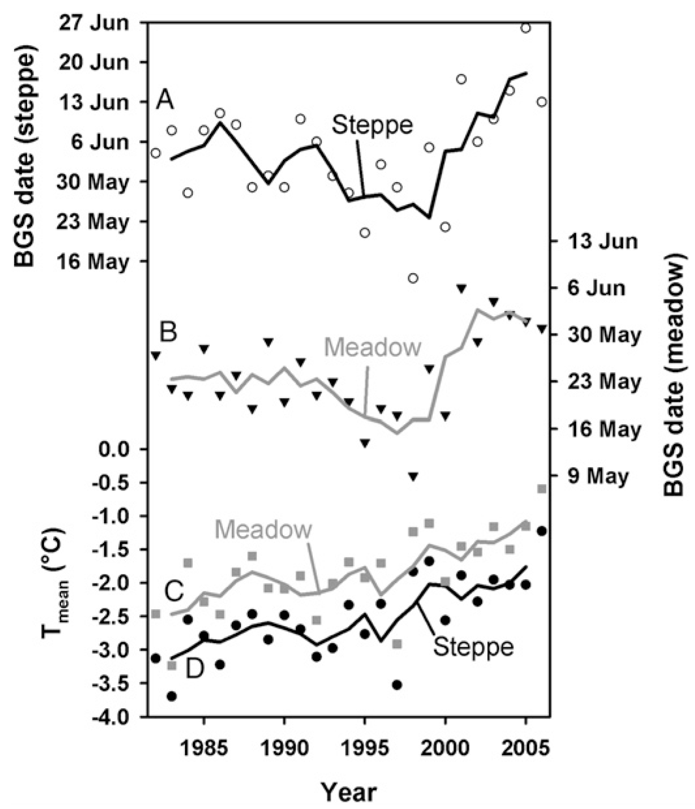
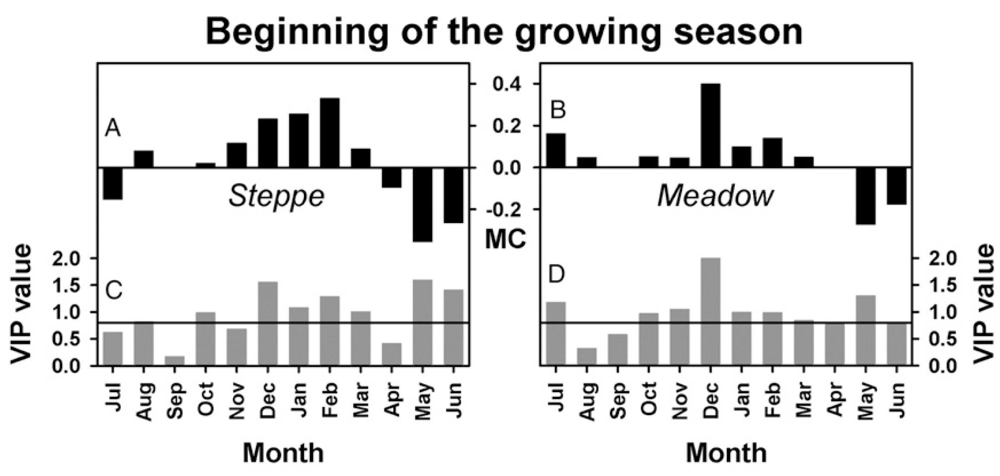
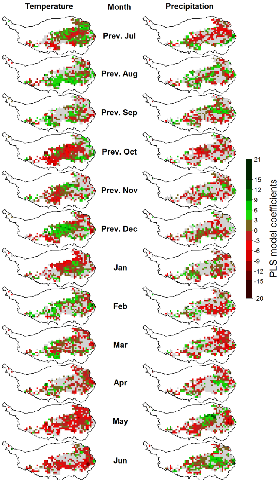
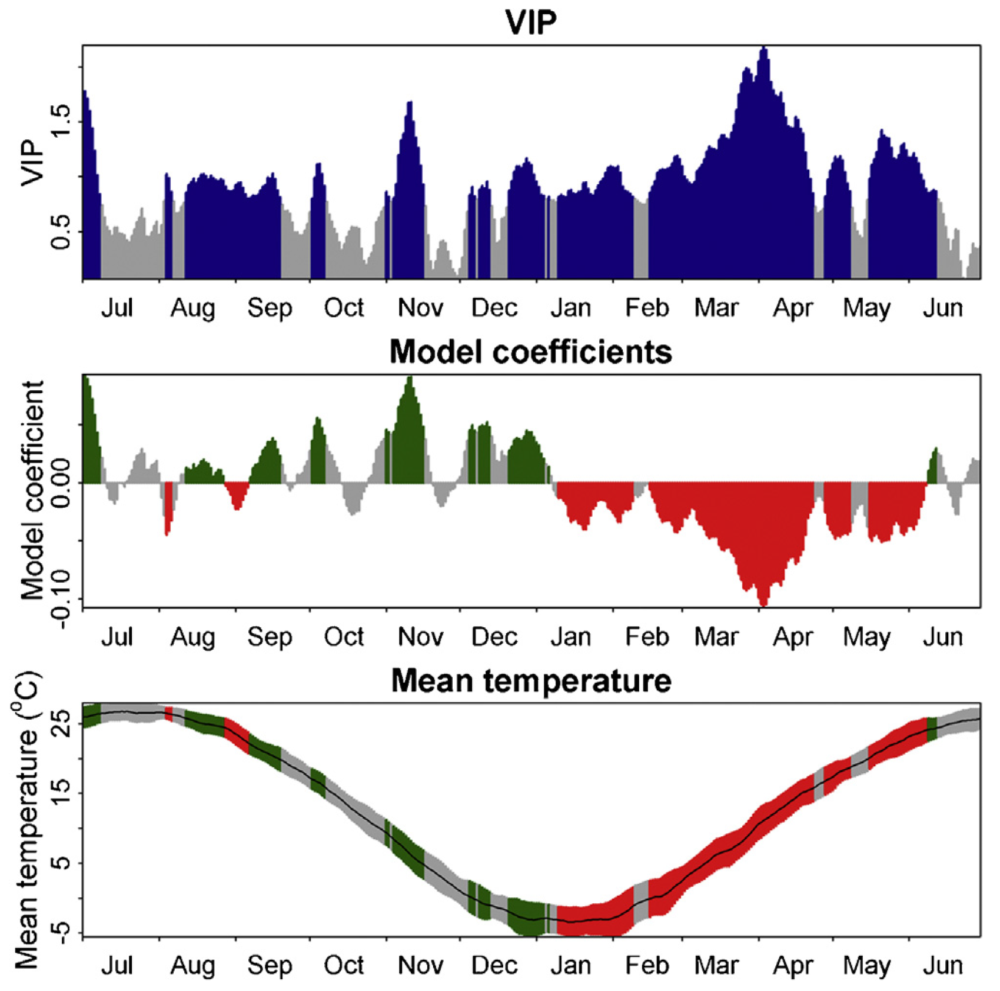
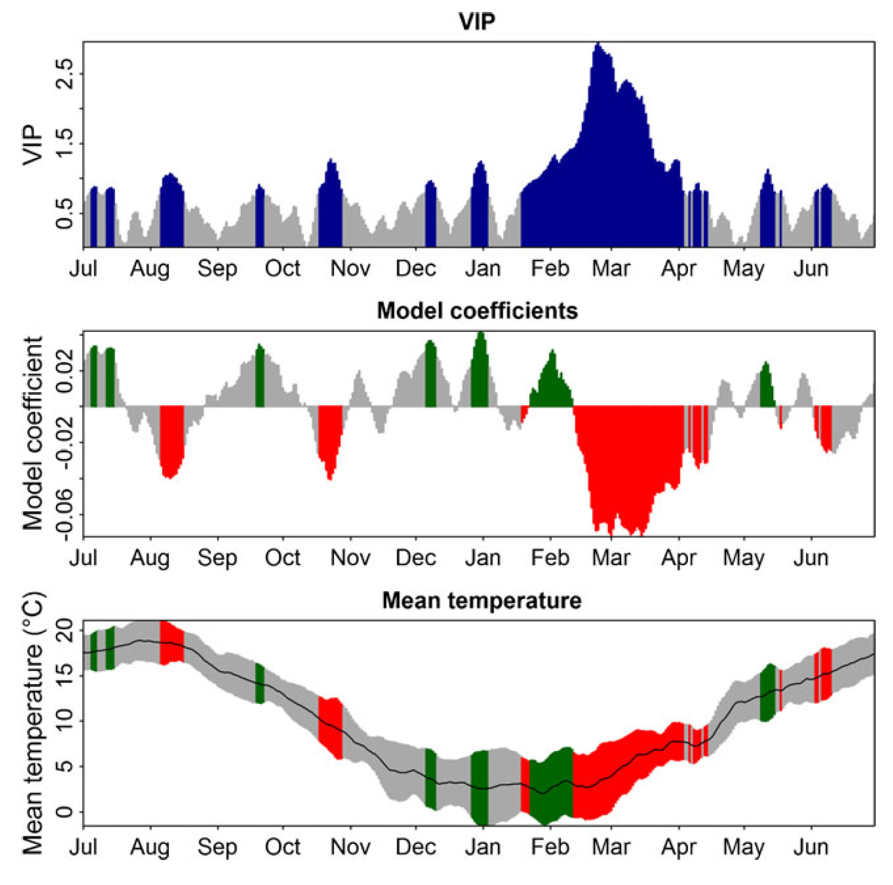
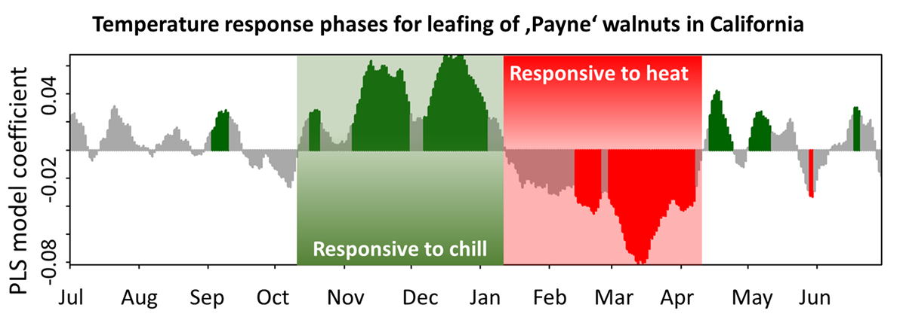

## PLS regression

Partial Least Squares (PLS) regression is a statistical method used to correlate high-resolution temperature data (e.g., daily temperatures) with lower-resolution phenological events (e.g., annual bloom times). In the phenology analysis at Klein-Altendorf, PLS regression successfully identified the forcing period (when warm temperatures accelerate bloom) for pears but failed to detect the chilling phase. This contrasts with a study on walnut leaf emergence in California, where both dormancy phases were clearly visible. Further examples illustrate where and why PLS regression is effective.

## PLS examples

### Grasslands on the Tibetan Plateau

An early application of PLS regression examined how grasslands on the Tibetan Plateau respond to temperature changes, particularly the start of the growing season under climate change. Initially, there was a clear trend of earlier growth until the late 1990s, followed by an unexpected delay in green-up dates.



Between 1982 and 2006, PLS regression identified significant influences of both winter (October–March) and spring (May–June) temperatures on the beginning of the growing season (BGS). The Variable Importance in Projection (VIP) scores highlighted these periods as crucial (VIP \> 0.8). Model coefficients indicated that warm winters delayed spring phenology, whereas warm spring temperatures advanced BGS.



A spatial analysis further examined these temperature responses at a pixel-by-pixel scale:



These findings resemble those observed in California walnuts, though the underlying mechanisms may differ. Surprisingly, increasing temperatures have not consistently led to an earlier growing season, suggesting a mismatch between current ecosystems and future climate conditions. This misalignment could threaten sustainability and create opportunities for invasive species better adapted to new thermal conditions.

### Deciduous Trees

PLS regression has also been applied to tree phenology, notably in collaboration with Guo Liang, a researcher at Northwest A&F University in China. His analysis of Chinese chestnut (*Castanea mollissima*) in Beijing identified a clear forcing period with consistent negative model coefficients from January to May. However, the chilling period was only partially visible, with inconsistent model coefficients.



A similar pattern emerged in an analysis of cherry bloom dates from Klein-Altendorf, where the forcing phase was clearly defined, but the chilling phase remained difficult to pinpoint.



This recurring pattern—clear forcing but an obscured chilling phase—contrasts with earlier studies in California, where both phases were more distinct.



## Challenges in Detecting the Chilling Phase

The absence of the chilling phase in PLS regression does not imply that the method is ineffective. Instead, it highlights that PLS is sensitive to monotonic relationships, where increases in temperature or another signal directly correlate with a response variable. For example, in spider mite studies, PLS successfully detected mite damage based on increased reflectance.

However, chilling accumulation follows a more complex, non-monotonic relationship with temperature. Effective chill accumulation depends on temperature ranges rather than a linear correlation. To understand this, different chill models can be analyzed using the `chillR` and `dormancyR` R packages:

```{r message=FALSE, warning=FALSE}
library(chillR)
library(dormancyR)
library(ggplot2)
library(kableExtra)
library(patchwork)
library(tidyverse)


hourly_models <- 
  list(
    Chilling_units = chilling_units,
    Low_chill = low_chill_model,
    Modified_Utah = modified_utah_model,
    North_Carolina = north_carolina_model,
    Positive_Utah = positive_utah_model,
    Chilling_Hours = Chilling_Hours,
    Utah_Chill_Units = Utah_Model,
    Chill_Portions = Dynamic_Model)

daily_models <-
  list(
    Rate_of_Chill = rate_of_chill, 
    Exponential_Chill = exponential_chill,
    Triangular_Chill_Haninnen = triangular_chill_1,
    Triangular_Chill_Legave = triangular_chill_2)

metrics <- c(names(daily_models),
             names(hourly_models))

model_labels <- c("Rate of Chill",
                  "Exponential Chill",
                  "Triangular Chill (Häninnen)",
                  "Triangular Chill (Legave)",
                  "Chilling Units",
                  "Low-Chill Chill Units",
                  "Modified Utah Chill Units",
                  "North Carolina Chill Units",
                  "Positive Utah Chill Units",
                  "Chilling Hours",
                  "Utah Chill Units",
                  "Chill Portions")


for(T in -20:30)
 {
  hourly <- sapply( hourly_models,
                    function(x)
                      x(rep(T,1000))
                    )[1000,]
 
  temp_frame <- data.frame(Tmin = rep(T,1000),
                           Tmax = rep(T,1000),
                           Tmean = rep(T,1000))
  
  daily <- sapply( daily_models,
                   function(x) 
                     x(temp_frame)
                   )[1000,]
 
  if(T == -20)
    sensitivity <- c(T = T,
                     daily,
                     hourly) else   
      sensitivity <- rbind(sensitivity,
                           c(T = T,
                             daily,
                             hourly))
  }

sensitivity_normal <- 
  as.data.frame(cbind(sensitivity[,1],
                      sapply(2:ncol(sensitivity),
                             function(x)
                               sensitivity[,x]/max(sensitivity[,x]))))

colnames(sensitivity_normal) <- colnames(sensitivity)

sensitivity_gg <- 
  sensitivity_normal %>%
  pivot_longer(Rate_of_Chill:Chill_Portions)
  
 # melt(sensitivity_normal,id.vars="T")
sensitivity_gg$value[sensitivity_gg$value<=0.001] <- NA


chill<-
  ggplot(sensitivity_gg,
         aes(x = T,
             y = factor(name),
             size = value)) +
  geom_point(col = "light blue") +
  scale_y_discrete(labels = model_labels) +
  ylab("Chill model") +
  xlab("Temperature (assumed constant, °C)") +
  xlim(c(-30, 40)) +
  theme_bw(base_size = 15) +
  labs(size = "Chill \nWeight")
```

```{r message=FALSE, warning=FALSE}
chill
```

Winter temperatures at the three locations (Klein-Altendorf, Beijing, and Davis) can be summarized by obtaining and processing the relevant temperature data. Once the data files are saved in the data subfolder of the working directory, the provided code will process and analyze the temperatures. This enables the comparison of winter temperature patterns across the locations and their influence on phenological responses.

```{r, message=FALSE, warning=FALSE}
KA_temps <- read_tab("data/TMaxTMin1958-2019_patched.csv") %>%
  make_JDay() %>%
  filter(JDay > 305 | JDay < 90) %>%
  stack_hourly_temps(latitude = 50.6)


hh_KA <- hist(KA_temps$hourtemps$Temp,
              breaks = c(-30:30),
              plot=FALSE)

hh_KA_df <- data.frame(
  T = hh_KA$mids,
  name = "Klein-Altendorf, Germany",
  value = hh_KA$counts / max(hh_KA$counts))

hh_KA_df$value[hh_KA_df$value == 0] <- NA


Beijing_temps <- read_tab("data/Beijing_weather.csv") %>%
  make_JDay() %>%
  filter(JDay > 305 | JDay < 90) %>%
  stack_hourly_temps(latitude = 39.9)

hh_Beijing <- hist(Beijing_temps$hourtemps$Temp,
                   breaks = c(-30:30),
                   plot=FALSE)

hh_Beijing_df<-data.frame(
  T = hh_Beijing$mids,
  name = "Beijing, China",
  value = hh_Beijing$counts / max(hh_Beijing$counts))

hh_Beijing_df$value[hh_Beijing_df$value==0]<-NA


Davis_temps <- read_tab("data/Davis_weather.csv") %>%
  make_JDay() %>%
  filter(JDay > 305 | JDay < 90) %>%
  stack_hourly_temps(latitude = 38.5)


hh_Davis <- hist(Davis_temps$hourtemps$Temp,
              breaks = c(-30:40),
              plot=FALSE)

hh_Davis_df <- data.frame(
  T = hh_Davis$mids,
  name = "Davis, California",
  value = hh_Davis$counts / max(hh_Davis$counts))

hh_Davis_df$value[hh_Davis_df$value == 0] <- NA


hh_df<-rbind(hh_KA_df,
             hh_Beijing_df,
             hh_Davis_df)

locations<-
  ggplot(data = hh_df,
         aes(x = T,
             y = name,
             size = value)) +
  geom_point(col = "coral2") +
  ylab("Location") +
  xlab("Temperature (between November and March, °C)") + 
  xlim(c(-30, 40)) +
  theme_bw(base_size = 15) +
  labs(size = "Relative \nfrequency")
```

```{r, warning=FALSE}
locations
```

To compare the plots, the results can be combined into one figure using the `patchwork` package:

```{r, warning=FALSE}
plot <- (chill +
             locations +
             plot_layout(guides = "collect",
                         heights = c(1, 0.4))
           ) & theme(legend.position = "right",
                     legend.text = element_text(size = 10),
                     legend.title = element_text(size = 12))

plot
```

To simplify the analysis, the focus can be shifted to plotting chill according to the Dynamic Model, as it is a more reliable approach compared to some of the other models. This will help in creating a clearer, more focused visualization of chill accumulation and its relationship with temperature.

```{r, warning=FALSE}
chill <-
  ggplot(sensitivity_gg %>%
           filter(name == "Chill_Portions"),
         aes(x = T,
             y = factor(name),
             size=value)) +
  geom_point(col = "light blue") +
  scale_y_discrete(labels = "Chill Portions") +
  ylab("Chill model") +
  xlab("Temperature (assumed constant, °C)") +
  xlim(c(-30, 40)) +
  theme_bw(base_size = 15) +
  labs(size = "Chill \nWeight")

  plot<- (chill +
            locations +
            plot_layout(guides = "collect",
                        heights = c(0.5,1))
        ) & theme(legend.position = "right",
                  legend.text = element_text(size = 10),
                  legend.title = element_text(size = 12))

plot
```

When comparing the effective chill ranges with winter temperatures at the three locations, it becomes evident that in Klein-Altendorf and Beijing, temperatures are often cooler than the effective temperature range for chill accumulation. In contrast, Davis experiences more frequent temperatures that are too warm for effective chill accumulation.

At Davis, warmer winter temperatures are likely to reduce chill accumulation, while in Klein-Altendorf and Beijing, the relationship is more complex. In colder conditions, warming might increase chill accumulation, but in warmer conditions, it could decrease it. This non-monotonic relationship between temperature and chill accumulation means that PLS regression is unlikely to yield clear results at these locations.

In the following chapter, a solution to address this issue will be explored.

## `Exercises` on chill model comparison

1.  Briefly explain in what climatic settings we can expect PLS regression to detect the chilling phase - and in what settings this probably won’t work.

PLS regression works well for detecting the chilling phase in climates where temperatures stay within the effective chill range, allowing for a clear relationship between temperature and chill accumulation. However, in areas with fluctuating or excessively warm temperatures (like Davis, California), the relationship becomes non-monotonic, making PLS less effective.

2.  How could we overcome this problem?

To improve chill detection, we could use models that account for non-monotonic relationships, such as the Dynamic Model. Additionally, incorporating environmental factors and refining chill models to better reflect temperature thresholds can help overcome the limitations of PLS regression.
