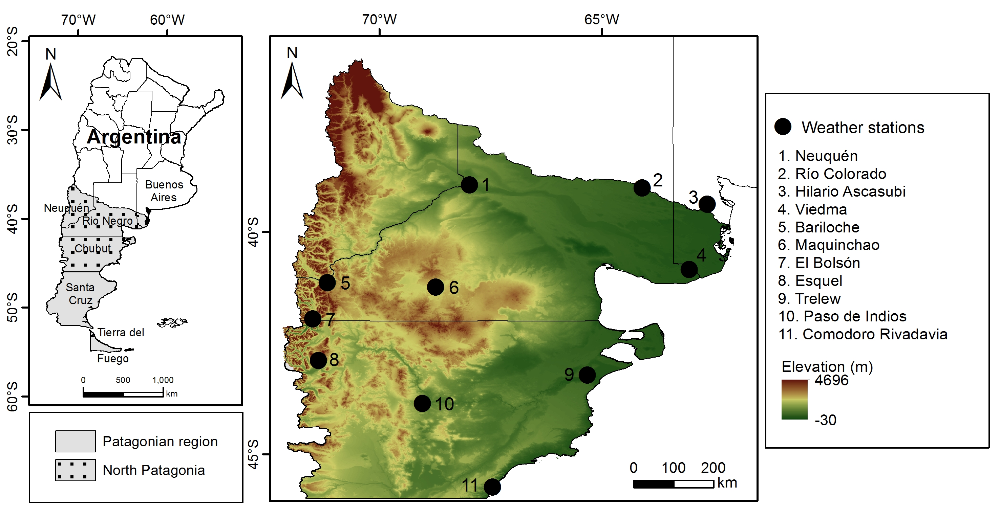

This section provides an overview of how winter chill can be modeled. It summarizes past studies on this topic, aiming to clarify the methodological aspects that lead to the analyses conducted. By the end of this lesson, most of the analyses presented in the discussed papers should be understandable.

## Winter chill in Oman

During his doctoral studies at the University of Kassel, [Prof. Dr. Eike Lüdeling](https://www.gartenbauwissenschaft.uni-bonn.de/author/prof.-dr.-eike-luedeling/) became interested in winter chill while participating in research on mountain oases in Oman. Initially focused on calculating nutrient budgets for the oases, particularly in the "Hanging Gardens" of Ash Sharayjah, the study shifted when many fruit trees failed to bear fruit. This led to the hypothesis that insufficient winter chill might be the issue, especially since the oases hosted temperate species such as pomegranates (*Punica granatum*), walnuts (*Juglans regia*), and apricots (*Prunus armeniaca*).

To investigate this, temperature loggers were placed in three oases at different levels of elevation, allowing for the study of chill accumulation along an elevation gradient. A map of the study area illustrates the locations of the oases:

A nearby long-term weather station provided valuable data, although its location - 1000 meters above the lowest oasis - limited its representativeness. Since records were available from the oases, transfer functions were defined to derive oasis temperatures from the long-term data. These transfer functions were set up using PLS regression, which, in hindsight, wasn’t a very good idea, to directly calculate hourly temperatures in the oases from the daily records of the official station at Saiq.

This approach facilitated the calculation of hourly temperatures, which were essential for assessing winter chill dynamics over several years.

The findings were submitted to the journal Climatic Change ([Luedeling et al., 2009b](https://link.springer.com/article/10.1007/s10584-009-9581-7)), where reviewers suggested incorporating future climate scenarios. To address this, the LARS-WG weather generator was employed to simulate plausible weather conditions for the oases under scenarios of 1°C and 2°C warming.

The results illustrated the potential impacts of climate change on winter chill, marking the beginning of a career focused on chill modeling.

## Chill model sensitivity

After completing a PhD at the University of Kassel, [Prof. Dr. Eike Lüdeling](https://www.gartenbauwissenschaft.uni-bonn.de/author/prof.-dr.-eike-luedeling/) became a Postdoctoral Scholar at the University of California at Davis, where his research focused on climate change impacts on winter chill in California's Central Valley, a key region for temperate fruit tree production.

Upon arriving in California, it became evident that the choice of chill model significantly impacts winter chill quantification. Initially, the simplest model was chosen due to a lack of programming skills, but further investigation highlighted the importance of model selection. Extensive library research revealed the need for a thorough examination of various chill models. Knowledge gained in Oman was utilized to create temperature scenarios for multiple locations, allowing for the analysis of how chill accumulation would likely change in the future.

The analysis focused on changes predicted by various models for the same locations and future scenarios. Here are the locations examined:

The results revealed considerable variation in chill projections for these locations. The analysis illustrated significant differences in estimates of chill losses by 2050, indicating that not all models could accurately represent winter chill dynamics. Ultimately, the Dynamic Model emerged as the most reliable option, prompting its primary use in subsequent research.

However, challenges arose with the complexity of the Dynamic Model, which required outdated Excel software for calculations. Additionally, the data processing steps necessary to generate credible temperature scenarios proved cumbersome and error-prone, highlighting the need to develop programming skills for more efficient analysis.

## Winter chill in California

The primary goal during the time in California was to create a winter chill projection for the Central Valley, an important region for fruit and nut production. Utilizing California's extensive network of weather stations, the plan involved using data from over 100 stations and generating multiple climate scenarios. To manage this complex task efficiently, a decision was made to automate most processes, leading to an exploration of programming.

The automation was implemented using JSL, a programming language associated with the statistics software JMP, which facilitated the handling of the data. Despite some challenges, the automation was largely successful, though running the weather generator manually for each station remained tedious. Ultimately, projections were generated for all stations, illustrating chill accumulation over 100 plausible winter seasons for each climate scenario.

To present the results effectively, a metric called 'Safe Winter Chill' was developed, defined as the 10th percentile of the chill distribution, indicating the minimum chill amount that would be exceeded in 90% of the years. Here’s an illustration of the Safe Winter Chill metric:

A method for spatially interpolating the station results was also established, leading to the creation of maps that depicted winter chill prospects for the Central Valley. Here’s one of the maps that resulted from this:

This analysis was published in the journal PLOS ONE ([Luedeling et al., 2009d](https://journals.plos.org/plosone/article?id=10.1371/journal.pone.0006166)).

## Winter chill ratios

Following the automation of processing steps in JSL, attention turned to creating a global winter chill projection. The Global Summary of the Day database was identified as a valuable data source, featuring records from thousands of weather stations. The project proved challenging due to limited programming skills. Data processing was carried out on six computers operating around the clock for several weeks, likely a result of initial setup difficulties rather than the complexity of the analyses. In the end, data for about 5,000 weather stations were processed, generating multiple chill metrics.

This extensive dataset allowed for a comparison of chill models by calculating the ratios between various chill metrics at each station. If these ratios had been consistent worldwide (e.g., one Chill Portion always equating to ten Chilling Hours), any chill model could have been reliably used. However, significant variations in chill metric ratios were observed globally.

This study was published in the International Journal of Biometeorology ([Luedeling & Brown, 2011a](https://link.springer.com/article/10.1007/s00484-010-0352-y)).

## A global projection of future winter chill

Using the same analytical methods, a global projection of the potential impacts of climate change on winter chill was also generated:

The regions marked in red and orange on the lower two maps may experience significant impacts on fruit and nut production due to decreasing winter chill. With substantial chill losses, it is unlikely that growers will be able to sustain their current tree cultivars. Notably, the Mediterranean region is expected to be particularly affected.

This prompted collaboration with partners in the Mediterranean region and other countries with similar climates, such as South Africa and Chile.

## Winter chill in Germany

Germany is not highlighted as particularly vulnerable to chill losses, and an analysis of historical chilling trends from 1950 supports this observation:

## Winter chill in Tunisia

Prospects for orchards in Tunisia are particularly challenging due to the region being close to the warmest limits for many fruit and nut tree species. An assessment published in 2018 examined past and future trends in winter chill for an orchard in Central Tunisia, following a seven-year gap from earlier studies. This delay stemmed from other professional commitments and the difficulty of obtaining suitable future climate data for chill modeling.

While climate change data is widely available, much of it is presented as spatial grids, making it cumbersome to work with. Each climate scenario requires numerous grids for temperature and rainfall, leading to substantial data storage needs, sometimes exceeding 700 GB. Soon after establishing a processing structure for these datasets, the IPCC introduced the Representative Concentration Pathways (RCPs), rendering earlier scenarios outdated and complicating the analysis further, especially given the limited data transfer capabilities while based in Kenya.

Collaboration with colleagues in Tunisia, particularly [Haifa Benmoussa](https://scholar.google.de/citations?hl=de&user=DdV9jsAAAAAJ), revealed that tree crops like almonds and pistachios are highly vulnerable to climate change impacts. Fortunately, a new climate database specifically for Africa, called AFRICLIM, was developed, facilitating the acquisition and processing of relevant climate scenarios. This allowed for the incorporation of new functions in `chillR` to sample from AFRICLIM grids and produce the necessary climate projections.

The figure, which is to be created by the end of the semester, illustrates the historical development of chill accumulation at a specific location, with observed values represented by red dots and typical chill distributions shown as boxplots. These data were generated using a weather generator that is calibrated with historical weather data and produces artificial annual weather records. The generator was also used to create future scenarios based on the AFRICLIM database.

The analysis indicates that in none of the future scenarios does the cultivation of pistachios or high-chill almonds remain viable. This conclusion is supported by observations in Tunisia, where, after the warm winter of 2015/16, many pistachio trees barely developed any flowers, leading to crop failures.

## Winter chill in Chile

AFRICLIM addressed the challenge of obtaining future climate data for Africa but did not fully meet the needs for integrating climate change projections into `chillR`. It was limited to African data, and users seeking information for single locations had to download large datasets, which was inefficient. A more effective solution was needed to access data quickly for individual weather stations globally.

An early resource was ClimateWizard, developed by [Evan Girvetz](https://scholar.google.de/citations?user=Yh2sQY4AAAAJ&hl=de), which initially provided gridded data but later included a script for extracting information for specific locations. This functionality was eventually made available through an API at CIAT, allowing access to outputs from 15 climate models for the latest RCP scenarios. This advancement enabled [Eduardo Fernández](https://scholar.google.de/citations?hl=de&user=ibSma_AAAAAJ) to analyze past and future chill development across nine locations in Chile, expanding the geographic scope of the research.

The following diagram illustrates the assessment of past and future winter chill across nine locations in Chile:

Eduardo preferred a different plot design and utilized the `ggplot2` package, a robust plotting tool for R, to redesign it. The complexity of having data from multiple sites made interpretation challenging, prompting Eduardo to creatively summarize key information for each scenario. He presented this information as a heat map, simplifying the visualization.

## Chill projection for Patagonia

Certain regions may become more suitable for agriculture as the climate changes. An analysis was conducted to assess the climatic suitability for fruit and nut trees in Patagonia, southern Argentina, which is located at the southern frontier of agriculture:

Weather station records for all locations on the map were obtained, enabling the calibration of a weather generator and the download of climate projections from the ClimateWizard database. This facilitated the creation of past and future temperature scenarios for all stations, as well as the computation of winter chill and other agroclimatic metrics. However, the results of the winter chill calculations were not particularly noteworthy, as minimal changes were projected.

Climate change could potentially enhance land suitability for fruit trees by providing increased summer heat:

A further beneficial development is a likely reduction in the number of frost hours:

While the changes observed may appear minor, they are likely to shift many locations from a climate that is too cool for agriculture, particularly for fruit trees, to a more optimal situation. This presents a rare instance of potentially positive news related to climate change, though it is important to acknowledge that these changes could have negative consequences for natural ecosystems and other agricultural systems.

## Chill model comparison

Eduardo Fernandez recently utilized the climate change analysis framework to enhance previous chill model comparisons, significantly building on earlier work. He compiled a collection of 13 methods for quantifying chill accumulation from existing literature and applied these models to datasets from several locations in Germany, Tunisia, and Chile, which are part of the PASIT project. A map illustrates the locations included in this analysis.

The expectation was that the models would show significant differences in the extent of changes they predicted, and this anticipation was indeed fulfilled:

The figure illustrates the changes predicted by 13 different models across various sites and climate scenarios, categorized into three groups: warm, moderate, and cool. Eduardo’s analysis reveals significant discrepancies among the models, highlighting the risks of selecting the most convenient model for predictions. The variation in predictions is evident in the color distribution across the rows of the panels, with a uniform color indicating consistency among models—something that is not observed here.

For locations in Tunisia and Chile, the predictions mainly concern the extent of chill losses, ranging from mild to alarming. In Germany, the situation is even less clear, with some models predicting increases in chill and others predicting decreases.

These findings underscore the importance of model choice, as many models may be arbitrary and can be disregarded, yet uncertainties remain regarding which models accurately represent future conditions. This area of research offers opportunities for further exploration and innovation.

## Chill projection for all of Tunisia

The study projected climate change impacts on winter chill for an orchard near Sfax in Central Tunisia, but the region is not the most favorable for temperate fruit and nut tree cultivation. Tunisia is climatically diverse, featuring mountains, plains, coastal areas, and interior deserts, leading to significant variation in historical and future chill availability across the country.

Under the leadership of [Haifa Benmoussa](https://scholar.google.de/citations?hl=de&user=DdV9jsAAAAAJ), the team mapped chill accumulation throughout Tunisia using a framework previously developed. This analysis utilized data from 20 weather stations in Tunisia and neighboring countries. By applying the established analytical framework to each location, they were able to interpolate results and create chill maps that illustrate the trends in chill availability in Tunisia over the past few decades:

The process of interpolating site-specific results into a comprehensive map for Tunisia involves some areas for improvement. Currently, the methodology uses site-specific predictions of Safe Winter Chill, defined as the 10th percentile of the chill distribution derived from annual temperature dynamics generated by the weather model. This information is then interpolated using the Kriging technique.

In addition, the elevations of the locations where chill was modeled are also considered. A linear model is fitted to establish a relationship between chill accumulation and elevation. Using a Digital Elevation Model (DEM), the differences between the model-derived elevations from weather stations and the actual elevations of each location are calculated. This difference, not accounted for in the initial chill surface derived from weather station data, is corrected using the established elevation-chill relationship.

While this method seems reasonable for Tunisia, it may not be suitable for cooler regions like Germany, where the relationship between elevation and chill availability may not be linear. The resulting projection of future chill for Tunisia is displayed in the following map:

The projections reveal significant concern regarding winter chill in Tunisia. The Dynamic Model, which is regarded as a reliable predictor, indicates substantial decreases in Chill Portions, the units used by the model. This trend poses serious challenges for much of the country. Even in areas where some winter chill is expected to persist, farmers will need to adapt their practices, as the tree species currently cultivated are suited to past climate conditions. Adaptation strategies may include shifting to tree cultivars with lower chilling requirements, provided such options are available.

## Revisiting chill accumulation in Oman

After a decade of exploration in other regions, the analysis turned back to Oman, where there was a desire to enhance the initial study of chill accumulation. The first assessment had limitations, particularly concerning model selection and a lack of adequate future climate data. With encouragement from [Prof. Dr. Andreas Bürkert](https://scholar.google.de/citations?user=ZNvcJJ8AAAAJ&hl=de), a more robust evaluation became possible using the climate change analysis framework. This involved incorporating new methods to convert daily temperatures into hourly data. Updated assessments of past winter chill and future forecasts for the oases of Al Jabal Al Akhdar were produced, with the findings published in *Climatic Change* ([Buerkert et al., 2020](https://link.springer.com/article/10.1007/s10584-020-02862-8)).

## `Exercises` on past chill projections

1.  *Sketch out three data access and processing challenges that had to be overcome in order to produce chill projections with state-of-the-art methodology.*

-   **Accessing Climate Data for Specific Locations**:\
    Previous climate datasets like AFRICLIM and ClimateWizard only provided large-scale data. To get weather data for specific locations without downloading too much extra information, an API was created to quickly access data for single sites

-   **Converting Daily to Hourly Temperature Data**:\
    Chill models need hourly temperature data, but many databases only give daily averages. Early methods for converting daily to hourly data weren't very good, especially in areas with unique temperatures. Improved algorithms were developed to estimate hourly temperatures more accurately from daily data

-   **Handling Large Volumes of Climate Model Outputs**:\
    Studying different climate futures involves dealing with a lot of data from many climate models, which can be hard to manage. To handle this large amount of data effectively, workflows were streamlined and selective processing techniques were used

2.  *Outline, in your understanding, the basic steps that are necessary to make such projections.*

To make climate-based chill projections for specific regions, here are the essential steps typically involved:

-   **Data Collection and Calibration:** collect historical weather data and use it to calibrate a weather generator for realistic temperature simulations

-   **Model Selection and Scenario Setup:** choose relevant climate models and emission scenarios to explore various future climates

-   **Generate Temperature Projections:** downscale climate data, converting it to daily or hourly temperatures as needed for chill calculations

-   **Chill Calculation:** apply chill models to estimate chill accumulation across different climate scenarios

-   **Analysis and Visualization:** compare chill projections across models and scenarios and visualize the findings

-   **Interpretation:** validate projections with observed data where possible and assess agricultural impacts and adaptation needs
